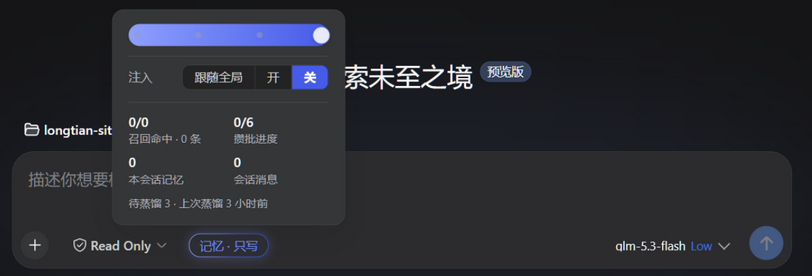
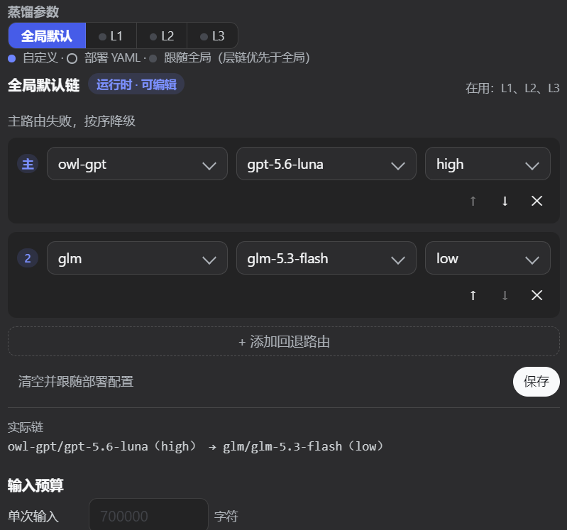
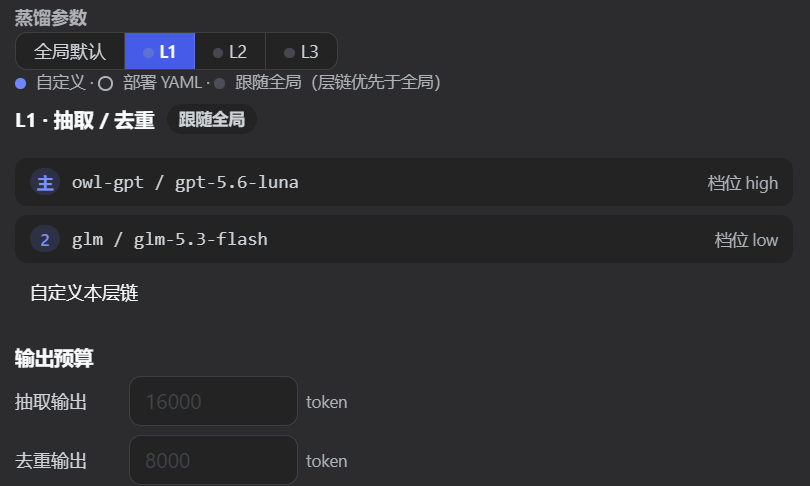
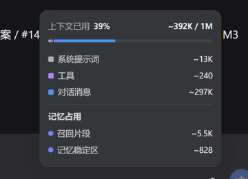

# 更新日志（Changelog）

本文件记录 dsh-prime-memory（0.5.0 前名为 dsh-memory-plugin）的显著变更。格式参考 [Keep a Changelog](https://keepachangelog.com/zh-CN/1.1.0/)，
版本号遵循 [语义化版本](https://semver.org/lang/zh-CN/)。

> **UI 截图约定**：带界面变化的条目在 `assets/changelog/<版本号>/<两位编号>-<简述>.png`
> 存真机截图，并在条目内以相对路径引用，读者可在更新日志里直接看到新版本 UI 的样子。

## [Unreleased]

### 新增

- **激活槽位（Active Slot）——把「每次都该生效的约定」从语义召回里拿出来，变成可跨会话持久的常驻上下文。** 起因是一次真实失效：网络访问总则（上传走官方、下载走镜像）已写进记忆，下一轮对话里却**没有被召回**，于是旧的错误习惯继续生效。语义召回是概率性的，而这类规则需要的恰恰是确定性——所以给它们一条机械通道。
  - **存储**：`<dataDir>/slots.json`，独立于 `state.json`（槽位是高频小改，不能把 checkpoint 的原子写拖着变频），复用 `util/io.ts` 的 `atomicWriteJson`；内存态只原地改，`list()/open()/alwaysOn()` 一律返回副本（对齐 `StateStore.reset()` 的活引用教训）。
  - **工具面三件**：`memory_slot_write` / `memory_slot_list` / `memory_slot_close`。写入与关闭受既有的高权限门控 `live.memoryMutate`（默认关）——状态变更强风控；读取受会话档位门控，与 `memory_search` 同语义。新 registrar 独立成文件，`tools/index.ts`（1156 行）零侵入。
  - **常驻注入**：`hooks/slot-recall.ts` 独立注册 `agent/pre-step`（waterfall prepend），与既有 `recall.ts` 可组合（两段注入顺序有测试钉住）。`pinned && open` 槽位按 priority 降序、按字节预算截断；超预算的以 `… 另有 N 个` 明示并给出找回路径——**截断不静默**。`validUntil` 由注入前的一次机械清算转 `expired`（纯时间戳比较，不引入任何 LLM），否则「有效期」只是装饰。
  - **服务端投影 `memorySlots`**：经 `ctx.inject(['sessionProjections'])` 注册——宿主没有该服务时**静默不注册**，而不是让整行 profile 加载失败。`apply` 闭包 `SlotStore` 并以 `revision()` 判脏：**只在 `tool/result`（settled、非 error）且 rev 变化时重建**（`tool/call` 提交在 `execute()` 变更 store 之前，按 call 折会读到 stale），无关事件返回**同引用**；`view` 用 `WeakMap` 保引用稳定，且**不含 body**（判定与生成正交，正文按需再取）。本轮不含任何 client 代码：展示留给下一轮 brief。
  - **schema 零新依赖**：`stateSchema` / `viewSchema` 自实现 `parse`（注册表运行时只调这一个方法），合法态**原样返回同一引用**、非法态抛错；不引 zod（`package.json` 与锁文件不在本轮改动白名单内）。
  - 上限：≤8 槽（可配）/ 常驻 ≤2048 字节 / body ≤512 / title ≤60。
- **来源锚点（R7）——记忆现在能追回会话里的**真实位置**。** 在此之前溯源链是断的：L1 带着 `source_message_ids`，但那些是 **L0 消息 id**（`msg_<epoch_ms>_<hex>`），而 L0 表没有 `turn`/`step` 列；且该 id 列表**根本没写进检索库**（写入侧只取 `metadata`，字段被静默丢弃）。结果是**任何一条记忆都无法定位到原文**。
  - `l0_conversations` 补 `turn`/`step` 两列（幂等 `ALTER TABLE`；旧行保持 NULL = 无锚点，**绝不猜测回填**），并新增 `(session_id, turn)` 索引。
  - 捕获侧新增 `step/start` fold：`user/message` 在内核负载里**不带** `step`，靠同轮 `step/start` 推出；`assistant/message` 用事件自带的 `{turn, step}`。**首个 `step/start` 之前的消息 step 留空**——缺坐标时不编坐标，这是红线。
  - 锚点存在 `metadata_json` 的保留键 `dsh_source_anchors`（UI 显示为 `t12 s3`）。不加列、不动磁盘契约。**新建与「合并/更新」两条写入路径都带锚点**——否则合并一次就丢坐标，而合并是长会话里最常发生的动作。
  - 新增宿主取数接口 `MemoryDb.l0ByAnchor(sessionId, turn, step?)`：**按坐标**（而非按时间）取 L0 消息，是后续「证据读取器」的唯一入口。
- **记录面板显示来源锚点**（此前该行永远是「-」）。
- **证据读取器（R1）——把锚点还原成会话原文。** 取原文走**内核 `ctx.sessionQuery`** 直连（`readSession` / `listEvents`），不再等外部索引插件的 HTTP 端点：本插件是宿主插件，手里就有 `ctx`，少一层进程边界与失败点。本轮落地**纯函数层**（装配接线与真机实调见后续条目）。
  - 会话 id **两种形态都试**：实测索引里 `session_id` 有带 `session-` 前缀与纯 uuid 两种，只试一种会**静默漏掉 124 个会话**（不报错，只是永远查不到）。
  - `foldEventAnchors` 在读取侧复用**与捕获侧同一条 fold 规则**，保证写入的坐标与读回的坐标是同一套语义。
  - **忠实投影**：不 `stripCodeBlocks`、不按长度截断、不做「值不值得记」筛选——**捕获可以为省 token 丢东西，取证不行**。唯一保留的过滤是「插件注入的上下文不算用户发言」。
  - **失败可分类**（这是本节的重点）：`no-service` / `no-anchor` / `session-unreadable` / `anchor-not-found` / `timeout` / `error`。前四类的区分是必需的——把「读不到」当成「没谈过」会让已归档会话的记忆被系统性误判。

- **记忆退场（软删）与清理闭环：删除不再等于丢数据。** 此前"删除"是**物理删除**——一次误删只能去 `records/*.jsonl` 事实源里手工捞。现在删除分两档，**可逆的那档是默认**，不可逆的那档需要显式要求且自带导出物。
  - **退场（软删）**：保留主表行 + 闭合 `valid_to` + 写取代标记（`metadata` 保留键 `dsh_superseded`，含时刻 / 原因 / 裁决结论 / 冲突对 id），只撤掉 `l1_fts` 与 `l1_vec` 行。**检索侧 SQL 一字未改**——不引入任何查询漂移。三条退场路径（裁决判负 / 去重取代 `update`·`merge` / 人工删除）**共用同一个原语**，否则迟早出现"某条路径还在硬删"的不一致语义，而那种不一致只在误删发生时才暴露。
  - **端点 33 → 38**：`records-retired`（已退场列表）/ `records-restore`（找回）/ `cleanup-retired`（物理清理）/ `snapshots-list`（快照清单）/ `snapshot-restore`（从快照回灌）。三处清单（`contract.ts` 映射表 / `stats.ts` 的 `MEMORY_ENDPOINTS` 白名单 / 分发 `case`）与端点总数断言同步更新——少改任一处都会让端点恒返 404，而客户端 `rpc` 的 catch 会静默吞掉异常、面板整块消失。
  - **`memory_delete` 默认只退场 1 条**（原为 3），并新增 `ids` **精确路径**（跳过语义匹配）。原实现用语义 top-N 批量删，实测**误删过两条无关的真实记忆**——"删得准"必须由精确 ID 保证，而不是靠相似度。
  - **物理清理默认干跑**：省略 `dryRun` 即视为 `true`。即便显式执行，也先落**全库快照**并**按内容哈希**校验，不一致即中止且一条不删。为此把 `deleteL1Batch` 收敛到**唯一调用方**（`exportThenPurge`），并由源码守卫测试钉住——"没有绕过导出的物理删除路径"由此成为结构事实，而不是一句约定。
  - **补上回程票**：`restoreL1Snapshot` 此前**只有测试在调用**，于是"先有导出物再清理"只成立了一半——导出物在、回灌出口不在，真出事只能人工解析 `l1-records.json`。现接上 `snapshots-list` / `snapshot-restore`：只收快照**目录名**（拒绝路径与 `..`）、默认干跑、并如实报出 `stillRetired`。这一条是必需的：清理只清理**已退场**记录，而快照拍在删除**之前**，所以找回的每一条都带退场标记——**写回主表 ≠ 回到召回**，不说明就会让人以为"恢复完了"。要一步完成真正的回滚用 `unretire: true`（复用既有 `restore`，不新开写路径）。
  - **面板**：记录页新增「已退场（可恢复）」区（默认折叠、展开时才拉取，不让它拖慢正常浏览）；删除确认文案改为明确"可恢复"。**物理清理刻意不做面板入口**——不可逆动作只留 RPC / 模型出口。
- **§C 矛盾冻结：同批次矛盾现在也能冻结（修掉"模型唯一会说的话恰好被拒收"）。** 取证发现 `validateConflictPair` 的第③条硬性要求"另一方必须是候选池里的已知记录"，而**同批次新记忆的 id 不在其中**（它们是本轮刚生成的、尚未入库）。于是"本轮两条新记忆互相矛盾"这种最典型的"机器判不了"情形，模型即便正确 emit 了 `conflict`，也**必然被判不成对而回落 `store`**。证据：模型层 7/7 会 emit，但那一跳从未落库（`conflict_pending` 建库以来 0 行、`l1_receipts` 里 `conflict` 凭证 0 条，而 `store 381 / merge 204 / update 172 / skip 7`）。修法：`validateConflictPair` 新增可选 `batchIds`（缺省 = 旧行为），仍要求"恰有一方是本条记忆"以保证配对唯一；并补队列满护栏——**败方属本轮新记忆时不做自动了结**，否则刚抽取的产出会立刻退场且没有任何人被告知，改为不停放、照常入库。

### 修复

- **面板说"矛盾冻结未开启"，而开关明明是开的。** `conflicts` / `conflict-resolve` 端点读的是**部署静态配置** `cfg.conflictFreeze.enabled`，而面板写入的是**运行时设置**（live）。部署默认恒 `false`，于是开关已开、`settings.yaml` 已落 `true`，本页仍报未开启。改走 `effectiveCfg(cfg, live)`，与去重管线同一套解析——开关只有**一个**事实源，读端与写端必须看同一份状态，否则会出现"列表说开着、裁决说没开"的自相矛盾。
- **`dsh-memory/embedding-reindex` 声明了却恒返 404。** 端点写在契约里，但既缺席 `MEMORY_ENDPOINTS` 白名单、也没有分发 `case`；同时 `startReindex()` 是**死代码**，设置页「向量索引」区块因此只有"取消"没有"开始"。补白名单 + `case` + 用例。
- **`UiRecord.sourceMessageIds` 是死字段。** 它读的是 `l1_records` **从不存在的列**，永远回退 `[]`，于是记录面板的来源行**从未渲染过**。已替换为读真实数据的 `sourceAnchors`。

## [0.12.0] — 2026-09-17

### 新增

- **手动重建向量索引（端点 `dsh-memory/embedding-reindex` + 设置页「向量索引」区块）**。此前重建只有两条路：启动时的 `db.init` 变更检测链，与周期 backfill 的缺失补齐——**用户没有任何手动入口**。设置页里能看到的只有「取消」（且只在重建进行中才出现），既看不到「开始」，也看不到当前嵌了多少、还缺多少。现在补齐：
  - **端点面 31 → 32**。新增 `EmbeddingReindexStartResponse`（`{accepted:true}`），**受理即返回，进度不在此回传**——客户端照旧轮询 `embedding-state-get` 的 `reindex` 字段。两套进度语义各说各话是迟早要出事的，所以刻意只留一套。三处清单（`contract.ts` 映射表 / `stats.ts` 的 `MEMORY_ENDPOINTS` 白名单 / 分发 `case`）与端点总数断言同步更新；这四处**少改任何一处都会让端点恒返 404**，而客户端 `rpc` 的 catch 会静默吞掉异常、面板整块消失。
  - **`EmbeddingStateView` 新增 `vectors`**：L1 / L0 各自的 `embedded` / `total` / `missing` / `skipped`。「已嵌入 X / 总 Y」由此而来。db 层的 **`-1` 哨兵原样透传**——「向量能力不可用」与「一条都没嵌」在界面上必须是两句不同的话；折叠成一个数字，用户就会去点一个永远没反应的按钮。

### 修复

- **拒绝「受理了但根本不会跑」的重建请求**。`L1Store.reindex` / `L0Store.reindex` 首行在向量能力未就绪时**静默短路**成 `0/0/0`。入口若不设门槛，UI 会显示「重建完成、零条待补」——而真相是它**根本没开始**。该陷阱在 `src/index.ts:240` 早有注释，但那只覆盖启动链，手动入口是新开的破口。`startReindex()` 现将五道门槛全部前置，且各自给出**可行动的**文案：已卸载 / 重建已在进行中 / 嵌入源切换占用 / **嵌入源已关闭**（`currentInfo` 为空）/ **嵌入服务未就绪**（「先启用」与「再等等」是两句不同的话，不能合并成一句）。为此给两个 store 补了 `vectorsReady()` 访问器——`helper` 是私有的，外部无从询问。
- **`embedding-subsystem.test.ts` 的 `db` 桩件不完整**。它只有 `swapProvider` / `markEmbeddingSynced` 两个方法，靠 `as never` 绕过类型检查，因此从未被检出；`snapshot()` 开始附带向量计数后即崩（`getVecSkipSet is not a function`）。**补桩件，而不是把 `vectorCounts` 改成防御式**：类型签名声明的是完整 `MemoryDb`，把缺失方法吞掉，等于把真实接线错误一并藏起来。

### 测试

- 新增 5 个用例：关闭态拒绝 / 未就绪拒绝 / 受理并驱动 L1+L0 且并发第二次立即被拒 / 卸载后拒绝 / `snapshot` 计数口径。**每条拒绝路径都同时断言「抛错」与「下游一次都没被调用」**——只断言抛错的话，一个「先调用下游、再抛错」的实现照样能过。
- **反证**：临时摘除就绪守卫后，`向量能力未就绪 → 拒绝，不谎报「已受理」` 确实变红（`expected [Function] to throw an error`），还原后复绿。
- 全量 **39 文件 / 403 用例**通过；`typecheck`（三份 tsconfig）、`build`、`smoke` 均绿。

## [0.11.0] — 2026-09-13

### 兼容性（按 DSH 插件框架文档适配）

- **settings 注册跨版本兼容（0.1.1-rc.2 ~ 0.1.5-rc.2）**。`src/settings.ts` 此前从 `@deepseek-ai/dsh-settings` **值导入** `settingsNamespace()`，而 v0.1.3+ 已移除该导出符号——在 0.1.3+ 的宿主上模块加载即抛 `Failed to load plugins`，整棵插件树被拖垮。现改为：
  - 命名空间用字符串字面量 `'dsh-memory'`（浏览器半只看原始字符串，新旧宿主等价）；仅保留类型导入（编译后擦除，无加载风险）；
  - 注册走运行时三分支：优先 `settings.register()`（全部目标版本存在，返回 get/watch/update scope，live 开关与 UI 写入全走它）；回退 `settings.installSection()` 桥接（v0.1.2+ 服务面，仅 register 缺失时；运行时写入显式报业务错误）；两者皆无则降级为恒开——"settings 缺失绝不拖垮宿主"的铁律不变；
  - `SettingsScope` 改为本地结构类型，不再依赖包级类型导出。
- **新增 `dsh.plugin.json`**（DSH 发现清单：id / engines.dsh `>=0.1.1-rc.2 <0.2.0-0` / components 指向 `dist/` 产物），对齐 `dsh-plugin-template` 标准文件结构。
- **`@deepseek-ai/dsh-*` peerDependencies 转 optional 并放宽版本范围**（`^0.1.1-rc.2 || ^0.1.2-rc.1 || ^0.1.3-rc.1 || ^0.1.5-rc.2`），`@deepseek-ai/cordis` 保持必选——对齐 awesome-dsh-plugin 投稿要求 B.3。
- **新增 `screenshots.json`**（8 张，引用 `assets/img/`），投稿卡片可展示。

### 变更

- `package.json` `version` 升至 0.11.0；npm `files` 补 `dsh.plugin.json`（`screenshots.json` 按 awesome-dsh-plugin 探测约定仅存于 git 仓库，不入 npm 包）。

### 待实测

- v0.1.5-rc.2 上 `conversation.input.left` / `settings.section` 槽位与 Session V3 `session.surface.nodes` 语义（occupancy 估算）尚未实测，兼容矩阵见 README。

## [未发布]

> 📘 **踩坑与修复方向手册**：本轮及前两轮实际踩过的坑、走错过的方向已系统沉淀到
> [`ENGINEERING-NOTES.md`](./ENGINEERING-NOTES.md)（一页速查表 + 逐条「现象 / 根因 / 正确做法 / 如何验证」
> + 交付前验证清单）。涵盖：`nullable` 崩溃整棵插件树、deps 漏注入被降级分支掩盖、
> 重复解析器必然腐烂、守卫标志位放 `finally` 等于没放、长任务不置 `running` 导致界面无进度、
> 可选字段让 `tsc` 抓不到未定义标识符、空数据测试掩盖必崩缺陷、`vitest` 只转译导致契约漂移、
> 沙箱 `spawn EPERM`（含 `ESBUILD_BINARY_PATH` 为何无效）、PowerShell 管道捕获让 `tsc` 错误数变 0、
> 编码 BOM/乱码/行号漂移，以及 `git amend -m` 清空提交正文等 Git 陷阱。

### 新增

- **§E 存储作用域 `scope`（可见范围，与 `family` 正交）**。此前所有项目共用一份记忆库：项目 A 沉淀的 `work` 族记忆在项目 B 的会话里同样被召回。新增 `scope` 配置（`global` 默认 / `workspace`），与既有 `family`（内容类型）**正交**——`family` 问"这是什么内容"，`scope` 问"它该在多大范围内可见"，四象限都存在。「`workspace` 模式下按工作区隔离 `work` 族、`chat` 族默认仍全局」是**默认值不是推导规则**（个人记忆本应跨项目，而污染面恰在项目之间）。
  - **零漂移是构造性的，不是比对出来的**：`cfg.scope` 非 `workspace` 时统一的 `scopeFilterOf` 恒返回 `undefined`（= 不过滤），任何调用点都不可能意外传进一个工作区标识。既有部署（不传该键）行为与改动前**逐字一致**。
  - **隔离落在与族隔离同一层**：不只是检索出口——**去重候选召回**同样过滤。候选池决定新的去重决策，此处跨工作区会产出「项目 B 里看不见、却已经决定了项目 A 记忆去向」的记忆，比不隔离更糟（[`ADR-0008`](./docs/adr/0008-storage-scope-vs-family.md)）。图谱路按**来源记录**的归属在同层过滤；写入路径（抽取管线 / `memory_add` / `memory_import`）共用同一个 `resolveRecordScope`。
  - **工作区标识取 canonical cwd，而非宿主 `dsh-workspace` 的 `WorkspaceId`（uuid）**：与 §A 的 `parentSession` 同一条 header 通路、同步可得；声明 `inject` 会让缺该服务的宿主整树加载失败；宿主自己的成员判据本就是「session header 的 canonical cwd == workspace path」；uuid 需要"已注册的工作区"，未注册目录下隔离会静默失效。已知边界：**不解析符号链接**，后果是过度隔离（安全方向）而非泄漏（[`ADR-0009`](./docs/adr/0009-workspace-identity-source.md)）。
  - **迁移只标注归属，不搬运不删除**：`l1_records` / `l1_fts` 各补 `scope` + `workspace_id` 两列，存量数据由 `ALTER` 的 `DEFAULT` 直接标为 `global`——条数、id、content、created_time 逐字不变。
  - **执行期抓到两处真问题**：① **FTS 重建回灌漏带 scope 会静默抹平隔离**（`backfillL1Fts` 参数与 insert 语句不对齐时会被它自己的逐行 `catch` 吞掉，症状是 `count=0` 的空索引）；② **写入侧漏做形态归一 → 记忆写进去却再也查不出来**（检索侧传归一后的小写路径，写入侧原样存调用方的大写字符串，字符串相等判定必然落空）。两者均由端到端测试与变异探针抓出并修复。
- **§F 图谱节点向量列 `graph_node_vec`（存储与降级地基）**。图谱此前只有词法加权打分，无向量列——"云深处"与"DeepRobotics"这类**语义等价但字面不同**的实体无法互相消解。新增与 `l1_vec` **同模式**的 vec0 虚拟表（同一份编码、同一种 `float[N] distance_metric=cosine` 声明），维度**复用**既有能力探测结果，不新增一套。
  - **降级内层消化**：vec0 缺失时建表会抛，若冒到 `GraphStore.init` 外层那层 `catch`，图谱会从"向量路不可用"退化成"**整个图谱域不可用**"——词法检索、投影、裁决全部陪葬。故向量列自带窄 `try/catch`。接口在停用态一律 no-op 返回，调用方无需判断能力位（[`ADR-0011`](./docs/adr/0011-graph-node-vector-storage-and-degradation.md)）。
  - **本波只有门，没有生产者与消费者**：投影管线尚未接线去算嵌入。如实登记为未完成——它是 §F 的起点而非终点。
- **§B L1 决策凭证链（可追溯性基础设施）**。`memory.db` 里每条 L1 记录都是**去重决策的结果**（store / update / merge / skip），但决策本身不留痕——事后只能看到"结果长这样"，看不到"当时基于什么做的判断"。新增 `l1_receipts` 表：每次去重决策留一条凭证（`run_id` / `record_id` / `kind` / **候选池有序序列的 sha256 摘要** `input_digest` / `decided_at`），配套新工具 **`memory_receipts`** 与 RPC 端点 **`dsh-memory/receipts`**，按记录或按批次**双维回溯**（同给为 AND）。凭证必须在事件**之前**存在——输入快照**无法事后补录**，故本能力前置落地、不设症状触发条件（[`ADR-0006`](./docs/adr/0006-l1-decision-receipts.md)）。
  - **`input_digest` 三项刻意设计**：**顺序敏感**（候选池是有序的，"当时看到哪些候选、按什么序"正是要复原的输入）、**重复不折叠**（候选池里的重复本身是事实）、**长度前缀编码**（否则 `['a|b']` 与 `['a','b']` 会碰撞——序列化不是单射，摘要就失去指纹意义）。
  - **保留策略**：按 **run 数**裁剪（`RECEIPTS_MAX_RUNS = 1000`）——时间窗口**给不出行的上界**（阈值与写入速率无关，高频用户 90 天能写进任意多行，无界增长只是被**推迟**）；裁剪**粒度是 run 而非行**——按行裁剪会切出"半截批次"，让"这一轮都判了什么"给出**看似完整、实则遗漏**的结论，危害**高于查不到**。
  - **红线**：裁剪**只碰 `l1_receipts`，绝不碰 `l1_records`**——前者是可丢弃的观测数据，后者是用户的事实源，为省几 MB 而波及记忆本体是把容量优化做成了数据丢失。
  - **失败隔离**：凭证是旁路设施，写失败只记 `warn`、**绝不中断 L1 蒸馏**。

- **§C 矛盾冻结（可选，默认关）**。此前去重**决策词表**只有 `store` / `update` / `merge` / `skip`——"冲突检测器"（`CONFLICT_DETECTION_SYSTEM_PROMPT`）检测到矛盾后**由 LLM 直接裁决落盘**（`update` 覆盖或 `merge` 合并），**没有"停下来等人裁决"这个选项**。开启 `conflictFreeze.enabled` 后词表新增 `conflict` 动作：LLM 判定"两边都像是对的、机器判不了"时，把冲突对**停放**到 `conflict_pending` 队列——**新记忆照常入库，双方内容都不被改写**，由新工具 **`memory_resolve_conflict`**（RPC：`dsh-memory/conflict-resolve`）交人裁决，结论 `winner` / `loser` / `both`。
  - **冻结不是"拦住写入"，而是"不自动裁决"**——实现成前者会丢信息，比它想解决的问题更糟。
  - **安全阀**：`maxPending`（队列上限）/ `timeoutDays`（超时降级）。语义是"**不收新的**"而非"偷偷删旧的"：被自动了结的对**仍写入队列留痕**，`resolution` 记为 `auto` 以区别于人工结论。没有安全阀的两个后果都是确定的：队列无界增长；"两条互相矛盾的记忆长期并列召回"永久留在库里。
  - **图谱侧**：被冻结的记录，其**来源命中的图谱节点**标为 `disputed`（复用既有状态；该状态仍在检索候选内，是"照常召回、但状态可见"的中间态）。该标记是**派生同步**而非单向标记——裁决会**撤销**争议，单向标记会让已裁决的节点永远停在 `disputed`，那是**派生图谱在说谎**。
  - **零漂移**：关闭时去重 prompt 与改动前**逐字节相同**——这是**构造性**保证（关闭态直接 `return base`），不是人工比对出来的（[`ADR-0010`](./docs/adr/0010-conflict-freeze-default-off-and-timeout.md)）。

### 变更

- **新增配置** `conflictFreeze.enabled`（默认关）/ `conflictFreeze.maxPending`（100）/ `conflictFreeze.timeoutDays`（30，`0` = 不做超时降级）；**新增端点** `dsh-memory/receipts` 与 `dsh-memory/conflict-resolve`（端点面 26 → 28）。
- **`L1ReceiptKind` 新增 `conflict`**。扩词表时必须同步检查**所有消费该词表的地方**（凭证归一、统计日志、渲染文案、schema 描述）——执行期实测：漏登记会把"模型**明确**说判不了"记成 `skip_missing`（= "模型**没答**"），而 §C 的裁决可审计性**完全**依赖凭证链，审计结论与事实**正好相反**（比缺一条凭证更糟：缺了是"查不到"，错了是"查到了错的"）。
- **`GraphStore.markSourcesDisputed`（单向标记）→ `syncDisputed`（派生同步）**：`active` 且来源命中 → `disputed`；`disputed` 且来源不再命中 → 复原 `active`；`archived` 墓碑不动。管线侧传的是**当前全部未裁决对的记录集**，而非本轮新增那一对。
- **裁决顺序刻意为之**：先打 `resolved_at` 再退场败方——反过来的话，"记录已消失、队列里那条仍在待裁决"要等人再点一次才发现无据可依；打标用 `WHERE resolved_at = ''`，**二次裁决不覆盖第一次结论**。

### 测试

- **§B 新增 5 个测试文件**（凭证建表与摘要、写入点与失败隔离、保留策略、双维查询、端到端回溯），含**变异探针**：把裁剪表换成 `l1_records` 后红线用例确实失败。
- **§C 新增 7 个测试文件**（词表 / 建表 / 开关 / 冻结语义 / 安全阀 / 裁决 / 闭环），均按 TDD 先观察 RED。三条**区分性**判据值得一提：`version===0`（区分 store 语义与 merge/update 语义）、端到端抓真管线实际送出的 prompt（静态函数全绿**证明不了**管线把开关传了下去）、`both` 分支变异后用例确实变红。
- 全量 **34 文件 / 341 用例**；CI 七步链（`typecheck` / `test` / `lint` / `build` / `build:smoke` / `smoke` / `verify-catalog`）全绿。
- 闭环实测留档：真 `runExtraction` × 2（仅 LLM 传输层打桩）→ 真裁决端点，原始 JSON 存档于计划域 `evidence/`。

### 修复

- **未识别动作被兜底分支静默承接**。`pipeline/l1.ts` 的应用循环只对 `store` / `skip` 显式分支，**其余动作一律落到 update/merge 分支**。conflict 决策按设计不带 `target_ids`，于是 `targets=[]` → 记录被当成"替换了 0 条"的合并产物追加，`version` 被算成 `1`。**不报错、不丢数据，唯一痕迹是一个 version 数字**——即"conflict 被静默降级为 merge/update"，正是 §C 要消灭的行为。**修复**：显式 `conflict` 分支；校验不过或开关关闭时**回落 `store`**，绝不落到兜底分支。
- **端点门禁是手抄副本**。`tests/contract-keys.test.ts` 的 `ENDPOINTS` 是真实注册表（`src/stats.ts` 的 `MEMORY_ENDPOINTS`）的**手抄副本**，两条断言只在该副本内部自洽（`ENDPOINTS.length === 26`）。§B 新增 `dsh-memory/receipts` 使真实注册表升到 27 时，副本**没有跟着更新**，而数量断言仍停在 26——于是"断言与副本一致、副本与事实不符"让它**一路绿灯**；本次新增 `conflict-resolve` 后**依然全绿**。**门禁测的是自己的影子**：被测系统换成什么都不会变红。**修复**：新增 `expect([...ENDPOINTS].sort()).toEqual([...MEMORY_ENDPOINTS].sort())`——本地清单必须与唯一事实源**逐项一致**，数量断言保留作为变更时的显式路标。

- **插件树加载失败：工具输出 schema 使用了 DSL 不支持的 `nullable` 关键字**（回归修复，会导致 DSH 完全无法启动）。`memory_ruminate` 与 `memory_ruminate_status` 的输出 schema 在 `startedAt`/`finishedAt`/`error` 上声明了 `nullable: true`，而 DSH 的 value schema DSL 只接受一组白名单作者键（`description`/`title`/`default`/`examples`/`required`/`enum`/`const` 及各类型的 `type`/`properties`/`additionalProperties`/`items`/`oneOf`）。`defineTool()` 编译 schema 时抛 `JsonSchemaError: schema.properties.startedAt.nullable is not supported by the value schema DSL`，loader 随之判定 `dsh-memory (dsh-prime-memory)` 条目加载失败，整个插件树 apply 中止，进程以未捕获异常退出。
  **修复**：删除 4 处 `nullable: true`。语义不变——该 DSL 中属性默认即为可选，仅显式 `required: true` 才必填；且运行时校验对 `undefined` 做跳过处理，`execute` 返回的 `startedAt: undefined` 依旧合法。校验步骤：`tsc` 编译通过 + dist 产物已无该关键字 + 新增工具注册回归用例。
- **反刍（ruminate）RPC 端点全部不可达：控制器从未注入端点 deps**。`dsh-memory/ruminate-status` 恒返 `{supported:false,running:false,phase:'idle'}`，`ruminate-start`/`ruminate-cancel` 恒抛「反刍控制器未初始化」。根因是 `EndpointDeps.ruminate` 虽已声明、三个端点实现也已写好，但 `registerMemoryRpc` 组装 deps 实参时未把控制器注入，`deps.ruminate` 恒为 `undefined`，端点被永久钉在降级分支上。
  **用户可见影响**：反刍面板（`RuminatePanel.tsx`）依据 `supported === false` 整块 `return null`，因此表现为"功能不存在"而非报错，故障因此长期未被察觉；修复后面板首次实际渲染。
  **修复**：把 deps 组装抽为可测接缝 `buildEndpointDeps()`（单一所属者），由它显式把控制器写入 `ruminate` 字段；`rebuild`/`embedManager`/`sessionInfo` 由此与 `ruminate` 走完全同一条注入路径，不再有第二条位置形参。
  **校验**：`dsh-memory/ruminate-status` 在注入 stub 后返回 `supported !== false`。

- **反刍必崩：`pending.json` 被二次解析且漏解包 `buckets`，`TypeError: messages is not iterable`**。`RuminateController.start()` 用自带的 `readPendingBuckets()` 把 `JSON.parse(readFileSync(file))` 直接断言成 `PendingBuckets`（`{auto,chat,work}`），但磁盘真实形状是 `PendingFile`（`{version,buckets:{auto,chat,work},warmup}`）——**漏了一层 `buckets` 解包**，于是 `buckets[mode]` 恒为 `undefined`，在 `groupPendingBySession` 的 `for (const m of messages)` 抛错。
  **用户可见影响**：**该功能从未成功过一次**。错误只在"文件不存在"时才被 `catch` 兜成空桶走通；而 `persistPending` 每轮都会写这个文件，所以在任何有缓冲的真实部署里点反刍必然失败，面板显示红字。**注意与直觉相反**：抛错与桶里有没有数据**无关**，空桶同样抛——此前"三桶为空所以未暴露"的判断是错的，真实原因是反刍从未被触发过（`memory.log` 无 `反刍开始` 记录）。
  **修复**：删除 `readPendingBuckets()` 与 `readFileSync`，改为复用 `store/pending.ts` 的 `loadPending()`——它是桶形状的**唯一权威**，并免费带来形状校验、逐桶 `Array.isArray` 校验、`isMessage` 坏行丢弃计数、旧格式 `LEGACY_SESSION` 归组与 `warmup` 校验。**不在 `pending.ts` 新增第二个入口**（那正是本缺陷的成因：同一语义两条实现路径，其中一条腐烂且无人察觉）。
  **校验**：新增控制器级用例先红后绿（红：`TypeError: messages is not iterable` @ `pending.ts:104` ← `ruminate.ts:75` ← `:139`；绿：`total` == 会话组数、`mode` 由桶键推导）；`dist/pipeline/ruminate.js` 已无 `readPendingBuckets`。
- **反刍失败后状态与界面自相矛盾**。失败路径从不写 `this.status`（原 `:149-155` 仅成功路径赋值），于是 `ruminate-status` 仍返回 `phase:'idle'`/`error:null`，UI 的 `failed` 分支永不亮——用户看到报错红字，状态端点却说一切正常。**修复**：catch 内写入 `phase:'failed'` 与 `error`，并 `logger.warn` 后再抛出。
- **反刍进度与产出恒为 0，导致修复效果无法判定**。`totalL1` 只被声明/归零/读出而**从不累加**，`status.done` 无任何自增点，因此 `recordsBuilt` 恒 `0`，完成日志恒为 `0/N 会话, 产出 0 条记录`。**修复**：`PipelineTask` 增加 `onDone` 完成回调（`drain` 内调用且回调异常不影响管线），`enqueue` 透出 `onTurnDone`，反刍据此累加真实记录数；`doEnqueue` 收尾时置 `status.done = index`。
- **三处静默失败点**：`loadPending` 的 `catch` 与 `doLightRefresh` 的 `.catch(() => {})` 把"文件不存在（正常）"、"不可读/损坏（需告警）"、"形状不符（需告警）"压成同一个静默降级，与"合法空 pending 的轻量刷新"在日志和状态上完全不可区分，用户看到 `phase:'done'` 误判成功。**修复**：`loadPending` 区分 `ENOENT`（静默）与其余（`warn` 含文件路径与原因），形状不符亦 `warn`；`doLightRefresh` 改为 `await` 且**仅在成功后归零** flag，失败记 `warn`（原先失败也归零，等于吞掉重试机会）。
- **反刍"轻量刷新"期间谎报空闲、无进度、无取消**（用户实测反馈）。`start()` 在无 pending 切片时 `return await this.doLightRefresh()`，而该分支**从不置 `running`**——于是等待期间 `ruminate-status` 仍返回 `phase:'idle'`/`running:false`。但这里的 L2/L3 是**真实 LLM 调用**（实测单次 70 秒以上），期间 `start()` 一直挂在 await 上占住守卫。
  **用户可见影响**：点反刍后界面只有一句静态说明，**无进度条、无取消按钮、无阶段、无耗时**；此时再点一次就得到「反刍已在进行中」——正确但毫无信息量，无法判断"在跑"还是"卡死"。
  **修复**：轻量刷新改为**如实上报**——先按 L2/L3 待办族数登记 `total`，逐步骤自增 `done`，并新增 `RuminatePhase='refreshing'` 与 `detail` 描述当前动作（如「L2 场景整合(chat)」）；完成日志由静默改为 `反刍轻量刷新结束:2/3 步,耗时 84s`。面板相应显示阶段名、`已完成/总步数(百分比)`、**实时已用时长**与当前动作，并把 `refreshing` 视为运行态。
- **反刍进行中不显示已用时长**：L2/L3 单次调用可达分钟级，只显示"运行中"无法区分"在跑"与"卡死"。**修复**：运行期间每秒重算并显示 `已用 X分Y秒`。

### 变更

- **`RuminateStatus` 新增 `detail`；`RuminatePhase` 新增 `refreshing`**：为分钟级步骤提供可观测性（向后兼容：新增可选字段 + 联合类型新增成员）。`detail` 在蒸馏阶段给出「会话 <id>（第 i/N 个）」，在收尾/刷新阶段给出当前 L2/L3 动作。
- **`DshMemoryRequestMap` 补上反刍三键**（契约修复，恢复 CI 类型门禁）：响应映射表早已声明 `dsh-memory/ruminate-status|start|cancel`，而 `DshMemoryEndpoint = keyof DshMemoryResponseMap` 因此把它们纳入端点联合类型，但**请求映射表漏了对应三键**——于是 `client/src/rpc.ts` 的 `DshMemoryRequestMap[K]` 报 `TS2536`，`tsc -p tsconfig.client.json` 恒失败，**CI 的 `npm run typecheck` 必红**。修复为与 `rebuild-*` 同形的三行 `Record<string, never>`（三个端点均无入参）。验证：三份 tsconfig 全部 exit 0，`npm run typecheck` 完整链路 exit 0。
- **`registerMemoryRpc` deps 组装抽为 `buildEndpointDeps()`**：为"哪个控制器落入哪个字段"提供可测接缝，并以 `EndpointDepsInput` 类型约束注入面，使漏注入字段在编译期即可暴露（此前该缺陷是运行时静默降级）。`handleEndpoint` 与 `EndpointDeps` 一并导出以供测试直调。
- **反刍增加启动锁 `starting`**：`loadPending` 使 `start()` 在守卫与 `status.running` 置位之间多出一个事件循环让出点，双击/连发 RPC 可双双穿过守卫、两套 `sessions` 互相覆盖。新增标志位封住该窗口。**注意**：该标志在 distilling 分支末尾显式复位，而非放在 `finally`——因为 `doEnqueue` 是异步入队，`finally` 会立刻清旗使守卫失效；跨 `await` 的持久守卫是 `status.running`。

### 测试

- 新增 RPC 层「控制器端点注入护栏」5 例：`rebuild` 与 `ruminate` 两族各自覆盖「已装配 → status/start/cancel 可达」与「未装配 → status 降级、start/cancel 报未初始化」，另含 `rebuild-start` 的存储降级守卫分支。两族共用同一范式（可选控制器 + 降级响应 + deps 注入），`rebuild` 注入本就正确，作为对照组锁住范式形状。测试用例数 194 → 199。
- 新增 `tests/ruminate.test.ts` 5 例，钉死**控制器真实读取路径**这条此前零覆盖的契约：三桶含真实消息时不抛且 `total`/`mode` 正确、手写磁盘形状 JSON（**不经 `savePending` 往返**，避免"读写两侧同时改错仍通过"）、三桶皆空走轻量刷新、文件缺失走轻量刷新（ENOENT 正常路径）、并发 `start()` 仅一次通过。测试用例数 199 → 204。
- **顺手清理 `tests/` 的 10 个既有 lint error**（未使用导入/变量、`require()` 改为顶层 ESM 导入、恒真条件），使 `lint` 范围得以纳入 `tests`。**此前测试目录完全游离于 lint 之外**。
- **`npm test` 与 `npm run lint` 首次接入 CI**：`.github/workflows/ci.yml` 原先只跑 `typecheck → build → build:smoke → smoke → verify-catalog`，**从不跑测试**——测试写了等于没写。现已补入门禁。

### 已知限制

- **`tests/` 类型门禁仅部分开启（ratchet）**：新增 `tsconfig.test.json` 并纳入 `npm run typecheck`，但因 8 个既有测试文件存在约 60 个类型错误（`MemoryConfig` 模块错位、`DistillBudgets` 缺 `graph`、`UserMessage.turn`、只读数组赋值、`rpc.test.ts` 大量裸 `as` 等），当前只纳入 `tests/ruminate.test.ts` 与 `tests/stores.test.ts`。详见 `pending-issues.md` P8——**这反映测试已与类型契约漂移，而 vitest 只转译不检查，故运行时全绿却无人察觉**。
- **反刍存在磁盘/内存双事实源**：会话清单取自磁盘 `pending.json`，但实际抽取在 `runner.ts:667` 从**内存桶**按 `sessionId` 取消息，故传入的 `session.messages` 对结果无影响。窗口内可能漏蒸馏或空转（`total` 虚高）。建议由 runner 暴露内存只读视图根治，见 `pending-issues.md` P9。
- **反刍收尾竞态**：`setImmediate` 链不等队列排空，单会话也会立刻 `finalize`，使 L2/L3 对着陈旧 L1 白跑一次（记录经 `l1.ts:264` 后续补整合，**非丢失**）。见 `pending-issues.md` P10。
- **反刍进行中的单次 LLM 调用不可中断**：点「取消整理」只会在**当前那一步完成后**停止后续步骤。L2/L3 单次可达分钟级，这是取消延迟的成因。

## [0.10.0] — 2026-09-06

### 新增

- **知识图谱投影**(L1 的可重建投影,回答"人物/项目/组织/工具/地点现在是什么状态"):L1 蒸馏产出的记录按批喂给模型提案实体与有向关系,`applyGraphProjection` 硬校验落库——**零无来源事实**:每个节点/fact/边的 `sourceRecordIds` 必须全部属于本批认领的记录,越批提案整条静默丢弃,任何图谱结论都能沿 `节点 → sourceRecordIds → L1 记录 → JSONL 事实源` 回查。实体消歧(NFKC 归一 + 类型一致合并,别名累积)、状态历史(supersede + validTo 闭合,`currentState` 只由 active facts 重建)、时间锚四级链(`activity_start_time → activity_end_time → timestamps → createdAt`,无证据不猜日期)。图谱表族可随时 drop 重造,不作事实源。
- **投影任务队列**(GraphStore,独立降级:初始化失败仅图谱 no-op,不传染主存储):持久化 job 状态机 pending → running → completed/dead,去重下推 SQL(在途 mapping + 投影台账两张索引表,不做全 job 扫描);优先级不倒挂(新蒸馏 10000 > 存量补投影 100);attempts 封顶转 dead、指数退避 `nextAttemptAt`、启动回收 running→pending;`deleteL1Batch` 后删除传播(来源全失效的节点/边惰性标 archived)。LLM 调用永不进事务(claim 与 complete 是两个事务缝,complete 单事务原子提交)。
- **图谱检索与工具**:字段加权检索(name×6/aliases×5/tags×5/currentState×4/facts×4/relations×3/type×2),仅关系词命中的邻接噪声过滤,`matchedFields` + 中文 `matchReason` 可解释输出;新工具 `memory_search_graph`(紧凑节点卡)与 `memory_expand_graph_node`(facts 全量含历史 + 关系边),受与 `memory_search` 同款的档位/注入拒读门约束,并按会话族过滤(纯档只见本族衍生节点)。
- **RPC 端点 24→26**:`dsh-memory/graph-search`(检索)与 `dsh-memory/graph-node-get`(详情展开;悬挂 id 返回 `node=null` 不解析);契约单一事实源同步,client 泛型调用面零改动自动获得新端点类型。
- **预算键扩容**:`DistillBudgets` 加 `graph` 键(默认 8000,设置页图谱行可编辑);`layerKeyFor('graph')` 显式回全局解析,绝不落入 l1 层链;图谱投影成本进总额与按模型分组,不进 l1→l2→l3 分层表与趋势(旁路豁免)。

### 变更

- **新配置**:`config.graph.enabled`(部署级,默认 **false**——开启后还需运行时蒸馏开关同时为真;泵护栏:每轮 drain 至多一个图谱任务、永远让位实时蒸馏轮次)。
- 插件版本 0.9.0 → 0.10.0(端点面变化)。

## [0.9.0] — 2026-09-01

### 新增

- **Hall 粗分类通道**：与 `family`/`type` 正交的粗属性面。`types.ts` 定义 `HALL_CATALOG`（唯一事实源：主线 `work`/`relationships`/`general` 默认启用，实验性 `finance`/`journey` 带 `experimental` 标记）；`config.hall.enabled` 控制参与打标的 Hall。L1 抽取阶段按启用列表自动给 `metadata.hall` 打标（无法明确归类时省略该字段，不强制 General）；`ListRecordsRequest.hall` 与 `UiRecord.hall` 扩展契约，记忆浏览新增 Hall 筛选下拉与卡片 Hall 标签。
- **远程嵌入运行时覆盖**：嵌入 `baseUrl`/`apiKey`/`model`/`dimensions` 改为**设置页可编辑**，运行时覆盖部署 YAML（`effectiveCfg` 注入 `cfg.embedding` 子树，与 llm 通道独立）；`EmbeddingManager` 增 `getEff()` 读取运行时覆盖后的生效配置，使设置页编辑即时生效。
- **高权限写删工具**：注册 `memory_add`（显式"记得 X"→直接落库一条 L1，可选 `hall`）与 `memory_delete`（语义检索命中后删除，最多 10 条），受 `live.memoryMutate`（设置页高权限模式）门控；记忆浏览新增高权限开关（二次确认）与单条删除按钮。
- **多语文档**（对标 `multilingual-docs-skill`）：`README`/`INSTALL`/`CHANGELOG` 覆盖 `zh`/`en`/`ja`/`ko`，每页顶部语言切换互链（母语书写），`ja`/`ko` 页附 DSH 兼容性说明。
- **工具链**：接入 ESLint 9 扁平配置与 Vitest，新增 `npm run lint`/`npm run test`，并补 `HALL_CATALOG` 与 Hall 抽取 prompt 的首批单测。

### 变更

- **远程嵌入 `apiKey` 改为可选**：接受免 key 自托管 `/embeddings` 服务（`remoteCeiling` 不再强制 `apiKey`）；无 key 时不注入 `authorization` 头，避免空 `Bearer` 被拒。

### 修复

- 远程嵌入在 `apiKey` 为空时不再发送空 `Bearer` 头。

### 已知限制

- `EmbeddingManager` 构造点（`src/index.ts`）尚未传入 `getEff`，运行时覆盖暂未流入管理器内部嵌入服务，待后续补齐接线。

## [0.8.11] — 2026-08-29

### 修复

- **会话档位控件手机端适配**：pill 与滑动选择器此前只按桌面 Web 布局考虑——浮层以
  pill 中心为轴向上悬浮，而 pill 位于输入栏左侧，手机窄视口下浮层左半会被屏幕裁掉。
  现在浮层做水平视口夹持：打开时量一次，被裁（含侧边栏开合把输入区挤向屏幕边缘
  这类布局位移）即自动贴边，桌面端天然在界内，零行为变化；
  点按外部关闭从 `mousedown` 换 `pointerdown`（iOS 触点纯文本区不合成 mouse 事件，
  原实现在手机上会漏关）；pill 与滑轨的命中区按触屏 44px 标准上下扩出隐形热区
  （视觉一像素不变、浮层几何零变化，全端统一——桌面点中目标同步变大）。滑动选择器
  交互逻辑（点按设档、拖拽动量投影吸附）不变。

## [0.8.10] — 2026-08-28

### 新增

- **会话级「只写不读」（Issue #38）**：某些会话希望记忆系统「只进不出」——继续
  捕获对话、参与蒸馏，但不向当前会话注入任何记忆。此前 off 档是完全隐身（连捕获
  都关、未蒸馏切片挂起），召回开关又只有全局粒度，表达不出这个组合。现在悬浮板
  新增**「注入」三态开关（跟随全局 / 开 / 关）**：设为「关」即只写会话——L0 捕获
  与 L1→L2→L3 蒸馏照常，召回注入、画像/导航稳定区、工具指南一并停止，
  `memory_search` 等读工具返回只写提示（写入走捕获钩子不经工具，语义无洞）。
  pill 面文随状态换作 `记忆·只写`（注入态优先上脸，族名收进滑轨）；覆盖按会话
  持久化、与档位正交（切档不丢），「跟随全局」即清除；「全局关 + 个别会话开」
  反向组合同样成立。优先级链：部署上限 > 全局开关 > 会话覆盖 > off 档（完全隐身
  语义不变）。悬浮卡「召回命中」停用原因同步细分（新增「会话只写」一因）。
  适合调试/评测、敏感/一次性、长期后台等「只吸收不干扰」的会话。

  

## [0.8.9] — 2026-08-27

### 新增

- **蒸馏按层独立路由（Issue #34 / ADR-0005）**：蒸馏各层对模型诉求不同（L1
  高频要便宜快稳、L3 低频大输入要强能力），现在可以**按层各配一条完整回退链**。
  双入口：部署 YAML `llm.layerRoutes`（层键 l1/l2/l3，头行必须显式供应商+模型）
  与设置页运行时 `distillLayerChains`；层内优先级**运行时层链 > 静态层链 > 全局
  默认链**逐级兜底，非空即完整替换该层（覆盖层降级绝不落全局链），未配置层行为
  一个比特不变；部署 pin 只锁运行时侧（静态层链照常生效）。设置页「蒸馏参数」
  重构为**分段面板**（全局默认 / L1 / L2 / L3）：分段状态点总览（蓝实心 = 运行时
  自定义 / 空心 = 静态 YAML / 灰 = 跟随全局）+ 一行图例提示（优先级关系挂 tooltip）
  + 全局面板「在用：哪些层」标注 + 分层预算随层归组（语义零改）。分层输出预算的 high/xhigh/max
  ×4 放大触发跟随层档位（层链头候选 > 全局候选）；记账零改动（token_cost 行级
  已按 层+实际服务路由 归因）。

  
  

- **上下文占用指示器（官方环外圈记忆光晕弧 + 明细面板分项）**：插件注入的记忆
  内容此前混在官方上下文环的大类里不可见，现在——输入栏官方环外侧多一条品牌蓝
  **发光细弧**（长度 = 记忆占窗口比，与官方环同帧）；点开官方面板，底部多一节
  「记忆占用」，列**召回片段 / 记忆稳定区**两行分项（官方同款 `~5.5K` 格式与
  亮色数值）。数字与官方 token-meter 同一固定密度启发式（`ceil(chars/4)+开销`，
  UTF-16 制式），分母为主对话模型的官方声明窗口；旧会话照常支持（live 会话
  surface 现扫 + 持久化服务读存储前缀回填），重启不丢（occupancy.json 写穿），
  OFF 后既定事实继续可见、随压缩自然衰减。纯附加实现：移除全部新增节点后界面
  逐比特还原原生形态。

  
  

## [0.8.8] — 2026-08-26

### 新增

- **RPC 契约单一事实源 `src/contract.ts`**：23 个 `dsh-memory/*` 端点的请求/响应
  类型集中为 types-only 模块（零运行时代码），host 侧（stats.ts 的 case 表）与
  client 侧共享同一套形状——契约漂移在编译期暴露，而不是等 UI 渲染出 undefined。
  各 host 模块的纯数据类型（MemoryStats / RebuildStatus / CostSnapshot 族 /
  EmbeddingStateView / MemoryLiveSettings / RecallSessionStats 等）迁入契约并在
  原处保留 re-export；`EFFORT_CHOICES` 经 `satisfies` 反向锁定词表漂移。
- **client 半边迁移 TS/TSX + esbuild 打包**：`client/client.js`（3433 行手写
  ES5 单文件）重写为 `client/src/` 多文件 TSX（按底座/控件/pill/tabs 分层），
  经 `scripts/build-client.mjs`（esbuild，cjs 体包进 factory wrapper，与官方
  dsh-client-ui-* 包同构）产出单文件 `dist/client.js`。react / react/jsx-runtime /
  @deepseek-ai/* 全部 external（宿主 require 注入，防双 react 实例）；**行为零
  变更**（UI 逐像素等价、RPC 端点与载荷不变、handoff 协议不变）。新增
  `npm run typecheck`（主 tsconfig + tsconfig.client.json 双检）；smoke 第 21 节
  改为对**产物** dist/client.js 的断言（协议形状 + external 接线 + 既有令牌/
  圆角/粒子场断言等价迁移）。
- **蒸馏路由链编辑器（设置页 UI，统一列表）**：一张有序列表取代旧「蒸馏思考」
  全局切换器与「蒸馏模型」单路由选择器——第 1 行主路由（徽标「主」，可留空
  跟随默认模型），后续行按序降级；**档位逐路由设置**（缺省「跟随部署配置」，
  仍过能力钳制）。运行时新键 `distillChain`（≤8 条；主路由行双空或双全、回退行
  必显式、重复条目拒收；空数组 = 跟随部署配置）。RPC：llm-providers 增 `chain`
  块（current 含旧键投影 / static / effectiveChain / source）、llm-models 每模型
  附 `efforts` 档位表。位置即优先级：第 2 行可与主路由互换 / 顶替（空主路由被
  顶替不保留）；pinned 只读；跟随态「编辑为运行时链」一键拷贝静态链。设计
  spec 见 `design/settings-spec.md`（RouteChainEditor 节）。
- **蒸馏回退链（#31 方案 1）**：`llm.fallbacks` 对象列表（条目 = provider + model +
  可选 `reasoningEffort`）——主路由失败（报错/被掐断/网络异常/空输出）后按条目
  顺序自动降级，某条路由成功即返回；与主路由完全相同的条目跳过；每条路由各享
  全额 `llm.timeoutMs`；条目档位非空覆盖全局档位（旧运行时键 `reasoningEffort`
  的整体接管——含给条目盖章——在未配置 `distillChain` 时仍对存量值生效）；调用方
  主动取消不降级原样上抛；全部失败抛最后一个错误交既有按会话
  指数退避。token 成本与蒸馏用量逐次尝试记账、成功记实际服务路由；降级切换
  info 日志 + 单路由持续失败一次性告警。缺省空数组 = 单路由行为不变。中英
  README 新增"蒸馏回退链与慢 TTFT 模型"章节（含配置示例与三层缓解策略）。

### 变更

- **设置页删除「蒸馏思考」全局切换器与「蒸馏模型」单路由选择器**：并入统一路由
  链编辑器（档位逐路由化）。旧运行时键 `reasoningEffort`/`distillProvider`/
  `distillModel` 语义逐比特不变（effectiveCfg 只认显式 `distillChain`，存量值
  兼容读取），UI 不再写入。
- **空输出改判为调用失败**：`callLLM` 对"流正常结束但 0 字符输出"从返回空串
  （warn 日志）改为抛错（完整诊断日志保留）——原行为只是把失败推迟到下游
  JSON/Markdown 解析且诊断更差；未配置回退链的部署同样生效，蒸馏各层的既有
  失败兜底路径（只记日志不阻塞管线）天然兼容。

## [0.8.7] — 2026-08-25

### 新增

- **token 成本看板（#30，贡献者 @Irvington258）**：每次蒸馏 LLM 调用
  （l1-extract / l1-dedup / l2 / l3）的 token 成本按 `provider/model` 复合键写入
  SQLite `token_cost` 明细表（含旧表 provider 列迁移），设置页新增「成本」Tab：
  按模型分色的趋势折线（`--dsh-mem-chart-1..8` 图表系列令牌，日/周/月粒度 +
  近 N 天窗口强制日粒度 + L1/L2/L3 层级过滤）、层级 × 时间窗口表格（调用数 /
  输出与思考 token / 均值 / 中位数，median 在 JS 侧计算）、按模型累计列表，
  经 `dsh-memory/token-cost` 只读 RPC 拉取、5s 轮询。数据口径：输入按字符
  （dsh 流式 usage 不含输入 token，沿用 llm-usage 口径），输出/思考按 token；
  记账挂在 callLLM 出口、成功/失败双路都记，记账失败只 warn 绝不阻塞蒸馏；
  语句构造期 prepare 缓存；插件卸载清理模块引用。
- `tokenCost.retentionDays` 配置项（默认 `365`，`0` = 永久保留）：成本明细保留
  天数，写入时滚动清理；成本看板「近 N 天」窗口上限同此值（保留期放开后 client
  输入上限放宽到 3650，真实上限由后端按配置校验）。

### 变更

- design spec 回写：`global-spec.md` 新增「图表系列色」节（数据可视化编码色类目——
  单强调色锁的功能性豁免，先例同档位色；8 档双主题令牌 + AA 对比度复算值，
  浅色全档 ≥3:1 / 暗色全档 ≥4.29，第 1 档锚定品牌蓝、第 8 档中性灰收"其他"）；
  `settings-spec.md` 新增「成本 Tab（CostTab）」节；README 中英同步功能说明与
  配置表行；smoke 新增 retentionDays 默认值/边界断言与图表令牌接线断言。

## [0.8.6] — 2026-08-24

### 新增

- **召回时效衰减加权（#29 建议 B）**：召回排序按 `相关度 × max(0.5, 0.5^(Δ天/半衰期))`
  软加权（Δ 按记忆 updated_at）——相关度相近的候选之间新鲜记忆优先，长会话中召回名额
  随使用自然轮转，陈年条目不再霸占 top-N。设计要点（对照 Generative Agents 与生产级
  RAG 实践的取舍）：**乘法而非加法**——时效只能在相关度相近的候选间微调名次，永不
  僭越相关性（加法会让不相关的新记忆靠 recency 上位）；**衰减地板 0.5**——老记忆最多
  损失一半排序分，长期事实（"三年前写的咖啡偏好"）永不沉底，这让半衰期成为不敏感旋钮；
  缺 updated_at 的记录按最老处理（地板接管，零特判）。挂载在检索唯一缝
  （`L1Store.search()` 三路阈值后、截断前），召回注入与 memory_search 工具自动一致；
  **去重候选召回（searchCandidates）明确不应用**——写路径找同语义旧记录要无视新旧，
  衰减会让去重漏检。`recall.decayHalfLifeDays` 默认 30 天、0=关闭（bench 基线可比性
  可 pin 0）；hit 的 score 字段不被改写（排序用加权分，展示仍反映检索相关度）；
  idf 不单列（BM25 路内建，向量路无此概念）；importance（priority）暂不启用（当前
  抽取输出近常数，参与排序收益趋零，公式预留位置）。
- **召回去重（省 token）**：同会话内已注入过的记忆不再重复注入——用户追问相关/
  类似问题时，检索会再次命中相同记录，而模型上下文里已有这些内容，重复注入纯属
  浪费（每轮最多 ~2000 字符 ≈ 1000 token）。纯过滤语义：剩几条新鲜命中注几条，
  全量压制（0 条）是正确状态而非未命中。粒度 = L1 记录 id：去重合并更新会换新 id，
  内容变化过的记忆天然解除压制重新注入。上下文被 `/compact` 压缩或 `/clear` 清空时
  （`agent/session-start` 事件）重置记录——注入内容已从模型上下文丢失，记忆可重新
  注入；`resume` 不重置（历史仍在）。记录持久化在数据目录 `recall-dedupe.json`
  （写穿串行化原子写，session-modes 同款；会话 LRU 200 条 / 单会话 id 上限 512 /
  90 天过期，任何 I/O 失败降级内存态绝不阻塞召回路径——热路径新增成本仅 O(hits)
  的内存 Set 查询）。统计新增 `suppressedRecalls` 累计计数（session-stats RPC 可查），
  压制发生时打 debug 日志；悬浮卡口径保持连续（全量压制轮计入 hitTurns——相关记忆
  已在上下文里，本质是命中）。

### 修复

- **旧版 records.jsonl 导入永久卡死（#28）**：旧代写入器产出的记录缺 `type`/`priority`/
  `scene_name` 任一字段时，`undefined` 进 node:sqlite 绑定层被拒——逐条回退也系统性全挂
  （同一代写入器产出的缺字段是同批的），文件保留导致每次启动重试、数据永不入库。修复：
  **绑定层字段兜底**（`upsertL1InTx`/`upsertL0Batch` 归一化局部变量，主表/向量/FTS 共用
  同源值；默认值取 schema 列默认 `type='' / priority=50 / scene_name=''`，L0 侧
  `sessionId='default' / role='' / recordedAt='' / timestamp=0`）——一处修覆盖旧版导入、
  reindex、backfill 与常规写入全部调用方；附带消除 `familyForType(undefined)` 的
  TypeError 隐患（归一化后回落 chat 族）。L0 旧版导入同时补最小有效性门（缺 id/content
  坏行读取时丢弃计数，此前零过滤）。注：报告所指"无行级隔离"不成立——逐条回退早已
  存在（报告日志自证），真正缺的是字段兜底；`.failed` 熔断按共识跳过（已知循环成因
  已根治，未知形态留待真实出现再做）。
- **本地嵌入冻结整页（性能事故级）**：transformers.js 的模型加载与 ONNX 推理原先在
  host 主线程同步执行——onnxruntime-node（v1.24.3）的 `run`/`loadModel` 是
  setImmediate 回调里的同步调用（Promise 包装不卸载计算），启用本地嵌入
  （embeddinggemma-300m 实测单条推理 ~0.3-1.3s）后每轮对话的 L0 落盘、召回 query、
  蒸馏落库、reindex 批次都会冻结事件循环数秒——dsh 页面一切交互无响应。修复：
  推理整体移入 worker 线程（`resources/embedding-worker.cjs`，主线程只留协议代理
  `LocalEmbeddingService`）：逐条推理 + 条间让路，单条请求（召回 query）插队不被
  reindex 批次堵队尾；实测 8 条批量嵌入（旧路径 ~10s 连续冻结）期间主线程采样
  超期 0.0ms。附带语义增强：召回路径的 `embeddingTimeoutMs` 内层钳制对本地嵌入
  从"忽略"变为真实生效（race 放弃、迟到回复丢弃）。worker 崩溃不自愈（转 failed
  态走 FTS 降级链，换源/重启恢复）；`close()` = terminate，terminated 不可复活
  语义保持。
- **蒸馏重试风暴（LLM 故障期间连环烧调用）**：L1 抽取失败（如网关 120s 超时）后，
  闲置兜底每 30s 继续入队 force 蒸馏任务，在 LLM 等待期间堆积成无限连环调用
  （memory.log 2026-08-24 实证：每 2 分钟一轮 120s 调用不收敛）。修复：按会话
  指数退避（60s 起步翻倍封顶 30 分钟，成功消费清零；重建轮豁免——用户显式动作
  有自己的失败/取消 UI），退避期间闲置兜底与阈值触发均跳过该会话。
- **附带安全加固（语义零变化）**：bench 工具与 smoke 测试的全部文件读写边界改为
  内联 containment 写法（resolve 后 startsWith 根目录校验 / SAFE_NAME 白名单；
  目录类环境变量契约断言：绝对路径且无 `..` 段）。

## [0.8.5] — 2026-08-23

### 修复

- **判卷口径修正**（bench）：①带 stale 的题（update/连锁更新/遗忘）FAIL 条件从
  "旧值出现"改为"旧值**当作现状陈述**"——单纯交代演变过程且终值正确不判负
  （2026-08-23 lifecycle 回归实测：连锁更新题答对铂钻但提及豆腐砂演变轨迹被
  整批误杀）；②拒答题 FAIL 仅限"把被问的具体内容当已知事实说出"，引用真实
  背景解释"为什么不知道被问点"判 PASS（"只知道 A 和 B、没有 C 的记录"此前
  被误杀）。work-project-stack 的 update 题由 contains-all 换 llm 判卷（程序
  判无法区分现状陈述与演变交代，全库不再有 contains-all+stale 组合）。
- **auto 档族错标：个人"计划性"事实被吸进 work 族**（lifecycle 赛道首跑实测发现）：
  抽取输出的 type 前缀隐式决定 family，而「驱虫方案/疫苗安排/猫砂选择」这类规则态
  个人事实在 chat 词表没有贴合句式、被 work_fact/work_method 的形状语义吸走 → 族
  错标 → 同一事实双族并存（去重永不跨族 → 旧值复活、连锁更新题失败）+ 分族门控
  泄漏（chat 档会话能答出 work 事实，lifecycle 实测 2/2×2）。修复：auto 档抽取
  Prompt **每条记忆显式输出 family 字段**（判定只看语境不看形状——职业/团队/项目
  → work，家庭/宠物/健康/个人行程 → chat；family 决定 type 词表不许交叉）；工程侧
  三级兜底链 `resolveRecordFamily`（纯档强制 → 抽取显式 → type 前缀）。与
  MemoryCore 上游的分叉已在 prompt 头注释注明。**存量错标库需升级后 rebuild 一次
  治愈**（L1 清空重导；注意 rebuild 会从 L0 复活已"遗忘"的事实——既有语义）。

### 新增

- **效率三角补全**（bench + 插件）：「记忆的开销」与工作流赛道已测的"记忆节省"
  配成完整 ROI——①**注入开销**（注入轮 vs 无注入轮的轮次响应差分——事件时间戳
  在步骤派发时统一落盘，注入钩子自身耗时不可直接观测，实测取证后改差分口径；
  A 组内自成基线）；②**注入占比**（探针轮注入字符/该轮输入 token，中文 1 字≈1
  token 折算）；③**蒸馏记账**（新增 `src/llm-usage.ts` 常开计数器，callLLM 按
  l1-extract/l1-dedup/l2/l3 层累计输入字符/输出/思考 token，经 bench 控制服务
  `getDistillUsage` 读取，摊到每条捕获消息；lifecycle 的 rebuild 另有前后差分
  专属用量）。patch-arm-on 同步开启 benchControl；旧运行无新字段时报告自动跳过。
  另修复 run.mjs 链接守卫漏洞：主树之下的兄弟 worktree（.worktree/…）此前被
  放行——2026-08-23 实测链接指向 .worktree/dev 的旧 runner 静默跑完全程。
- **生命周期赛道**（bench `--track lifecycle`，只跑 A 组）：考只有本架构能测的
  生命周期不变量——**分族门控**（chat 档会话问不出 work 族事实、镜像亦然，
  异族泄漏非 0 即"写入与召回同档"被打破）、**off 档捕获**（off 会话教的 nonce
  事实双断言：auto 探针须拒答 + records/conversations JSONL 全文缺席，rebuild
  后复验）、**rebuild 保真**（触发全量重建后探针轮 2 对照轮 1，显著回退即
  rebuild 链路丢信息）、**遗忘请求**（自然对话要求删记忆 → L1 冲突检测的删除
  路径 → 原题重问须拒答且不复述旧值；rebuild 从 L0 复活旧事实为已注明的现状
  语义）。零新场景文件，复用对话场景库。
- **规模退化曲线**：①离线灌水（`retrieval-metrics.mjs --flood N1,N2`）——复制
  基准库灌 N 条确定性合成记录（主题域错开、全文零数字防误撞数值 gold）重算
  recall@k，零运行成本出「检索质量 vs 库容」曲线（0.8.3 存档库实测 +400 条时
  recall@5 70.2%→65.8%）；②运行时噪声（run.mjs `--noise k`）——对话场景间插
  入填充会话（`fillers.json` 25 会话，装载期断言不撞 marker）测端到端退化，
  report 新增「规模位置分析」节（前/中/后段三桶）；填充不改 scenarioFiles
  清单，跨 noise 档 compare 不触发环境告警。
- **bench 控制服务**（插件 `benchControl` 配置，默认关）：进程内 cordis 服务
  `dsh-memory-bench`（rebuild 触发/状态轮询/会话档位设置），供 lifecycle 赛道
  使用——宿主侧 connection.rpc 只有 handle 没有 call，这是唯一干净的进程内
  通道；生产部署不开此配置，零表面积。
- **基准检索层离线指标**（bench）：report/compare 自动计算 + 独立 CLI
  （`bench/harness/retrieval-metrics.mjs`）——recall@5 / gold 覆盖 / MRR 分题型表
  （探针问题原文在 rep 最终记忆库上受控复现 keyword 检索，候选池/阈值/小语料
  例外与运行时逐项一致，分词与索引共用 dist 的 search-utils）+ 注入精度
  （含 gold 要点的注入行占比）+ 注入含已作废信息计数（update 类 stale 进注入，
  更新失败在注入层直接可见）。runner 补落盘 `recall.lines`（注入记忆行明细）。
  端到端准确率是钝器的问题从此有了不依赖判卷与采样的直接信号。
- **基准四种新题型 + 前瞻记忆工作流场景**（bench，借鉴 MemoryAgentBench /
  GoodAI LTM / BEAM）：`accretive`（增量积累：完整事实拆多会话考拼装）、
  `update-chain`（连锁更新 v1→v2→v3，含回摆链）、`ordering`（事件排序）、
  `paraphrase`（同义改写压测词法缺口）——对话场景库 15→20（新增场景全 10 题制，
  90→140 题/rep），场景可带 reinforce 补强教学会话（0~2 个，夹在 teach 与
  change 之间）；工作流新增 `wf-preflight`（教学立常设约定"生成前先写预检文件"，
  探针只给模糊任务，A 组须凭记忆主动补步骤）。

### 变更

- 对话场景校验器规则更新：探题数 6→6~10（六核心各恰 1 + 扩展题型各至多 1）、
  允许 reinforce 会话（顺序强制 teach → reinforce → change）、
  `update-chain` 必须带 stale；更新专项口径并入连锁更新题。
  场景清单变化使旧基线 compare 告警"环境不一致"——属预期，重跑基线或用
  `--scenarios` 指向同子集对比。

## [0.8.4] — 2026-08-22

### 修复

- **设置页新思考档位词汇被写入门拒绝**（0.8.3 引入）：档位表扩至八词表时
  `settings-set` 的 RPC 白名单漏同步（仍只认 `''/off/high/max`），设置页选
  `none/minimal/low/medium/xhigh` 一律报"非法思考档位"并回滚。现白名单与
  schema/settings 同源——词汇表收敛为 `config.ts` 的 `EFFORT_CHOICES` 单一
  事实源（此前同一列表在 4 处字面抄写）。
- **显式 `xhigh` 输出预算被双重放大 ×16**（0.8.3 引入）：阶段侧 `layerMaxTokens`
  与 `callLLM` 自动档防线各自持有高档位字面量表且分叉（防线漏 `xhigh`），
  配置 `xhigh` 且模型声明支持时先 ×4 再 ×4。现两侧共用 `HIGH_EFFORT_TIERS`
  单一常量，配置本身就是高档位时防线不再放大。
- **思考档选择器补「自动」项**：0.8.3 删除"跟随配置"选项后选择器只剩模型声明
  档位，选过显式档位便无法从 UI 回到自动。现首项固定「自动」（key=''，点击
  回写空串），同时把选项构造的重复三元收敛为单次计算。
- 文档漂移：README 中英两版 `llm.reasoningEffort` 值列表补 `minimal`（与
  schema 对齐）；设置页预算提示与代码注释的"high/max ×4"补全为
  high/xhigh/max。

### 变更

- **宿主运行时升级 0.1.0-rc.8 → 0.1.1-rc.2**（devDeps 精确钉死、peers 换线
  `^0.1.1-rc.2`）：9 个直依赖包 tarball 逐文件比对——7 包代码零变更，
  dsh-llm / dsh-client-connection 纯增量（多模态图片卸载 / Files API /
  adapter `prepareCall` / RPC `doFetch` 可选参数），本项目使用的
  GenerateOptions/StreamChunk/createUserMessage/installModelSelection/
  rpc.handle|call 逐字节相同，零适配改动。验证：build/smoke/双 profile
  dump-config/bench fixture 冒烟全过。跨预发布族升级的 npm ERESOLVE 用
  `--legacy-peer-deps` 过渡（口注已记入 AGENTS.md）。

### 基准

- **DSH-MemBench 工作流赛道扩至 7 场景**（`bench/`），新增三类考法：
  流程知识更新（`wf-heap-update`——教学 v1 → 变更会话宣布改版 v2 → 探针考
  "现在生效的流程"，旧流程专属产物不得再出现，L1 去重更新的操作化度量）、
  相似工作流消歧（`wf-twin-runbook`——双胞胎 runbook，改错服务的配置由负检查
  判负）、风格规范延续（`wf-report-style`——命名/结构/千分位/页脚约定跨会话
  落地）。完成度校验从单一正检查扩为四型判据（`contains`/`notContains`/
  `absent`/`exists`），检查器抽为可独立单测的 `checks.js`；runner 支持可选
  `change` 会话；场景库校验同步收紧（判据恰选其一、marker 须出现在教学文本）。
  正式基线（`bench/baseline/`）仍为 4 场景版，扩库后首次回归跑需重建基线。

### 基准加固（漏洞审计后修复批次）

- **AB 双组并行**：`run.mjs --arm AB` 双进程并发跑两组（对照互不依赖），父进程
  收尾自动出联合报告；子进程免清扫免自动报告防互扰。
- **跨运行考古通道封堵**：每次运行开始前清扫 `%TEMP%/dsh-mem-bench/` 历史沙箱与
  `~/.dsh/sessions` 中 bench 命名空间的会话目录（只匹配 `dsh-mem-bench`，用户自身
  会话/数据不受影响）。
- **对话赛道 B 组下线**：Harness 会话彼此独立，无记忆的 B 组探针必然失败（历史
  实测 17.8% ≈ 地板），对照无信息量——`--track dialog --arm B` 拒跑，只保留 A 组。
- **代码指纹与链接守卫**：结果头 environment 增记 `gitSha`；run.mjs 启动校验 bench
  profile 两个 link: 依赖指向被测仓库（旧工作树代码会静默污染结果，2026-08-21
  实测事故）。
- **越界读取双档审计**（工作流赛道）：严格档命中（`~/.dsh` 记忆/会话库、memory.db、
  records/conversations/scenes 存储路径）→ 涉事场景全部检查判负；宽松档仅提示复核；
  修复 `.MemoryMappedFiles` 子串误报；合法记忆工具调用（memory_read_scene 等参数即
  路径）不进审计。
- **场景去自明化**：`wf-heap-update` 改 `target.env + apply.sh` 两步约定、
  `wf-twin-runbook` 改同构 `svc-a/svc-b` 文件（映射只存教学文本）——修复"B 组翻沙箱
  文件即可逆向流程"的判别力漏洞（实测 B 探针曾 12/12、11/12 逼近满分）。
- **工作流污染实测**：工作流探针的召回注入纳入 contamination 统计（此前字段缺失
  被报告显示为 0）；report 新增**探针段完成度**单列（教学/变更段两臂都有现场上下文，
  探针段才是纯记忆窗口）。
- **场景库校验收紧**：marker 全库唯一、同 kind 会话查重、contains-all 的 gold 必须
  出现在教学文本（无记忆不可答即坏题）、gold 不得泄漏进问题文本；求助检测补英文
  模式；fixtures 按赛道分 `dialog/`、`workflow/` 子目录（对话 patch 下工作流场景
  无工具必挂，混装冒烟会误报）。

### 基准易用性（bench.env 模型配置）

- **模型三角色集中配置**：`bench/harness/bench.env`（模板 `bench.env.example` 复制
  使用，含 API key 已 gitignore）统一配被测 Agent / 判卷 / 蒸馏三个模型——
  `BENCH_PROVIDER/BENCH_MODEL`、`BENCH_JUDGE_*`、`BENCH_DISTILL_*`；命令行参数
  优先于 env 文件。新增 `--distill-provider/--distill-model` 命令行参数，蒸馏模型
  从 patch 硬编码改为环境变量化（缺省回落 official/flash）。
- **自定义 OpenAI 兼容网关**：bench.env 填 `BENCH_TEST_BASE_URL + API_KEY`（判卷
  可另配一对）后，run.mjs 自动生成 llm-pi-ai patch 注册 `bench-gw` /
  `bench-judge-gw`（判卷/蒸馏复用被测网关时模型表自动聚合去重），API key 经
  apiKeyEnv 引用并只注入子进程环境。配置网关后本次运行的自定义供应商完全由
  bench.env 决定（用户 settings.yaml 的网关不参与，隔离可复现）。
- **被测模型缺省回落移除**：不配 `--provider/--model` 也不配 bench.env 直接拒跑
  （原回落命中 settings.yaml 默认模型、bench profile 无 adapter 时启动即炸）。
- 解析与网关 patch 构造抽为纯函数模块 `env-config.mjs`（22 项单测 + dump-config
  结构验证全绿）。
- **思考强度三角色可配**：`BENCH_REASONING_EFFORT`（被测）/ `BENCH_JUDGE_REASONING_EFFORT`
  （判卷）/ `BENCH_DISTILL_REASONING_EFFORT`（蒸馏，缺省 off）+ 对应 `--effort/
  --judge-effort/--distill-effort` 命令行参数；经 `ModelSelection.reasoningEffort`
  （installModelSelection 官方入口）与判卷 GenerateOptions 下发，留空 = 不传跟随
  provider 默认；结果头 environment 记录两侧 effort（可复现性）。

### 基准实测数据更新（README 中英同步）

- **工作流赛道扩至 7 场景后的新数据**（v4-flash@high、判卷 glm-5.3、插件 0.8.3）：
  探针段完成度 A 组（记忆开，3 轮）**85.5%**（59/69）对 B 组（记忆关，1 轮）
  **43.5%**（10/23）；B 组每场景输入 token 为 A 组 **6.8 倍**（1.81M vs 266k，
  high 档下无记忆的重新探索代价被显著放大）；风格规范场景探针 B 组 0/4（约定
  只存记忆，判别力天花板）；流程更新场景 B 组仍可读脚本逆向（判别力受沙箱
  可供性限制，README 如实标注）。`bench-workflow.svg` 图表随数据重制；对话
  赛道旧数据标注为 0.8.0 留档基线（B 组已下线）。
- **B 组成本护栏**：`--repeats` 只作用于 A 组，B 组固定只跑 1 次（无记忆长任务
  的 token 消耗过高，用户决策）。
- **实时进度面板**：跑基准时 `run.mjs` 自动拉起 `panel.mjs`（零依赖、只绑
  127.0.0.1）并打开浏览器——A/B 双臂卡片、场景/阶段/消息粒度进度、累计成本、
  事件尾巴；心跳（5s）与活动新鲜度双指标直判"卡住 vs 进程挂了"。数据源为
  runner 向 `rep-N/progress.json` 的原子增量写（≥1s 节流）+ `run.mjs` 启动时
  的 `plan.json`（rep 循环在父进程手里，子进程不知道总轮数）。`--no-panel`
  关闭；面板随运行退出自动收割（子进程 unref，否则吊住父进程事件循环）。

## [0.8.3] — 2026-08-21

### 变更

- **蒸馏思考档位改为模型感知（修复非 deepseek 模型蒸馏必炸）**：此前插件把蒸馏
  思考档位（默认 `off`）原样发给任何模型——`off` 是 deepseek 适配器层概念，
  pi-ai/openai-responses 网关不认（qwen 本地拒绝、上游 400 Invalid
  reasoning.effort）。现发送前按 `resolveModelInfo` 探询模型能力（按路由缓存，
  拓扑变化失效）：声明支持→照发；`off` 遇 OpenAI 系词汇表→别名 `none`；不支持
  或未声明→不传 + 告警一次；**"跟随配置"选项删除**，'' = 自动（模型默认档 →
  high）；设置页可选档位表跟随当前模型实时显示（未声明只显示 high）；档位表
  词汇扩至 off/none/minimal/low/medium/high/xhigh/max；自动档解析为高档时输出
  预算 ×4 防线同步生效。
- **蒸馏模型切换自动选模型**：切换供应商后模型自动落到该供应商的第一个模型
  （成对写覆盖），模型下拉不再有"跟随默认"（跟随默认 = 供应商下拉首项清空覆盖）；
  模型列表按供应商缓存 + 面板加载时后台预取（切换即时渲染无真空期，未命中显示
  "加载模型列表…"占位而非过期模型名）。**按钮文本即时切换修复**：`writeLlm` 的
  乐观更新此前把 settings 键 `distillProvider/distillModel` 直接合并进 `info.current`
  而显示层读 `current.provider/model`——键不匹配导致乐观更新对按钮文本是空操作，
  只能等 5s 轮询刷新（体感"等几秒才变"）；现映射成视图键同步写 `current` 与
  `effective`，写入在途丢弃轮询旧响应（防闪回），成功后立即拉一次服务器真值。
- **下拉选择器整件自绘，对齐 dsh MenuDropdown 观感**：原生 `<select>` 的弹出列表
  是操作系统绘的（方角、系统高亮），CSS 管不到——改为按钮触发 + 浮层面板（12px
  圆角 / dsw-specific-menu 底 / lv3 投影，选项 10px 圆角 + hover 底色 + 选中打勾，
  键盘 ↑↓/Enter/Esc 全支持、aria listbox 语义）。蒸馏模型的供应商/模型两级与
  记忆 Tab 的类型/情境过滤共 4 处全部替换，bundle 内不再有原生 `<select>`。
- **设置页场景块可折叠**：场景 Tab 的场景卡默认收起（只显头部 + 摘要行），
  点击头部展开/收起正文，折叠箭头展开态旋转 90°（respect reduced-motion）。
- **日志 Tab 默认滚到最底**：看日志的意图是最新尾部（tail 语义），加载/刷新后
  自动贴底，不再默认停在最顶。
- **部署 pin 时给出解锁指引**：蒸馏模型被 profile 静态 pin（`llm.provider`+
  `llm.model` 双字段）锁死、选择器不出场时，静态文本补充"如何移除 pin 恢复
  页面切换"的提示（此前只显示固定路由，用户无从得知为何不能切换）。

全面代码审查（安全 + 健壮性 + 文档一致性）后的修复批次。

### 修复

- **畸形代理配置不再拖垮插件加载**（高危）：`embedding.proxy` 写成无 scheme 形态
  （如 `127.0.0.1:7890`）或代理环境变量本身无 scheme 时，`ProxyAgent` 构造器同步
  抛 TypeError → apply 失败。现与畸形 mirror 同款容错：捕获后降级直连 + warn。
- **代理 URL 日志脱敏**：下载走代理的日志此前原样输出代理 URL（可能带
  user:pass 凭据）并持久化到 `memory.log`，现剥离 userinfo 只留 `scheme//host`。
- **`NO_PROXY=*` 通配生效**（此前 `*` 条目永不匹配，设置了仍走代理）。
- **双写失败的可见性闭环**：L0/L1 的"JSONL 事实源已写、检索库批量写失败"
  此前静默（记录从此不可检索、去重候选缺失），现升 error 日志并提示可用
  「重建记忆」从事实源全量重导修复。
- **原子写耐久性**：state/pending/场景/persona 的 tmp+rename 原子写补上 fsync
  数据块（此前断电可能留下空文件/半截）；tmp 名加随机段防同毫秒碰撞，失败
  路径清理孤儿 tmp。
- **运行时安装器取消语义**（Windows 主平台）：ci 阶段被取消后不再误入
  "ci 失败"回退分支白跑一次 install；ci 退出与回退起跑之间的间隙里取消同样
  生效；`shell:true` 下 kill 改用 `taskkill /T /F` 按进程树终止（此前只杀
  cmd.exe，npm 孙进程继续跑，超时与取消都只是表面停止）。
- **本地嵌入截断读配置**：`embedding.maxInputChars` 此前只对远程嵌入生效，
  本地路径硬编码 5000，现两路同源。
- **场景文件名加固**：Windows 保留设备名（CON/NUL/COM1…带扩展形态）加 `_`
  前缀避让；超长名截断到 120 字符（ENAMETOOLONG 防御）。
- **旧版 L1 迁移判据**：旧 `records.jsonl` 混入坏行时迁移永不完成（每次启动
  重复导入同一批），判据改按过滤后的有效行数。
- **RPC 入参上限**：sessionId ≤512 / query ≤4096 / provider·model·activeModel ≤200、
  分页 offset ≤100 万——防 loopback 面畸形超长载荷（session-modes.json 膨胀、
  jieba 全量分词 CPU 峰值）。
- **FTS/向量检索 limit 守卫**：三个 search 入口拒绝 `limit ≤ 0`（SQLite 负 LIMIT
  = 无界；当前调用面已钳制，纯防御未来新增调用方）。
- **工具调用缺 agent 标识告警**：`exec.agent` 未传递时档位过滤退化为全族检索，
  现告警一次（fail-open 行为保持，不拒绝工具调用）。

### 文档

- 中文 README 补齐英文版独有的「日志与故障排查」整节（违反中英同步铁律的缺口），
  两版同步补 JSONL 耐久性边界说明；pin 示例版本 0.8.0 → 0.8.2。
- **修正 0.8.2 条目两处事实错误**：① peer 范围实际保持 `^0.1.0-rc.6`（rc.6~rc.8
  兼容），"peer 要求随之变为 dsh ≥ 0.1.0-rc.8" 与 package.json 不符；② 引用的
  `docs/dsh-dev-experience.md` 不随仓库分发（gitignored），对外是悬空引用。

## [0.8.2] — 2026-08-20

宿主依赖跟进 dsh 0.1.0-rc.8。

- **宿主依赖钉死升级 0.1.0-rc.6 → 0.1.0-rc.8**（devDependencies 精确钉死，用于
  开发/测试；peerDependencies 保持 `^0.1.0-rc.6` 范围——rc.6→rc.8 实测**零 API
  漂移**，类型编译/冒烟/真机启动全过）。rc.8 起 dsh 本体改为**全局安装**布局
  （`profiles/node_modules` 由 heal 机制维护为符号链接农场），旧"实体树"装法
  会启动失败。
- bench `run.mjs`：dsh CLI 入口改为解析链（`DSH_BIN` → npm 全局前缀 → 旧布局兜底），
  去除硬编码个人路径，其它机器可直接运行。

## [0.8.1] — 2026-08-20

蒸馏模型运行时切换 + 模型下载抗污染重试 + DSH-MemBench v3 自动化基准。

### 新增

- **蒸馏输出预算运行时调整**（设置页 → 记忆 → 概览 → 蒸馏参数 → 输出预算）：
  抽取 / 去重 / L2 场景 / L3 画像四层各自的 token 上限改为 UI 可调（此前是代码
  常量，调整须改配置文件重装）；留空或 0 = 跟随内置默认（16k/8k/32k/16k），
  思考档 high/max 的 ×4 放大在生效值之上照常应用。设置页开关面板同时重组为
  「记忆模式 / 蒸馏参数」两组，配置项分组更清晰。
- **蒸馏输入预算运行时调整**（同组 → 输入预算）：单次蒸馏调用的输入字符上限
  （`llm.maxInputChars`，默认 70 万）UI 可调，留空/0 = 跟随静态配置；L1 抽取
  分块、L2/L3 截断与重建调用数估算全链按生效值。
- **蒸馏模型运行时切换**（设置页 → 记忆 → 概览 →"蒸馏模型"选择器）：从宿主
  **已配置的供应商路由**（含 dsh 设置 → 模型里添加的自定义 OpenAI 兼容供应商）
  中选择蒸馏用的 provider/model，即时生效、无需重启、重启后保持。优先级：
  部署静态 pin（`llm.provider`+`llm.model` 双字段齐，防用户选择把对话外送）
  > 运行时选择 > 默认模型。新增 RPC 端点 `dsh-memory/llm-providers`
  （供应商目录 + 默认选择 + 当前覆盖 + 实际生效路由 + 所选供应商是否仍注册）
  与 `dsh-memory/llm-models`（按供应商列模型；适配器不提供目录时 UI 降级手输）；
  供应商/模型被删后 UI 明示"已不在列表"并提示重选。

### 修复

- **EmbeddingGemma 无法安装**（真实根因）：目录里 `generation_config.json` 的
  sha256 抄写错了一个字符（`a736d1b3` 误作 `a736b1b3`）——镜像从未返回过错误
  字节，是完整性契约本身错了，下载必败且报"sha256 校验失败"无从下手。已按
  实测修正，并对全目录 19 个文件做了权威核验（LFS 文件对照 HF tree API 的
  oid，小文件实测哈希）——其余全部吻合。新增 `npm run verify-catalog`
  （`scripts/verify-catalog.mjs`）在升级目录时一键复验，杜绝同类抄写事故。
- **模型下载连不上/慢**（伴随问题，同一场景实测）：镜像直连在国内网络间歇
  不可达（TCP 连接超时与可达窗口交替），而 Node fetch 不读代理环境变量——
  下载器现在支持代理（新增 `embedding.proxy` 三态配置：默认自动探测
  `HTTPS_PROXY`/`ALL_PROXY` 等环境变量并尊重 `NO_PROXY`，`none` 强制直连，
  或显式指定代理 URL；走 undici `ProxyAgent`，与 curl/npm 同语义）。
- **下载器韧性**：单文件失败自动重试（默认 2 次，间隔 1s/3s）且每次重试追加
  `?dshmem-retry=N` 换缓存键——镜像 CDN 层的坏缓存对象窗口内同一 URL 会
  确定性拿到坏响应，换键另取对象才能自愈。校验失配从零重下（污染断点已删）、
  数量不吻合/网络错误保留断点续传；取消不受影响；跨进程断点续传语义不变。

### 基准与文档

- **DSH-MemBench v3 自动化基准**（`bench/`）：对话赛道（15 场景 × 6 题型 × 3 次
  = 270 题/组）+ 工作流赛道（4 个真实工具沙箱场景）双轨 A/B 对照——**A 组（记忆
  开）vs B 组（记忆关）**同场景库、逐字相同输入，无头自动驱动（dsh headless
  profile + 本地 runner 插件）、程序/LLM 双级判分；完整性指标齐备：跨场景污染
  检测（场景标记词扫描）、工具越界审计、稳态缓存率（剔除会话首请求）、知识
  更新专项（改口后答旧记 0）与拒答专项（编造记 0）。`run.mjs` 一条命令跑
  A/B，`report.mjs` 出结构化报告，`compare.mjs` 供改插件前后的回归对比；
  正式基线（两赛道 × A/B × 3 次全量结果）留档 `bench/baseline/`。上一代
  手动 agentic 剧本（v2）已移除。
- **README「实测对比」回填实测数字**（中英同步）：对话赛道总准确率 A 组 92.6%
  （250/270）vs B 组 17.8%（48/270）、两组均 0 编造；召回双通道拆解（被动注入
  命中 75.1% + 84 题主动查询、60 题靠记忆工具兜底答对）；工作流赛道 B 组多付
  +49% 步骤 / +61% 工具调用 / +43% 输入 token、登录场景 +88% 输入（凭据只存
  在记忆里，B 组每轮反问用户）。实测表格升级为 SVG 图表（`bench-dialog` /
  `bench-workflow`），README 全部 SVG 图示统一为金黄/深蓝新视觉（`flow` /
  `storage` 同步）。

## [0.8.0] — 2026-08-18

记忆优化包（决策记录 ADR-0001/0002/0003）：
召回消息侧注入 + 蒸馏触发改造（渐进阈值 + 全链路会话隔离）+ 分层输出预算 + FTS 写路径修复。

### 新增

- **召回消息侧注入**（ADR-0001）：相关记忆以带插件来源的合成消息（`form: 'recall'`，
  宿主 UI 显示为**"上下文注入 · memory"**署名行）排在每条新的用户消息之前注入会话流
  ——用户能直接看到"记忆生效了"。`<relevant-memories>`
  标签 + "仅供参考"引导语；纯工具步 / reject 决策透传；只在有新用户消息的步骤触发
  （轮首 + steering 插话）。工具指南注明受限环境（如仅允许代码执行入口的 code-runtime
  档）须经该环境的调用机制间接使用记忆工具。系统提示只保留稳定内容
  （画像/导航/门控指南），`memory:recall` 动态槽撤除；
- **召回预算**：`recall.maxCharsPerMemory`（默认 500）/ `recall.maxTotalRecallChars`
  （默认 2000）——超限截断并以 `…（已截断；可用 memory_search 或 conversation_search
  查看详情）` 引导模型用工具查全文（截断是引流：工具路径返回完整记录）；总量超限丢
  低分尾部；code point 安全截断；
- **召回超时**：`recall.timeoutMs`（默认 5000，0 不限时）总预算，超时跳过本轮注入；
  远程嵌入 fetch 内层钳制 3000ms（给 FTS 降级留时间），本地推理不钳；
- **蒸馏渐进阈值**（ADR-0003）：生效阈值 1→2→4→稳态爬坡（`extract.minMessages` 语义
  升级为稳态阈值，默认 1→6）——新用户首轮即出记忆，稳态攒批省调用；爬坡状态随
  pending.json 持久化；
- **闲置兜底**：`extract.idleSeconds`（默认 300，0 关闭）——会话静默达标后未蒸馏切片
  自动落袋，off 档会话挂起跳过；
- **档位切换切片同步**：非 off 档间切换 → 该会话切片立即按捕获档位蒸馏；切到 off →
  挂起；从 off 切回 → 挂起片按捕获档位落袋（切片永不跨档位混装）；
- **分层输出预算**：抽取 16k / 去重 8k / L2 32k / L3 16k；思考档 high/max 自动 ×4
  （reasoning 吃光预算的历史事故防线）；`llm.maxTokens` 默认 256k→65536 降为兜底总闸。

### 修复

- **跨会话污染**（现存缺陷）：抽取背景消息原为全局内存数组（A 会话内容给 B 会话当
  背景且重启即丢），现按会话从 L0 现查（走会话索引）并剔除切片自身；蒸馏触发按会话
  切片计数、只抽取达标会话的切片——五条通道（阈值/idle/背景/档位切换/重试残留）
  全部会话隔离（ADR-0003）；
- **FTS 写路径 O(N²) 放大**：防御性 FTS 删除改主表存在性点查预判（record_id 在 FTS
  表 UNINDEXED，按 id DELETE 是全表扫描——重建/重嵌/导入等全新增路径原为每条记录白付
  一次全扫）。外部行为逐项不变（ADR-0002；rowid 映射方案因陈旧映射静默错删风险否决）。

### 变更

- 工具指南改三条件门控（`tools 开启 && 画像 ∥ 导航 ∥ 本轮召回命中`）：空库用户与
  关闭工具的用户不再每步支付这份固定 token；
- pending.json 持久化条目增加 `sessionId` 字段（旧格式自动归入 legacy 会话组），
  另随桶持久化渐进阈值状态；
- 启动补跑改为按会话切片分组入队；
- **中文检索分词从 CJK 二元组升级为 jieba 词级分词**（与 MemoryCore 官方实现对齐）：
  `@node-rs/jieba`（Rust napi 预编译二进制）产出 **jieba 词元 ∪ 拉丁词 ∪ CJK 二元组**
  有序去重并集——词元给 BM25 高 idf 整词命中，二元组保子词召回底线；加载失败自动回退
  纯二元组（进程内模式定死不漂移）；FTS 分词器版本戳（`fts_tokenizer`：`jieba-v1` /
  `bigram-v1`）戳不符时自动 drop 重建回灌，无戳旧库视同 `bigram-v1` 首启自动迁移。

## [0.7.1] — 2026-08-17

全量审查（2026-08-17）修复批次：文档补正 + 存储性能 + 运行时安装供应链加固。

### 性能

- **`PRAGMA synchronous=NORMAL`**（WAL 官方推荐档）：批量写从每事务一次 fsync 降为每
  checkpoint 一次，重嵌入/导入提速；代价仅是断电时丢最后若干已提交事务（只丢不损）；
- **reindex 向量写事务化**：L1/L0 重嵌入的逐行裸写改为按块（16/32 行）单事务批量
  （整批失败回退逐条，好行不丢），配合上一条大幅缩短大库重嵌耗时。

### 安全

- **本地嵌入运行时改 `npm ci` + 随包 lockfile**：`resources/runtime-package-lock.json`
  （构建期拷入 dist/）把 `@huggingface/transformers` 的完整传递依赖树冻结在作者侧——
  原 `npm install pkg@精确版本` 只锁直接依赖，传递依赖按 semver 浮动，registry 端后续
  发布/投毒会随安装时间漂移。ci 失败（lock 漂移等）自动回退 install（可用性优先）。

### 文档

- CHANGELOG 补 [0.5.3] / [0.5.4] 条目（此前缺失，npm 已发版）；
- README 中英配置表补 5 项：`recall.includePersona` / `recall.includeSceneNav` /
  `embedding.maxInputChars` / `embedding.timeoutMs` / `llm.timeoutMs`；
- 修正中文版"间族"错别字（应为"跨族"）；开发经验文档的旧存储布局路径
  （`l0/ l1/` → `conversations/ records/`）；CONTEXT.md 的 persona 文件名更新为分族形态。

## [0.7.0] — 2026-08-17

本地嵌入模型与活切换（最大特性）、Light/Dark 双主题、全量代码审查修复（issue #1-#24）。

### 新增

- **本地嵌入模型**（#20-#24）：**三态嵌入源**（关闭 / 远程 / 本地）运行时可切，
  状态持久化 `embedding-source.json`，生效 = 部署上限 AND 运行时选择；
  - **内置模型目录**（白名单，锁定 revision + 每文件 sha256）：BGE small 中文
    （512 维 / ~25MB）、EmbeddingGemma 300M（768 维 / ~330MB，上游 MemoryCore 同款）、
    BGE-M3（1024 维 / ~590MB，8192 上下文）；默认镜像 `hf-mirror.com` 可配
    （`embedding.mirror`），`.part` 断点续传 + 下载后流式 sha256 校验；
  - **按需推理运行时**（transformers.js 4.2.0）：首次切本地档才 npm 安装进数据目录
    `runtime/`（自带 package.json 锚定，不进插件依赖树）；模型落盘 `models/<id>/`，
    设置页可删（使用中的模型受保护）；
  - **活切换链**：预热加载 → 换服务 + swapProvider（维度变化 DROP 向量表）→
    meta 立即同步 → 后台全量重嵌（L1/L0 计数进度、可取消）→ 成功才持久化状态；
    失败保持旧源（重启仍按原源），重嵌取消/部分失败由 30 分钟周期 backfill 补齐；
  - 新配置：`embedding.allowLocalModels`（部署禁本地档）、`embedding.mirror`；
- **设置页与输入栏 Light/Dark 双主题适配**（#15-#19）：两层令牌（链 dsw 宿主别名 +
  自有语义令牌整组覆盖），主题切换 CSS 变量就地换值无需 React 重渲染；
- **档位选择器 UI 重做**：档位中文化（日常 / 工作 / 智能 / 关闭）、悬浮板重做、
  滑块填充（左浅右深、拖拽恒显）、拖动气泡（倒三角双叠尖角）、**粒子层**
  （点阵粒子场，档位分级场强：日常稀疏 / 工作水波 / 智能满场，浅色 multiply 混合）；
  设计系统落档 `design/` 目录（global / pill / slider / settings 四份 spec）。

### 修复（全量代码审查 #1-#14 + 独立复审 F1-F4 + 装配缝）

- store：FTS 写入失败随事务整体回滚（杜绝静默索引空洞，#2）；嵌入补齐改增量 +
  零向量记 skipped（修复每 30 分钟全量重嵌死循环，#3）；批量失败回退逐条 +
  语句缓存随 DROP 失效 + skip 集上限（F2-F4）；
- 生命周期：停机顺序先停任务/冲刷 L0 链再关库（#5）；捕获缓冲/重建快照/pending
  三处引用释放（#4）；
- recall：查询只取末尾 8 条 + 2000 字上限，空查询清缓存（#6）；
- settings：fiber 重启复用进程内 scope，开关不再被静默忽略（#8）；按服务实例判活
  缓存 scope，服务重启自动重挂（F1）；
- rpc：connection 服务下线/替换后自动重挂 RPC 注册（#9）；
- client：三面板错误态 + 概览降级 badge（#7）；列表请求序列号丢弃过期响应（#10）；
- tools：off 档三工具统一返回提示；搜索分页显式截断标记（#11）；
- log：log-tail 反向分块读 + 轮转连续失败截断兜底（#12）；
- config：数值边界 + pending 持久化截断 + 扩展开关复位（#13）；
- **stats 装配缝**：`/rpc` handler deps 漏传 `embedManager`——嵌入管理 UI 恒显示
  "存储降级"（可选字段缺失 TS/冒烟均无法拦截，已修复）。

### 性能

- 检索热路径预编译语句复用 + IN 分块 + L1 批量事务（#14）。

### 文档

- README 大改：新增"语义检索（嵌入源）"章节（三态表 / 模型目录表 / 下载与活切换）；
  Hero / 分层记忆 / 会话档位换用 image2 生成图；新增界面预览（深浅双主题真实截图）；
  storage.svg 补嵌入源三态与新文件形态；配置表补两行；
- 开发上下文补"嵌入与检索"术语表；归档 2026-08-17 全量代码审查报告。

## [0.6.1] — 2026-08-17

- `llm.maxTokens` 默认 20000 → **256000**：v4-flash 默认 high 思考档可吃光任意
  输出预算导致正文 0 字符，给足预算配合思考档位默认 off。

## [0.6.0] — 2026-08-17

蒸馏思考档位 + 记忆选择器 UI 重做 + 可靠性补强。

### 新增

- **蒸馏思考档位**：`llm.reasoningEffort` 配置（`off`/`high`/`max`/空串，默认 `off`）
  + 设置页概览 Tab 运行时切换（选"跟随配置"回退部署默认，走 settings 服务持久化）；
  推理模型默认思考可吃光输出预算致正文 0 字符，故蒸馏默认关思考；
- **未蒸馏缓冲持久化**：失败待重试 + 攒阈值中途的消息按档分桶暂存 `pending.json`
  （每次蒸馏尝试后原子落盘），重启不丢，启动 20 秒后自动补跑；
- **记忆全量重建**（设置页 → 记忆 → 概览 → 重建记忆）：以 L0 为事实源重导全部派生层，
  旧产物整体归档不删除，低优先级分块（让位正常对话），带确认弹窗/进度/取消；
  统一按智能档（auto）重蒸馏、按会话分块（会话按首条时间排序），重建期间新对话走正常轮次。

### 变更

- 记忆选择器 UI 重做：auto 档边缘 conic 冷蓝流光、Apple 玻璃浮层（三层结构修
  Chromium backdrop-filter 采样失效）、滑块拖拽 1:1 跟手 + 松手动量投影吸附；
  线/停点/标签颜色主题化。

## [0.5.4] — 2026-08-16

发布工程化：npm Trusted Publishing（GitHub Actions OIDC）上线——push `v*` tag 自动发布，
免 token / 免 2FA；tag 与 package.json 版本一致性校验仅 tag 触发时生效（`workflow_dispatch`
手动试跑可走到 publish 鉴权链路，用于验证 OIDC）。无用户可见变更。

## [0.5.3] — 2026-08-16

### 修复

- L1 抽取后立即持久化阈值计数（进程中途退出不回滚，重启不重复抽取）；
- 蒸馏输出预算统一走 `llm.maxTokens`（默认 20000，防推理模型的 reasoning 吃光预算致正文 0 字符）。

### 新增

- auto 档画像/场景导航注入结构化：按类别归组 + `<domain family>` 分域标签，替代两族粗暴拼接。

### 文档

- README 安装方式改为 npm 优先（GitHub / 本地路径为备选），`files` 附 hero 资源。

## [0.5.2] — 2026-08-16

修复 Linux/macOS 上"任何工具调用都报
`Cannot read properties of undefined (reading 'prepare')"`的严重 bug
（WSL 真实事故：bash 工具一调就崩，turn 级失败）。

### 根因

插件把宿主运行时包（`@deepseek-ai/cordis`、`dsh-tools` 等）声明成了普通
`dependencies`——安装器为插件装入**私有拷贝**，与宿主自己的模块图形成
**双 `dsh-tools` 实例**。`ToolRuntime` 服务由插件侧拷贝实例化，而
`dsh-agent-loop` 用宿主侧拷贝的 `Symbol(@deepseek-ai/dsh-tools.scheduler)`
去读调度器——Symbol 身份不等（同名不同实例），读取落空 → 每次工具调用
在 `scheduler.prepare` 处抛 TypeError。Windows 上恰好两图解析顺序一致而
侥幸可用，Linux（pnpm hoisted + symlink 布局）必现。

### 修复

- **宿主运行时包改为 `peerDependencies`**（对齐官方插件约定，如
  `dsh-bash-local`：cordis / dsh-agent / dsh-home-paths / dsh-llm /
  dsh-session / dsh-settings / dsh-system-prompt / dsh-tools，`^` 范围），
  安装不再产生私有拷贝，插件与宿主共享同一模块图；
- 本地开发所需版本移入 `devDependencies`（构建/冒烟不受影响）；
- 纯库依赖保留 `dependencies`（schemastery、sqlite-vec）。

## [0.5.1] — 2026-08-16

修复 0.5.0 改名的客户端注册 bug（真实事故：从 GitHub 安装后浏览器端报
`client-modules: bundle ... loaded without registering "dsh-prime-memory"`，
设置页与输入栏记忆控件全部不可用）。

### 修复

- **client bundle 注册 id 随包名更新**：`client/client.js` 的
  `window.__ModuleLoader__.load({ id: ... })` 从旧名 `dsh-memory-plugin` 改为
  `dsh-prime-memory`——0.5.0 改名时只改了 host 侧与打包声明，漏掉浏览器半边，
  导致 loader 条目名与注册名不一致、bundle 加载即失败。host 侧插件名
  `dsh-memory-plugin`、配置键 `dsh-memory`、RPC 端点 `dsh-memory/*` 均保持不动
  （改它们会破坏既有配置与数据通道）。

### 文档

- README 视觉美化（beautify-github-readme）：新增项目原生 hero（`assets/readme/hero.svg`，
  L0→L3 分层管线 SVG，宽度递减表数据精炼）；重排为"价值 → 机制 → 首步使用 → 细节"
  顺序，合并重复段落，嵌入方式 `
`。

## [0.5.0] — 2026-08-16

公开发布改造：包更名为 **`dsh-prime-memory`**（旧名 `dsh-memory-plugin` 在 npm 已被
同类插件占用），并按官方组合包（bundle）规范完成打包。

### 变更

- **声明 `dsh.bundle`**（根目录新增 `cordis.patch.yml`）：`dsh plugin --profile <name> add`
  一条命令安装后**自动挂载插件行**，不再需要手改 profile 的 patch.yml；
  `files` 同步补入该文件；
- **依赖去本机化**：`@deepseek-ai/*` 从 `file:` 绝对路径（指向本机 profile）全部改为
  npm 精确版本（`0.1.0-rc.6` 一档、cordis `4.0.1`、schemastery `3.18.1`）——任何机器
  `npm install` / `dsh plugin add` 均可解析（rc.6 挂在 `next` dist-tag，勿用 `^` 范围）；
- 仓库卫生：MIT LICENSE、`.gitignore`（忽略 `node_modules/`、`dist-smoke/`、`.zcode/`）、
  README 安装段重写（一条命令安装 + 卸载 + 安全提示 + 源码开发），修正重复标题。

## [0.4.2] — 2026-08-16

蒸馏 LLM 空输出诊断增强（真实事故：L1 去重/抽取连续两轮输出 0 字符，日志只有
`原始输出前 400 字符:` 空摘录，无任何现场证据）。

### 根因排查价值

`callLLM` 原先只记输入/输出字符数；流"正常结束但一个字没吐"时无法区分
"模型只产出了 reasoning（text 为空）" vs "服务端返回空响应"。失败的那两次
（35~38s、0 字符、输入 1.3 万字符）远未到超时（120s）与 maxTokens（4096）预算。

### 变更

- `callLLM` 收集流内**块级统计**：finish 原因（stop/max-tokens/tool-calls/error/aborted）、
  usage token 计数（outputTokens/reasoningTokens）、text-delta 块数与字符数、
  reasoning-delta 字符数（带 300 字符摘录）、各 block-end 类型分布；
- **输出为空时打 warn 诊断日志**，携带上述全部统计——下次再空输出可直接判定
  reasoning 是否吃光预算、finish 原因、服务端是否空响应；
- 常规 `LLM 调用` 日志追加 finish 原因（非空输出时零额外开销）。

## [0.4.1] — 2026-08-16

修复长回复轮次丢失 user 消息的 L0 捕获缺陷（真实事故：4 轮对话中第 3 轮丢 user 消息、第 4 轮丢 user + 首条 assistant）。

### 根因

导出的 session.jsonl 是**压缩后**的日志；实时 `session/event` 流里每个流式响应还携带大量
text-delta/reasoning chunk 事件。长回复轮次（长文本 + 推理 + 联网搜索）的实时事件数超过
捕获缓冲的 `MAX_BUFFER=500`，头部队列裁剪（`splice(0, len-500)`）把一轮中**最早**的
`turn/start` 和 user 消息裁掉了——`findTurnStart` 找不到轮次起点，捕获退化为
"整段缓冲当本轮"，只剩轮次尾部消息。短回复轮次事件数不达上限，故 1、2 轮完整。

### 修复

- **缓冲只收 4 类事件**（user/message、assistant/message、turn/start、turn/end），
  流式 chunk 在入口直接丢弃（`isCaptureRelevant`）——缓冲量从数百/轮降到个位数/轮；
- **裁剪铁律**：进行中轮次（未闭合 turn/start 之后）的事件绝不裁，只裁其之前的已完成前缀
  （`trimBuffer`，防御性、基本不可达）；
- **L0 即时落盘**：turn/end 立刻经独立串行链写入（`capture.ts`），不再排蒸馏队列——
  原先 L0 会被慢 LLM 调用阻塞（实测延迟 26s），dsh 在蒸馏中途退出时排队中的 L0 直接丢失；
  runner 不再负责 L0 落盘。

### 验证

- smoke 新增第 12 节：4 类事件白名单、chunk 排除、600 事件 + 进行中轮次的裁剪场景
  （turn/start + user 不丢）、无进行中轮次按 500 上限、未超限不裁。

## [0.4.0] — 2026-08-16

会话级记忆档位：四态控件（自动/chat/work/关闭）+ 写入召回同档隔离 + L2/L3 分族存储。

### 新增（UI）

- **输入栏档位控件**（`conversation.input.left`，模式选择器右侧）：pill 显示当前档
  （`记忆·自动` 等，按档着色），点击在上方浮出 **macOS 风格滑动选择器**——
  横向轨道 + 四个停靠点（关闭 · chat · work · 自动），线条从圆球中心穿过，
  拖拽圆头（带阴影）、**松手吸附最近停靠点**后经 RPC 乐观提交（失败回滚 + 红提示）；
  当前档由下方标签高亮指示（上方无文字）；点停靠点标签直接跳档，点外部/Esc 关闭；
  会话切换组件自动重挂载并拉取该会话档位；
- 设置页浏览器保持两族**混合视图**（场景/画像端点拼接展示），概览的"Prompt 家族"
  改为"默认档"。

### 新增（语义：写入与召回同档）

- **档位四态**（`MemoryMode = auto | chat | work | off`），每会话独立，按 sessionId
  持久化到 `session-modes.json`（>90 天/超 500 条自动清理，写串行化）：
  - `chat` / `work`：窄 prompt 蒸馏本族 → 只入本族库；召回只查本族记忆 + 本族画像/场景导航；
  - `auto`（**新会话默认**）：合并词表 prompt 单次抽取（个人三类 + 工作四类，7 类全开），
    每条记忆按 type 前缀落族标签；召回两族全开（画像/导航两族拼接）；
  - `off`：本会话对记忆系统完全隐身——不写 L0、不蒸馏、不召回，三个模型工具返回提示；
- 新会话默认档 = 配置 `family`（union 扩为 `auto|chat|work`，默认 `auto`，语义降级为
  "默认档"；旧部署显式配置的 chat/work 仍有效）；中途切档下一轮生效，已提取记忆留在原族；
- 与全局开关叠加：全局开关是总闸，会话档位在总闸之下细分。

### 变更（存储分族隔离）

- **memory.db 仍是单库**：`l1_records`/`l1_fts` 加 `family` 列（存量按 type 前缀回填，
  FTS 表自动重建）；检索三策略（FTS/向量/hybrid）全部支持族过滤（vec 路径过度召回 + 回查过滤）；
- **L2/L3 拆分族文件**：`scenes/chat|work/`（旧 `scenes/*.md` 自动迁入 chat）、
  `persona-chat.md` / `persona-work.md`（旧 `persona.md` 自动改名）、`state.json` 升 v2
  分族 checkpoint（旧平铺内容归 chat 桶）；L2/L3 阈值计数、情境链、prompt 变体各自独立；
- 去重候选只在同族内召回（去重永不跨族）；L1 待重试缓冲按档分桶；
- 模型工具按调用会话的档位过滤（`exec.agent.id === sessionId`）；
  `memory_read_scene` 在两族目录按名查找，persona 参数改 `persona-chat.md|persona-work.md`。

### 新增（RPC）

- `dsh-memory/session-mode-get {sessionId} → {mode, defaultMode}`、
  `dsh-memory/session-mode-set {sessionId, mode}`（四值白名单校验）。

### 迁移（全部 init 内自动执行）

1. `l1_records` ALTER 补 family 列 + 按 type 前缀回填；`l1_fts` 缺列则 drop 重建回灌；
2. `state.json` v1 平铺 → v2 分族（旧数据归 chat）；
3. `scenes/*.md` → `scenes/chat/`；`persona.md` → `persona-chat.md`；
4. **部署同步**：web profile 的 `cordis.patch.yml` 删除 `family: chat` 行（否则默认档仍为 chat）。

### 验证

- smoke 新增第 11 节：族标签推断 / 档位存储持久化与默认档 / FTS 族过滤 + 候选族隔离 +
  list 族过滤 / 真实旧库（无 family 列）迁移回填 + FTS 重建 / 旧场景与画像文件迁移 /
  state v1→v2 / 合并词表 prompt 含 7 类 / RPC 档位端点（含非法值拒绝）；
- `Config['~standard'].validate({})` 默认 family=auto 验证通过。

## [0.3.0] — 2026-08-16

记忆浏览器 + 记忆模式开关：设置页"记忆"从纯文字计数表升级为多 Tab 内容面板。

### 新增（UI）

- **多 Tab 记忆浏览器**（设置 → 记忆）：
  - **概览**：运行计数 + 记忆模式开关面板 + 每 5 秒自动刷新；
  - **记忆**：L1 记忆卡片列表——关键词搜索（BM25，与召回同源）+ 类型/情境筛选 +
    相关度展示 + 点击展开详情（时间戳链/版本/来源消息）；默认更新时间倒序，分页加载；
  - **场景**：L2 场景块全文（含热度/摘要 META）；
  - **画像**：L3 persona 全文；
  - **日志**：memory.log 尾部 200 行滚动。
- **记忆模式开关**（总开关 + 捕获/蒸馏/召回三个分项，总开关关闭时分项置灰）：
  走官方 settings 服务（命名空间 `dsh-memory`，live 生效、官方持久化），
  页面 switch 经 loopback RPC 写入；语义 = 静态 config（部署上限）AND 运行时开关。

### 新增（Host）

- RPC 新端点（沿用 `/rpc` loopback 通道）：`dsh-memory/settings-get` / `settings-set` /
  `list-records`（浏览分页 + 关键词双路径 + 场景 facet）/ `scenes` / `persona` / `log-tail`；
- `L1Store.list()`（SQL 按更新时间倒序 + 类型/情境过滤 + 分页）与 `distinctScenes()`；
- 三处运行时门控：capture 事件入口、runner 蒸馏步骤、recall 注入文本函数；
- settings 服务晚于插件就绪时自动补挂（`internal/service` 监听），缺失时保持全开并提示。

### 验证

- smoke 新增：浏览接口分页/过滤、开关 schema 默认值、RPC 端点分发端到端
  （fake connection 逐端点断言，含开关写透与未知端点拒绝）；
- 真机 boot：`记忆模式开关就绪（settings 命名空间 dsh-memory）` 日志确认，HTTP 200。

## [0.2.4] — 2026-08-16

可诊断性完善：全管线关键节点入日志，出 BUG 时凭 `memory.log` 单文件即可还原执行路径。

### 新增

- **LLM 调用统计**：每次蒸馏调用记录 `provider/model、输入/输出字符数、耗时`，
  调用失败记录原因 + 耗时（此前失败只有裸 message，无路由上下文）；
- **JSON 解析失败带原文摘录**：L1 抽取 / L1 去重 / L2 场景操作解析失败时，
  记录模型原始输出前 400 字符（模型输出漂移排查的关键信息）；
- **去重决策统计**：`抽取 N 条 → 候选召回 M 条 → 决策 store/update/merge/skip=x/y/z/w`
  单行日志，无决策记录按 skip 计；
- **管线阶段耗时**：蒸馏管线开始/结束（含本轮新增数与总耗时）、L0 落盘、L1/L2 阶段耗时；
- **L0 捕获明细**：turn 级捕获从 debug 提升为 info（含 user/assistant 条数分布）；
- **召回命中**：召回命中时记录条数 + query 摘录（debug → info）；
- **启动信息增强**：数据目录行附带插件版本号；新增蒸馏模型路由解析行
  （路由错误启动期即暴露，不再等到第一次抽取失败）；
- L2 跳过原因（阈值进度）、L3 未触发原因（阈值进度）入 debug 日志；
- 所有管线失败 warn 携带错误堆栈首帧（`errDetail`）。

## [0.2.3] — 2026-08-16

可诊断性修复：真机两轮对话后 L0 有数据但 L1 无产出，且 dsh 宿主无持久化日志，无法定位原因。

### 新增

- **文件日志**：info 及以上级别镜像写入数据目录 `memory.log`（超 2MB 轮转为 `.1`），
  写入失败静默忽略——dsh 宿主只把插件日志打到控制台，现在蒸馏管线问题可事后排查。
- **L0 捕获跳过原因入日志**：被冷启动保护拦截的 user 消息、非用户来源（`source.kind≠user`）
  的消息各记一条 info——用于诊断"整轮只剩 assistant 消息"这类捕获缺口。

### 修复

- **L1 "成功但零产出" 与 "失败" 状态可区分**：抽取成功但没有可提取记忆时，
  `state.lastExtractAt` 也会推进（此前保持 0，与抽取抛错无法区分）。
- **召回上下文热重载泄漏**：`systemPrompt.context()` 的 disposer 此前未挂到插件
  生命周期，热重载后旧注册残留、新实例撞名（`"memory:recall" is already registered`）；
  现在插件卸载时主动注销全部 agent 上的 `memory:recall` / `memory:profile`。

## [0.2.2] — 2026-08-15

代码审查修复批次。

### 修复（高危）

- **MemoryDb 构造自降级（S1/P5）**：开库/建目录/PRAGMA 任一失败不再抛出，而是进入
  degraded 模式（全部读写安全 no-op），`init()` 对已降级实例直接短路——**任何存储故障都
  不再可能拖垮 dsh 宿主启动**（storage-degrade 不变量恢复成立）。

### 修复（检索语义，对齐官方）

- **hybrid 融合前不再做阈值过滤（P6）**：官方 hybrid 对各路完整列表直接 RRF 融合，
  `scoreThreshold` 仅对 keyword/embedding 单路策略生效（文档已注明）；
- **hybrid 融合分归一化到 0~1（P6）**：双列表 rank1 命中 = 1.0、单列表命中 ≤ 0.5，
  修复 memory_search 向模型报告 0.02~0.03 分数的语义破碎；
- **过度召回系数对齐官方（P1）**：候选池固定 = limit × 3（官方 tool 路径同款），
  移除 type 过滤的额外放大（此前误写为 ×5 的文档一并修正——0.2.0 的描述失实，
  实际代码是 ×9）。

### 修复（健壮性）

- **embedding_meta 延迟写入（P7）**：只在重嵌入完全成功（或空库无历史向量）后才持久化
  meta；失败则下次启动重新触发——修复"meta 过早写入导致向量表永远空着且能力位报 true"的漏洞；
- **周期性向量补齐（P3）**：向量能力启用时每 30 分钟（启动 1 分钟后首跑）比对
  向量行数与元数据行数，缺量自动重嵌入补齐——嵌入失败的批次不再需要手工干预；
- **旧数据迁移真实化（P8）**：只有全部记录成功入库才改名 `.imported`，rename 失败/部分
  导入会打真实日志并在下次启动重试（upsert 幂等）；
- **L1 去重决策改精确查询（S3）**：`pipeline/l1.ts` 按候选/目标 id 并集 `getByIds()` 取记录，
  不再每轮全表 `all()` 扫描。

### 修复（状态面板）

- stats 版本号从 `package.json` 读取（此前硬编码 0.1.0）；`message` 反映降级态；
  `pendingExtract` 接入 runner 真实的待重试计数（P4）；数据目录显示统一走 `resolveDataDir`。

### 清理（审查判断项）

- `EmbedHelper` 收敛 L0/L1 重复的嵌入降级/告警逻辑；`EmbeddingProviderInfo` 统一由
  `embedding.ts` 导出；场景导航标题统一引用 `persona.ts` 的 `NAV_HEADER`；
- 死代码移除：`Bm25Index.add`/脏标记/`snippet` 字段、`makeSnippet`、`readTodayCount`、
  recall 的未消费导出、`reindex` 未使用的 onProgress 参数（返回值改为
  `{written, failed}` 供 meta 时机判断）；
- `[DELETED]` 语义文档对齐（LLM delete → 工程侧删除文件；list 对遗留标记容错）。

## [0.2.1] — 2026-08-15

### 新增（输入 token 预算控制）

蒸馏模型上下文 1M token，日常按 ~700k 预算使用（`llm.maxInputChars`，默认 700_000 字符，
按中文 1 字 ≈ 1 token 保守折算）：

- **L1 抽取分块**：待抽取消息超预算时自动按块切分、链式多次抽取（情境名逐块衔接，`chunkByCharBudget`），
  消息不丢失——覆盖超长 agent 轮次与抽取失败重试堆积（最坏 ~840k 字符）两条路径；
- **callLLM 兜底截断**：任何蒸馏调用的用户 prompt 超预算时截断并标注（L2/L3 与异常场景的最后一道网）；
- 单条消息仍在捕获侧截到 `capture.maxMessageChars`（4000 字符），L2/L3 输入被场景文件尺寸天然限住。

### 配置

- 蒸馏模型显式固定为 `deepseek-official / deepseek-v4-flash`（`cordis.patch.yml`），
  不随 dsh 默认模型切换变化。

## [0.2.0] — 2026-08-15

存储与检索层按 [MemoryCore](https://github.com/TencentDB-Agent-Memory)（TencentDB Agent Memory）
官方 sqlite 后端架构重构：**JSONL 双写事实源 + SQLite 主检索引擎 + 三策略混合检索**。
动机：旧实现的 L0 检索每次查询重读近 30 天文件并现建内存 BM25 索引、L1 全量载入内存且
每次去重全量重写文件——数据量增长后性能与召回率都会崩。

### 变更（存储架构）

- **新增 `memory.db` 检索库**（`src/store/sqlite.ts`，`node:sqlite` 内置模块 + WAL + FTS5 +
  `sqlite-vec` vec0 余弦向量表），PRAGMA 组合照搬官方（busy_timeout/WAL/cache_size/mmap/wal_autocheckpoint）。
- **双写语义（官方同款）**：JSONL 追加文件降级为备份/恢复的事实源，**只增不改**；
  全部检索走 SQLite——L0 不再扫文件建索引，L1 不再全量载入/重写。
- **数据布局对齐官方**：L0 `l0/*.jsonl` → `conversations/YYYY-MM-DD.jsonl`；
  L1 `l1/records.jsonl`（单文件全量重写）→ `records/YYYY-MM-DD.jsonl`（按天追加）。
  旧布局在插件启动时自动导入检索库并改名 `.imported`（`l0/` → `l0.imported/`，
  `l1/records.jsonl` → `l1/records.jsonl.imported`），无需手工迁移。
- **去重/合并写路径重写**：`pipeline/l1.ts` 的应用决策从 `all() + replace(next)` 全量重写
  改为官方语义——合并结果作为**新记录追加**（版本号 +1），被替换目标 `deleteBatch` 只从检索库删除。
- L1 记录字段对齐官方：新增 `version`、`source_message_ids`、`metadata`
  （version/metadata 落检索库；source_message_ids 仅存于 JSONL 事实源）。

### 变更（检索）

- **三策略检索**（`recall.strategy`，默认 `hybrid`）：
  - `keyword`：FTS5 BM25 全文检索（`bm25()` rank → 0~1 分数，公式照搬官方）；
  - `embedding`：sqlite-vec vec0 余弦 KNN（score = 1 − cosine distance），可选能力；
  - `hybrid`：双路并行 + **RRF 融合（k=60）**，官方混合检索同款。
- **官方检索参数移植**：过度召回倍数（候选池 = limit × 3）、vec KNN 零向量
  补偿缓冲（+10）、召回分数阈值 `recall.scoreThreshold`（默认 0.3，含 FTS 小语料例外——
  结果数不超过 maxResults 时保留低分命中）、type 后置过滤（工具路径不过阈值）。
- **去重候选召回升级为官方 3 级**：空库跳过 → 向量优先 → FTS 兜底（原为内存 BM25 单级）。
- FTS 查询构造：token 引号化 OR 连接 + 中文停用词过滤（官方小表）；分词用项目自带
  CJK 二元组 + 英文词分词器（读写两侧同一分词器保证对齐），**不引 jieba 原生依赖**。
- **召回行格式**升级为官方样式：`- [type|scene] content`。

### 新增（embedding，可选能力，默认关闭）

- `embedding.*` 配置组：任意 OpenAI 兼容 `/embeddings` 服务（`baseUrl/apiKey/model/dimensions`
  等；DSH 的 `ctx.llm` 无 embeddings 端点，需自备）。向量客户端 L2 归一化（官方同款）。
- `embedding_meta` 持久化 provider/model/维度；配置变化自动 drop 向量表并**后台全量重嵌入**
  （`reindex()`，不阻塞启动）。
- 关闭 embedding 时等价官方 `provider="none"` 纯 FTS 模式——**默认零外部依赖即可运行**。

### 降级链（degrade-don't-crash 全程保持）

- sqlite-vec 加载失败 → 纯 FTS 模式（capability 位降级，warn 一次）；
- FTS5 建表失败 → `ftsSearch=false`；schema 初始化失败 → 检索库 degraded → 记忆功能停用
  但 **dsh 宿主照常启动**（沿用 storageOk 降级链）；
- embedding 单次调用失败 → 该次检索降级 FTS + 告警一次，写入侧跳过向量（可 reindex 补齐）；
- 插件卸载时关闭 DB 连接（WAL 落盘），注册于 `ctx.effect`。

### 依赖

- 新增运行时依赖 `sqlite-vec@0.1.7-alpha.2`（与 MemoryCore 同版本；预编译原生扩展，
  仅此一个原生依赖）。
- `node:sqlite` 为 Node ≥ 22.13 内置模块（engines 已要求 ≥ 22.16，无新增运行时要求）。

### 破坏性变更

- 数据布局：`l0/` → `conversations/`，`l1/records.jsonl` → `records/`（旧数据自动导入，
  原文件保留为 `.imported`，可手工清理）。
- `L1Store.search` / `searchCandidates` 由同步改为 **async**（向量路径需远程调用），
  第三参数从 `type?: string` 改为 `{ type?, scoreThreshold? }` 选项对象（仅插件内部 API，
  对外工具/召回行为不变）。

### 验证

- 冒烟测试新增/重写存储与检索断言：SQLite 双写、FTS 中英检索、type 过滤、阈值与小语料例外、
  merge 追加/删除语义、**vec0 向量 + hybrid + reindex**（确定性假嵌入）、旧布局迁移、
  RRF/bm25RankToScore/buildFtsQuery 纯函数——全部通过。
- Config Standard Schema 默认值填充验证通过（`embedding`/`recall.strategy`/`scoreThreshold`）。
- 真机启动验证：`dsh --profile web` 正常拉起，`~/.dsh/memory/` 生成 `memory.db`（含 WAL）+
  `conversations/` + `records/`，表结构完整（l0_conversations/l1_records/l0_fts/l1_fts/embedding_meta），
  停止干净。

## [0.1.0] — 2026-08-14

首个可用版本。

- L0~L3 分层蒸馏管线（捕获 → L1 抽取/去重 → L2 场景整合 → L3 画像蒸馏），Prompt 移植自
  MemoryCore（chat/work 双家族）。
- agent/pre-step 自动召回 + agent 作用域上下文注入（`<relevant-memories>` / `<user-persona>` /
  `<scene-navigation>` / 工具指南），capture 侧剥离注入标签防反馈循环。
- 模型工具：memory_search / conversation_search / memory_read_scene。
- 设置页状态面板（client bundle，Connection RPC 数据通道）。
- 修复致命 bug：配置 schema 导出名从 `schema` 改为 `Config`（cordis 只读 `plugin.Config`，
  导错名会导致整个 profile 启动失败）；LLM 流式文本收集改为 block-end 权威（修双倍输出）。
