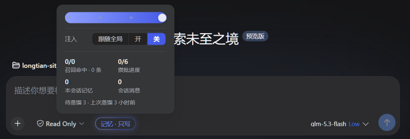
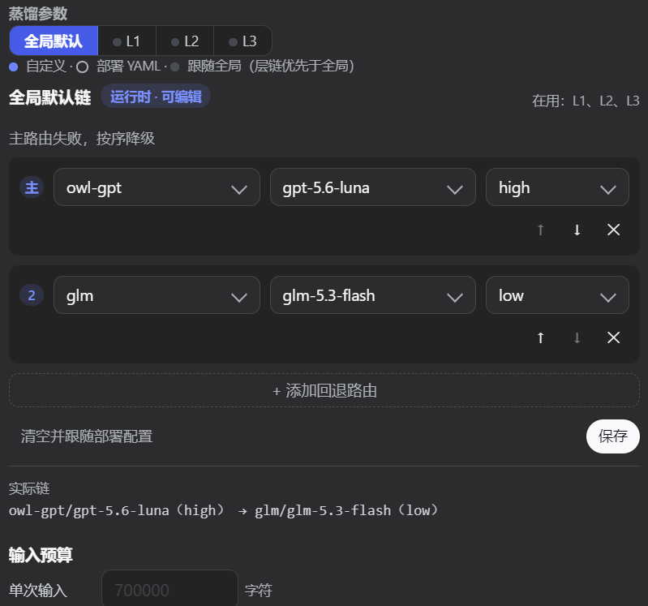
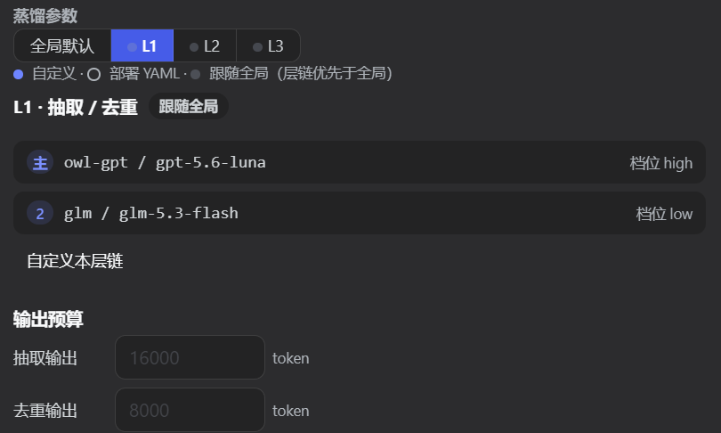
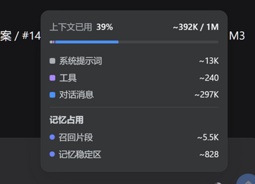

# Журнал изменений (Changelog на русском)

- [更新日志（中文）](./CHANGELOG.md)
- [Changelog (English)](./CHANGELOG.en.md)
- [日本語 changelog](./CHANGELOG.ja.md)
- [한국어 changelog](./CHANGELOG.ko.md)
- [Changelog на русском](./CHANGELOG.ru.md)
- [Changelog en français](./CHANGELOG.fr.md)
- [Changelog auf Deutsch](./CHANGELOG.de.md)
- [Changelog in italiano](./CHANGELOG.it.md)
- [Changelog en español](./CHANGELOG.es.md)

Этот файл фиксирует существенные изменения dsh-prime-memory (до 0.5.0 носившего имя dsh-memory-plugin). Формат следует [Keep a Changelog](https://keepachangelog.com/ru/1.1.0/),
номера версий подчиняются [семантическому версионированию](https://semver.org/).

> **Соглашение о скриншотах интерфейса**: записи, вносящие изменения в интерфейс, хранят живые скриншоты
> в `assets/changelog/<номер версии>/<двузначный номер>-<краткое описание>.png` и ссылаются на них относительным путём — в журнале сразу видно, как выглядит интерфейс новой версии.

## [0.19.0] — 2026-09-29

### Изменения

- **Адаптация к DSH 0.2.0 (compat/0.2.0)**: peerDependencies и engines.dsh (package.json + dsh.plugin.json) целиком переводятся на `>=0.2.0-rc.1 <0.2.1-0` (замена одним диапазоном; линия 0.1.7 продолжает обслуживаться веткой compat/0.1.7); 9 devDependencies dsh-* точно перебиты 0.1.1-rc.2 → 0.2.0-rc.1, добавлена type-only зависимость `@deepseek-ai/dsh-compaction`. Кодовая адаптация к дрейфу API хоста 0.2.0: событие `agent/session-start` вливается в `agent/created` (слушатели переведены на async ради сериального контракта); чтение событий сессии переходит с `session.events` на `session.snapshotEvents()` (хост объявил устаревшим синхронное полное чтение, цепочка деградации сохранена); тестовые заглушки обновлены (семантика смещения курсора проекции).
- **Метаданные релиза**: версия 0.18.4 → 0.19.0; publishConfig.tag `dsh-0.1.7` → `dsh-0.2.0`; dsh.plugin.json version → `0.19.0-dsh0.2.0.1`.

## [0.18.4] — 2026-09-28

### Добавлено

- **Восстановление после сбоя (§A)**: при падении хоста посреди хода этот ход беседы прежде навсегда терялся вместе с буфером захвата в памяти (холодный полог resume выбрасывал всю историю). Теперь при resume плагин сверяется с персистентным журналом событий хоста: максимальный уже записанный в L0 ход служит водяным знаком, за ним дозабираются полные последующие ходы (потолок — 2 хода; хода-сироты после сбоя хост закрывает записью `turn/end{reason:'interrupted'}` — на этой машине найдено 98 таких). Идемпотентность = водяной знак + проверка существования по каждому ходу; при недоступности служб чтения хоста — ступенчатая деградация (`sessionQuery.readSession` → `sessionPersistence.readFrom` → сохранение прежнего поведения + разовое уведомление), всюду fail-open и без блокировки запуска сессии.
- **Обезличивание полезной нагрузки (§C, `capture.redactSecrets`, включено по умолчанию)**: на границе записи захвата 8 классов секретов (ключи PEM / заголовки Authorization / Bearer и JWT / Cookie / формы вендорских API-ключей / почта / длинные номера ≥ 9 цифр без дат / ID высокой энтропии) заменяются типизированными плейсхолдерами `[REDACTED:<KIND>]` — единая точка прохода покрывает JSONL L0, SQLite L0, входы дистилляции и ручную запись `memory_add`/`memory_import` (обе границы записи L1 пользуются одним словарём). Безопасные значения (`example` / `$VAR` / `${{…}}` и т. п.) не обезличиваются; плейсхолдеры сохраняют семантику категории и остаются досягаемыми для поиска. Внимание: после включения исходный текст L0 навсегда изменён (реконструкция его не вернёт); `false` одним касанием возвращает открытый текст.
- **Анти-инъекция в промптах дистилляции (§B)**: все шесть промптов дистилляции (извлечение L1 ×3 / дедупликация L1 ×3 / сцена L2 ×2 / профиль L3 ×2 / проекция графа / сверщик) несут общую декларацию «граница содержимого (анти-инъекция)» и разграничение слотов данных — текст беседы, существующий пул воспоминаний, полные тексты сцен и прочее, вложенное в промпты, есть данные, а не инструкции, чтобы инструкционно выглядящий текст из беседы больше не мог перехватить дистилляцию, дедупликацию и разбирательство. Словари решений и контракты вывода не изменились ни на бит.

### Улучшения

- **Квитанция о внедрении (§D)**: внедрение припоминания больше не помечается как увиденное в момент возврата; переход к двухфазной схеме «pending → квитанция из журнала» — `dedupe.mark` происходит лишь тогда, когда хост действительно пишет сообщение внедрения в журнал сессии (`user/message` с подписью `plugin:memory` и стабильным id). Затёртые или отменённые внедрения больше не подавляют память ошибочно (на следующем туре можно внедрить снова); без квитанции в течение 5 минут происходит откат к обычной пометке (чтобы отказ цепочки подтверждения не сломал дедупликацию), неподтверждённое отбрасывается.
- **Точное повторное внедрение после сжатия (§E)**: после `compaction/end` (без ошибки) следующий ход сессии совершает усиленный направленный поиск — обходится подавление дедупликацией (сжатие уже выбросило старые внедрения из контекста), профиль внедряется немедленно, регистр занятости обнуляется; потребил — стёр. Прежний полный сброс уровня сессии при compact/clear сохранён как запасной путь; оба пути идемпотентны.
- **Структурированный трейсинг (§F, `trace.*`)**: события припоминания и дистилляции пишутся в ежедневный JSONL (`<dataDir>/trace/`, хранение по умолчанию 14 дней, остановка записи при 5 МБ/день + маркер). Событие припоминания содержит отпечаток запроса (по умолчанию только метаданные: длина + sha256, `trace.captureContent` сохраняет оригинал ≤ 200 символов), id попаданий/внедрений, оценки, длительности и четыре исхода (injected/suppressed/timeout/off); событие дистилляции содержит runId, агрегат решений по шести значениям (тот же источник, что у `l1_receipts`, доступен перекрёстный аудит), длительности и исход. Новый эндпоинт `dsh-memory/trace-tail`; вкладка «Журналы» страницы настроек получает переключение между тремя источниками данных: системный журнал / трассировка припоминания / трассировка дистилляции.

## [0.18.2] — 2026-09-27

### Исправления

- **Адаптация к подписи формата сессии v4 (хост ≥ 0.1.7-rc.1)**: оба внедрения припоминания памяти (`hooks/recall.ts` для межсессионного припоминания, `hooks/slot-recall.ts` для постоянной инъекции слотов) больше не используют старую подпись `source: { kind: 'plugin', plugin: 'memory', form: 'recall' }`, которую хост v4 отвергает (она вызывала `SessionFormatError` и провал целого хода — источник «ошибок при вызове памяти»); переход на producer-owned подпись `{ kind: 'plugin:memory', form: 'recall' }`. `form`, содержимое и время внедрений не меняются. Доказательная база: `source()` из `@deepseek-ai/dsh-session-format-v3-to-v4@0.1.7-rc.2` проверяет лишь, что kind непуст и ≠ `'plugin'`, не проверяя сопутствующие поля.
- **Совместимость с двойной формой на стороне чтения**: критерий подписи `isOwnRecallSource`, используемый для оценки доли припоминания, принимает и новую подпись, и старые строки v3 — правка только стороны записи заставила бы «долю припоминания памяти» на панели занятости молча обнулиться (без исключений, без ошибок). `MessageSourceMap` регистрирует `plugin:memory` через module augmentation (map у dsh-llm 0.1.7 — `user|model|tool|'system-prompt'`, без универсального приёма plugin, расширяемая по producer через merge).
- **Нативная адаптация к tool-result v4 (N1)**: чтение доказательных текстов в `store/evidence-source.ts` получает нативную ветку (сообщения первого класса `role:'tool'` в v4: content прямо из блоков text/reasoning, `isError` на верхнем уровне сообщения; `assertBlock` хоста жёстко отвергает старые блоки-обёртки `tool-result`), старый путь спуска по блокам сохранён как историческая совместимость — иначе доказательные тексты под v4 молча навсегда остались бы пустыми. Охрана `isError` в `projection/slots.ts` синхронно переходит на нативную.

## [Не выпущено]

### Добавлено

- **Активные слоты (Active Slot) — вынести «правила, которые должны работать каждый ход» из семантического припоминания и превратить их в постоянный контекст, длящийся от сессии к сессии.** Поводом стал настоящий сбой: общее правило работы с сетью (загрузка на сервер — через официальный, скачивание — через зеркало) было записано в память, но на следующем ходу **не было припомнено**, и старая дурная привычка продолжала действовать. Семантическое припоминание вероятностно, а именно таким правилам нужен детерминизм — потому для них выделен механический коридор.
  - **Хранение**: `<dataDir>/slots.json`, отдельно от `state.json` (слоты — частые мелкие правки; нельзя тянуть атомарную запись чекпойнта в их ритм), с переиспользованием `atomicWriteJson` из `util/io.ts`; в памяти меняется только на месте, `list()/open()/alwaysOn()` всегда возвращают копии (урок живых ссылок из `StateStore.reset()`).
  - **Тройка инструментов**: `memory_slot_write` / `memory_slot_list` / `memory_slot_close`. Запись и закрытие подчинены барьеру высоких привилегий `live.memoryMutate` (по умолчанию выключен) — смена состояния есть строгая защита; чтение подчинено гейтингу по режиму сессии, той же семантике, что у `memory_search`. Новый регистратор живёт в собственном файле, ноль вторжений в `tools/index.ts` (1156 строк).
  - **Постоянное внедрение**: `hooks/slot-recall.ts` регистрирует собственный `agent/pre-step` (prepend каскадом), сочетается с существующим `recall.ts` (порядок двух внедрений прибит тестами). Слоты `pinned && open` сортируются по priority по убыванию и усекаются под байтовый бюджет; сверх — явно указывается `… и ещё N` и показывается путь к поиску — **обрезка никогда не молчит**. `validUntil` переводится в `expired` механической сверкой перед внедрением (чистое сравнение отметок времени, без всякого LLM), иначе «срок годности» был бы лишь украшением.
  - **Серверная проекция `memorySlots`**: регистрируется через `ctx.inject(['sessionProjections'])` — если хост не имеет этой службы, **от регистрации молча отказываются** вместо того, чтобы обрушить загрузку всей строки профиля. Замыкание `apply` держит `SlotStore` и судит о грязи по `revision()`: **пересобирается только на `tool/result` (settled, без ошибки) и при изменившейся ревизии** (`tool/call` коммитит до изменения store в `execute()` — фальд по call прочёл бы устаревшее); нерелевантные события возвращают **ту же ссылку**; `view` держит стабильность ссылок через `WeakMap` и **не содержит body** (суждение и порождение ортогональны, текст добирается по запросу). В этом ходе нет ни строчки клиентского кода: показ остаётся на следующий брифинг.
  - **Схема без новой зависимости**: `stateSchema` / `viewSchema` сами реализуют `parse` (runtime реестра вызывает только этот метод); корректное состояние **возвращается как есть, той же ссылкой**, некорректное бросает; zod не привлекается (`package.json` и lockfile вне списка разрешённых изменений этого хода).
  - Ограничения: ≤ 8 слотов (настраивается) / постоянное ≤ 2048 байт / body ≤ 512 / заголовок ≤ 60.
- **Якоря происхождения (R7) — воспоминания теперь возвращают свою **настоящую позицию** в сессии.** До этого цепочка прослеживания была порвана: L1 несла `source_message_ids`, но это были **id сообщений L0** (`msg_<epoch_ms>_<hex>`), а у таблицы L0 не было колонок `turn`/`step`; к тому же этот список id **вообще не записывался в поисковую базу** (сторона записи брала только `metadata`, поле молча терялось). Результат: **ни одно воспоминание нельзя было локализовать на оригинале**.
  - `l0_conversations` получает колонки `turn`/`step` (идемпотентный `ALTER TABLE`; старые строки остаются NULL = нет якоря, **никогда не додумывать задним числом**), плюс индекс `(session_id, turn)`.
  - Сторона захвата получает fold `step/start`: `user/message` **не несёт** `step` в полезной нагрузке ядра, он выводится из `step/start` того же хода; `assistant/message` берёт `{turn, step}` от события. **Сообщения до первого `step/start` оставляют step пустым** — где нет координат, там их не выдумывают, это красная линия.
  - Якорь живёт в зарезервированном ключе `dsh_source_anchors` в `metadata_json` (в UI показывается как `t12 s3`). Колонок не добавлено, дисковый контракт не тронут. **Оба пути записи — создание и «слияние/обновление» — несут якорь** — иначе одно слияние хватило бы, чтобы потерять координаты, а слияние — самое частое действие в длинных сессиях.
  - Новая читающая интерфейс хоста `MemoryDb.l0ByAnchor(sessionId, turn, step?)`: брать сообщения L0 **по координатам** (а не по времени); это единственный вход для будущего «читателя доказательств».
- **Панель записей показывает якорь происхождения** (до сих пор эта строка показывала только «-»).
- **Читатель доказательств (R1) — вернуть якорям оригинальный текст сессии.** Оригинальный текст идёт через **`ctx.sessionQuery` ядра** напрямую (`readSession` / `listEvents`), не ожидая HTTP-эндпоинта внешнего плагина индексации: этот плагин — плагин хоста, у него `ctx` уже в руках, что экономит границу процесса и точку отказа. В этом ходе сдаётся **слой чистых функций** (сборка и реальные вызовы на машине: следующие записи).
  - **Обе формы id сессии пробуются**: в индексе встречаются `session_id` с префиксом `session-` и чистым uuid; пробовать только одну — **молча пропустить 124 сессии** (без ошибок — их просто никогда не найти).
  - `foldEventAnchors` на стороне чтения пользуется **тем же самым правилом fold, что и сторона захвата**, гарантируя, что записанные и прочитанные координаты говорят на одной семантике.
  - **Верная проекция**: без `stripCodeBlocks`, без обрезки по длине, без отбора «стоит ли помнить» — **захват может бросить что-то ради экономии токенов, сбор доказательств — нет**. Единственный сохранённый фильтр: «внедрённый плагином контекст не считается словом пользователя».
  - **Классифицируемые отказы** (ядро этой записи): `no-service` / `no-anchor` / `session-unreadable` / `anchor-not-found` / `timeout` / `error`. Различие первых четырёх обязательно — принимать «не читается» за «никогда не говорили» значило бы системно ошибаться с памятью архивных сессий.

- **Уход воспоминаний (мягкое удаление) и замкнутый цикл очистки: удалить больше не значит потерять данные.** Раньше «удалить» означало **физическое удаление** — после ошибки оставалось лишь вручную вылавливать из источников фактов `records/*.jsonl`. Теперь у удаления две ступени, **обратимая — по умолчанию**, необратимую нужно запросить явно, и она приносит с собой свой экспорт.
  - **Уход (мягкое удаление)**: строка главной таблицы сохраняется + `valid_to` закрывается + пишется маркер замещения (зарезервированный ключ `dsh_superseded` в `metadata`, с моментом / причиной / вердиктом / id конфликтной пары); снимаются только строки `l1_fts` и `l1_vec`. **SQL поисковой стороны не сдвинулся ни на слово** — ноль дрейфа запросов. Три пути ухода (проигрыш в разбирательстве / замещение дедупликацией `update`·`merge` / ручное удаление) **пользуются одним примитивом**, иначе рано или поздно возникла бы несогласованность «какой-то путь ещё жёстко удаляет» — несогласованность, которая вскрылась бы только в момент промаха.
  - **Эндпоинты 33 → 38**: `records-retired` (список ушедших) / `records-restore` (возврат) / `cleanup-retired` (физическая очистка) / `snapshots-list` (список снимков) / `snapshot-restore` (возврат из снимка). Три списка (таблица соответствий в `contract.ts` / белый список `MEMORY_ENDPOINTS` в `stats.ts` / распределительный `case`) и общее число эндпоинтов в assertion обновляются синхронно — пропусти любую из четырёх правок, и эндпоинт вечно отвечает 404, а `catch` клиентского `rpc` молча глотает исключение, и панель исчезает целиком.
  - **`memory_delete` по умолчанию уводит только 1 запись** (прежде 3) и получает **точный** путь через `ids` (в обход семантического поиска). Прежняя реализация удаляла партиями по семантическому top-N и на практике **ошибочно удалила две посторонние настоящие памяти** — точность удаления должна гарантироваться точным ID, а не похожестью.
  - **Физическая очистка по умолчанию идёт вхолостую**: без `dryRun` считается `true`. Даже при явном запуске сначала снимается **полный снимок** базы и **проверяется по хешу содержимого**; при расхождении — стоп, ни одна запись не удаляется. Для этого `deleteL1Batch` сведён к **единственному вызывающему** (`exportThenPurge`) и прибит тестом-стражем исходников — «не существует пути физического удаления в обход экспорта» становится структурным фактом, а не обещанием.
  - **Обратный билет добавлен**: `restoreL1Snapshot` до сих пор **вызывался только тестами** — принцип «сперва экспорт, потом очистка» выполнялся наполовину: экспорт был, выхода возврата не было; в аварийном случае оставалось лишь вручную разбирать `l1-records.json`. Теперь приходят `snapshots-list` / `snapshot-restore`: принимают только **имена каталогов** снимков (пути и `..` отвергаются), по умолчанию ходят вхолостую и честно сообщают `stillRetired`. Эта запись необходима: очистка чистит только **уже ушедшие** записи, а снимок снимается **до** удаления — потому всё найденное несёт маркер ухода — **вернулся в главную таблицу ≠ вернулся в припоминание**; без этой оговорки восстановление кажется завершённым. Для настоящего отката за один шаг: `unretire: true` (переиспользует существующий `restore`, без нового пути записи).
  - **Панель**: страница записей получает раздел «Ушедшие (восстановимые)» (по умолчанию свёрнут, загружается только при раскрытии — не должен тормозить обычный просмотр); текст подтверждения удаления теперь явно говорит «восстановимо». **У физической очистки сознательно нет входа на панели** — необратимое действие остаётся только на RPC / модельном пути.
- **§C Заморозка противоречий: теперь замораживаются и противоречия внутри одного лота (устранено «собственное решение модели отбивалось у двери»).** Судебное расследование обнаружило, что пункт ③ `validateConflictPair` жёстко требовал, чтобы «противоположная сторона была известной записью из пула кандидатов», но id новых воспоминаний того же лота там нет (они родились в этом туре и ещё не вошли в базу). Так в самом типичном случае «машина не в силах решить» — две новые памяти одного хода противоречат друг другу — даже корректно эмитированное моделью `conflict` неизбежно отбрасывалось на `store`. Доказательство: модель эмитирует в 7/7 случаев, но этот прыжок так и не достигал базы (`conflict_pending` — 0 строк с создания, `l1_receipts` — 0 квитанций `conflict`, рядом `store 381 / merge 204 / update 172 / skip 7`). Средство: `validateConflictPair` получает опциональный `batchIds` (отсутствует = старое поведение), с сохранением требования «ровно одна сторона — текущая память» ради уникальности пары; и перила для полной очереди — **если проигравший принадлежит новым памятям хода, автоматического закрытия не происходит**; иначе только что извлечённая продукция тут же уходила бы со сцены, никого не известив: тогда не парковать и обычная запись в базу продолжается.

- **§C Заморозка противоречий теперь понимает «три оси времени» — противоречие содержимого с временной последовательностью больше не безусловно отправляется человеку.** Запись памяти изначально несёт три несменяемые временные оси (момент записи `createdAt/updatedAt`, фактическая действительность `validFrom/validTo`, длительность `persistence`), но детектор конфликтов пользовался лишь моментом записи: вынося `conflict`, детектор не видел ни действительности, ни длительности и часто принимал за человеческий случай «старый факт, вытесненный новым»; и панель разбирательства показывала лишь тексты сторон, без сравнения действительности — слепое суждение. Этот ход подключает три оси к обоим концам заморозки:
  - **Сторона обнаружения**: объединённый пул кандидатов передаёт детектору, **когда заморозка включена**, `valid_from_ms` / `valid_to_ms` / `persistence` каждой памяти; в оговорку действия `conflict` добавляется «вспомогательное суждение по трём осям» — при противоречии содержимого сначала сравнить действительность/длительность; если одна сторона уже истекла или заметно позже, направлять к `update`/`merge` вместо `conflict`. **Все три ключа и оговорка под гейтингом `conflictFreeze`**: в выключенном состоянии user-промпт **байт в байт совпадает** с прежним (см. «Исправления» ниже и [ADR-0012](./docs/adr/0012-conflict-3axis-advisory-time-axes.md)).
  - **Сторона разбирательства**: `ConflictPairView` получает опциональные поля осей `winner_*` / `loser_*` (обратно совместимые); в список к разбирательству и в рендер к каждой паре добавляется сравнение «действительность от/до, длительность», чтобы одним взглядом видеть, кто новее, кто уже истёк.
  - Машина **по-прежнему не решает сама**: три оси — лишь опорные факты; итоговый вывод по-прежнему пишет человек (или предохранительный клапан: таймаут / полная очередь) — значения `ConflictResolution` не меняются.

- **§C Три класса конфликтов + группировка по claim + след отброшенного (Phase 3-4).** Конфликт больше не сводится к одной «жёсткой противоречивости» — LLM может теперь определить `hard` (взаимоисключающие факты), `conditional` (противоречие лишь при иных предпосылках), `supersession` (новое заменяет старое). Панель показывает по сегментам трёх классов, каждый со своей шапкой и пояснением; кнопка `defer` позволяет «увидено, но не решено» (сбрасывает таймаут, копит повторные просмотры). Колонка `claim_key` позволяет пометить несколько конфликтных пар на одну тему, панель группирует по ней. Незаконные отброшенные конфликтные решения можно запросить инструментом `memory_conflicts_rejected` и эндпоинтом `dsh-memory/conflicts-rejected`.
  - `conflict_pending` получает две колонки `conflict_type` / `claim_key` (идемпотентная миграция `ALTER TABLE`).
  - Счёт квоты учитывает только `hard`: `pendingHardTotal` фильтрует по типу; `conditional` / `supersession` квоту не тратят.
  - Заморозка хеша проекции: 7-полевая проекция колонок `projectConflictsForHash` не включает новые колонки, проверка существующих снимков не меняется.
  - Панель: `ConflictsTab` с сегментацией по трём классам + кнопка defer + тексты трёх осей + счётчик повторных просмотров + показ ключа claim.

### Исправления

- **В выключенном состоянии в промпт тайком просачивались три поля осей (затронуты deployment с настройками по умолчанию).** Первая версия безусловно вливала `valid_from_ms` / `valid_to_ms` / `persistence` в пул кандидатов, тогда как тот LLM-вызов читал переключатель только для system-промпта ⇒ при `conflictFreeze=false` (умолчание deployment) модель видела на каждого кандидата 3 лишних ключа **без единой поясняющей оговорки**: потраченные токены и изменённый вход. Теперь три ключа под гейтингом `conflictFreeze`, в выключенном состоянии user-промпт **байт в байт совпадает** с прежним; заодно критерий поднимается с «не содержит такую подстроку» до **golden-якоря sha1 + обратной проверки** (сломай гейтинг — тест обязан покраснеть).
- **Панель говорила «заморозка противоречий не включена», хотя переключатель явно был включён.** Эндпоинты `conflicts` / `conflict-resolve` читали **статическую конфигурацию развёртывания** `cfg.conflictFreeze.enabled`, тогда как панель писала в **настройки времени выполнения** (live). Умолчание deployment — всегда `false`: переключатель был включён, в `settings.yaml` стояло `true`, а страница продолжала докладывать о выключенном состоянии. Переход на `effectiveCfg(cfg, live)` — та же разрешалка, что у пайплайна дедупликации; у переключателя лишь **одна** источник истины, читатель и писатель обязаны смотреть одно состояние, иначе выходит «список говорит «включено», разбирательство говорит «выключено»», взаимоисключающие показания.
- **`dsh-memory/embedding-reindex` объявлен, но вечно отвечает 404.** Эндпоинт был в контракте, но отсутствовал одновременно в белом списке `MEMORY_ENDPOINTS` и в распределительном `case`; тем временем `startReindex()` был **мёртвым кодом** — блок «векторный индекс» страницы настроек предлагал поэтому только «Отмену», но не «Запуск». Белый список + `case` + тест добавлены.
- **`UiRecord.sourceMessageIds` было мёртвым полем.** Оно читало из `l1_records` **несуществующую колонку**, всегда откатываясь к `[]`, и строка происхождения на панели **никогда не рисовалась**. Заменено на `sourceAnchors`, читающее настоящие данные.

## [0.17.0-dsh0.1.7.1] — 2026-09-25

> Первый выпуск линии совместимости с хостом **0.1.7** (dist-tag `dsh-0.1.7`, на базе main @ 85d9b05). **Только для хостов ≥ 0.1.7-rc.1**;
> хостам 0.1.5 / 0.1.6 следует продолжать пользоваться линией версий тега `dsh-0.1.5`. Содержимое = полный main + следующая адаптация.

### Изменения

- **Рантайм-переключатели переезжают в volatile-секцию Config (декларативная поверхность настроек 0.1.7).** Хост 0.1.7 удалил обе генерации императивных API регистрации (`settings.register` / `installSection`); рантайм-переключатели (общий/захват/дистилляция/припоминание, цепочки маршрутов дистилляции, переопределения удалённого эмбеддинга, заслон записи-удаления — 20 ключей) теперь несёт целая секция `.volatile()` на `memorySchema.live`: хост автоматически проецирует volatile-поля в форму настроек, а рантайм-изменения идут через `ctx.settings.update` → configEditor → patch профиля → volatile-only коммит загрузчика (без пересборки плагина). Контракт `LiveSettingsHandle` не меняется, RPC и все потребители не трогаются. **Своя страница настроек на борту → автогенерируемая форма хоста выключена** (`suppressAutoSettingsForm`).
- **⚠️ Старые значения настроек не мигрируют автоматически**: секция `dsh-memory` старого `settings.yaml` держала плоские ключи верхнего уровня, не соответствующие новым путям `live.*` (и её логический `conflictFreeze` сталкивается с одноимённой объектной секцией нового Config), поэтому импортёр хоста отвергает секцию целиком. После обновления перепишите старые значения вручную в patch профиля как `- id: dsh-memory / config: { live: {…} }` (имена ключей в точности как в старом namespace, только на уровень `live.` глубже).
- devDeps подняты до стека 0.1.7 (cordis 4.0.4 / schemastery 3.18.4 / cordis-plugin-loader 1.0.5), потребителям не отгружаются.

### Исправления

- **Регрессия молчаливой потери первой записи**: файлы блокировки создавались до записи; если родительский каталог цели ещё не существовал, `open('wx')` падал с ENOENT, и хранилища глотали это как warn → первая запись терялась молча. `rmwJson` теперь делает `ensureDir` до взятия блокировки (включено вместе с исправлениями линии main).
- Содержит также всё линии main: укрепление файлового слоя (атомарные записи / классификация при чтении / fail-closed по версии / файловые блокировки / безопасность путей — см. записи [0.16.1] и Не выпущено).

## [0.16.1] — 2026-09-24

### Добавлено

- **«Сито ушедших» на панели записей**: записи с мягким удалением по замыслу не прячутся (они восстановимы), но вперемешку с активными их было трудно различить — ряд инструментов списка получает теперь трёхпозиционный фильтр «**Все / только активные / только ушедшие**». Бэкендовый `listL1` получает тот же трёхпозиционный фильтр, тот же критерий (по умолчанию всё; снимки/реконструкция не тронуты; критерий `retired:true` и критерий `listRetiredL1` — один и тот же, обе проекции показывают одни и те же строки); контракт `ListRecordsRequest.retired?: boolean`. Сито действует только на пути просмотра — поиск по ключевым словам покрывает лишь поисковую поверхность, где ушедших записей и так нет. «Загрузить ещё» и автообновление после удаления/возврата сохраняют текущее состояние сита.

### Исправления

- **После подтверждения «удалить память» панель словно игнорировала запрос — состояние ухода не доходило до UI.** Мягкое удаление (retire) всё время нормально работало на сервере (`valid_to` закрыт + выведен из поисковой поверхности + восстановим), но по замыслу активный список **сохраняет** ушедшие записи (тест `l1-retire` прибивает «путь просмотра панели не прячет ушедшие записи»), тогда как в контракте `UiRecord` вообще не было поля «уже ушёл», строки активного списка не имели никакого визуального отличия, а раздел «ушедшие» был по умолчанию свёрнут — после подтверждения пользователь видел **абсолютно идентичную запись** и естественно заключал, что «удаление не подействовало».
  - В контракт добавляются `UiRecord.retired` / `retiredReason`: выводятся через `hitToUiRecord` из `valid_to` + маркера замещения, единообразно передаются и активным списком, и результатами поиска.
  - Активный список рисует ушедшие записи с **бейджем «ушедшее · причина» + полностью посеревшей картой**, а встроенная кнопка меняется с «✕ Удалить» на «Восстановить» (через `records-restore`, с автообновлением после успеха) — в момент удаления интерфейс сразу меняется, и путаница второго клика (идемпотентный no-op) исчезает.
  - Новый `tests/ui-retired-flag.test.ts`, прибивающий маппинг (активное / уведённое вручную / уведённое замещением / форма без `validTo`).

## [0.16.0] — 2026-09-24

### Исправления

- **Вся цепочка маркировки Wing при перекалибровке / однокнопочном заполнении была нерабочей**: промпт требовал от модели вернуть `{"id":…,"wing":…}`, а парсер читал `item.hall` → никогда ничего не доставал → весь лот молча выбрасывался **(на практике: `wingLabeled=0 / tagged=0 / llmSkipped=60`, тогда как лог показывал успешный LLM)**. Это **3-й сопутствующий удар той же породы** от переименования hall→Wing (первые два: `cfg.hall`, `hall` в session-modes) — имена JSON-полей в промпте принадлежат **проводному протоколу** и не должны следовать за переименованиями надписей UI. Парсер теперь читает `wing` с валидацией по перечислению; **всякий отброс обязан оставлять след в журнале** (по warn на непарность id и по warn на недопустимое значение), а мёртвый никогда не срабатывающий `catch` удаляется.
- **`embedding-state-get` спускается с 2,5–3,1 с до миллисекунд.** Он при каждом вызове гонял 6 COUNT на месте, два из которых в форме `l1_records LEFT JOIN l1_vec … IS NULL` — `l1_vec` это **виртуальная таблица vec0 (1024 измерения)**, которая при обычных предикатах вырождается в построчное прощупывание. Заменено вычитанием «всего − уже вложено − skip» (замер: L1 55 мс → 0 мс, L0 371 мс → 3 мс), плюс **тиражированный TTL-кэш** (при работе 1 с / в покое 30 с + явная инвалидация по завершении реконструкции/переключения/дозаполнения).
- **Механическая часть перекалибровки больше не грузит всё одним куском** через `l1.all()`. Переход на курсорную пагинацию + только колонки `id/type/metadata` (`getAllL1Lite`), с уступкой руки после каждых 200 записей; обратная запись идёт через `patchL1Metadata` (**только metadata, никогда не текст**, прибито тестом).

### Добавлено

- **Слой Room: саморастущая классификация по меткам**. В пяти слоях MemPalace Room стоит под Wing/когнитивными hall и **динамически выводится** из `metadata.tags` (агрегат `json_each`, ноль схем, ноль реестра) — как только новая метка попадает в базу, она становится новым Room. Новый эндпоинт `rooms-get` и блок классификации Room на панели записей (клик фильтрует по метке; `list-records` получает канал фильтрации по `tag`). На этой машине насчитано **78 Room** (агрегат за 2 мс).
- **Общий модуль валидации `src/metadata-validators.ts`**: `isWingId` / `isCognitiveHall` / `isTag` / `normTags` сведены в одном месте. Прежде сторона Wing была **полностью без валидации** (любая непустая строка могла записаться в `metadata.hall`), тогда как у когнитивных hall был строгий `isCognitiveHall()` — эта асимметрия перечислений была дырой в целостности данных.
- **Изоляция воркера фоновой обработки (узкая вырезка B)**: выделяется граница `MemoryBackend`, доступы SQLite фоновой пакетной обработки (руминация/заполнение/перекалибровка) переезжают в `worker_threads` и больше не занимают главную event loop хоста; если воркер не поднялся — автоматический откат в процесс с warn (**провал изоляции никогда не должен обесценить фоновую обработку**). Горячие пути (припоминание/захват) не сдвинулись ни на строку — они опрашивают базу на каждом ходу, потоковость заставила бы их платить за IPC.
- **Прогресс партий различается по сегментам**: механический осмотр / досыпание Wing / выжимание меток получают каждый свой label и свой прогресс партии (прежде `sub` имел значение только на LLM-фазе; во время 1439 обратных записей механической фазы панель оставалась совершенно пустой).

### Изменения

- Обратная запись metadata перекалибровки переходит с `l1.upsert` на `patchMetadata`. **Трогать только metadata в принципе не должно было пересчитывать эмбеддинг** — прежде каждая обратная запись записи запускала эмбеддинг, одна перекалибровка могла просадить до 900 вызовов эмбеддинга.

## [0.12.0] — 2026-09-17

### Добавлено

- **Ручная реконструкция векторного индекса (эндпоинт `dsh-memory/embedding-reindex` + блок «векторный индекс» на странице настроек)**. Прежде у реконструкции было лишь два пути: цепочка обнаружения изменений в `db.init` при старте и дозаполнение недостающего периодическим backfill — **у пользователя не было никакого ручного входа**. На странице настроек виднелась только «Отмена» (и то лишь во время идущей реконструкции), не было «Запуска», ни того, сколько уже вложено и сколько не хватает. Теперь закрыто:
  - **Поверхность эндпоинтов 31 → 32**. Новый `EmbeddingReindexStartResponse` (`{accepted:true}`), **ответ при принятии, прогресс сюда не идёт** — клиент по-прежнему опрашивает поле `reindex` у `embedding-state-get`. Две противоречащие друг другу семантики прогресса — это подвешенный инцидент: сознательно оставлена одна. Три списка (таблица соответствий в `contract.ts` / белый список `MEMORY_ENDPOINTS` в `stats.ts` / распределительный `case`) и assertion общего числа эндпоинтов обновляются синхронно; пропусти любую из этих четырёх правок — эндпоинт вечно отвечает 404, а `catch` клиентского `rpc` молча глотает исключение, и панель исчезает целиком.
  - **`EmbeddingStateView` получает `vectors`**: для L1 / L0 по отдельности `embedded` / `total` / `missing` / `skipped`. Отсюда берётся «X вложено / Y всего». **Сентинел `-1` слоя db проходит как есть** — «векторная способность недоступна» и «не вложено ни одной» обязаны быть на поверхности двумя разными фразами; сложив их в одно число, пользователь пойдёт тыкать в кнопку, которая никогда не отзовётся.

### Исправления

- **Отвергать запросы реконструкции, «которые приняты, но никогда не побегут»**. Первая строка `L1Store.reindex` / `L0Store.reindex` **молча коротко замыкалась** на `0/0/0`, когда векторная способность не была готова. Без порога на входе UI показал бы «реконструкция завершена, досыпать ноль» — тогда как на деле **ничего не начиналось**. Эта ловушка была закомментирована ещё в `src/index.ts:240`, но та покрывала лишь стартовую цепочку; ручной вход был свежей брешью. `startReindex()` теперь выносит все пять порогов вперёд, каждый с **действенным** текстом: плагин не установлен / реконструкция уже идёт / занята переключение источника эмбеддингов / **источник эмбеддингов выключен** (`currentInfo` пуст) / **служба эмбеддингов не готова** («сначала включить» и «ещё подождать» — два разных предложения, их нельзя слить в одно). Для этого обоим store выдаётся аксессор `vectorsReady()` — `helper` приватный, извне никто не мог спросить.
- **Заглушка `db` в `embedding-subsystem.test.ts` была неполной.** У неё были только `swapProvider` / `markEmbeddingSynced`, и она обходила проверку типов через `as never`, потому её никогда не ловили; стоило `snapshot()` начать прикладывать векторные счётчики, она взорвалась (`getVecSkipSet is not a function`). **Догрузить заглушку, а не делать `vectorCounts` защитным**: типовая подпись объявляет полный `MemoryDb`; проглатывать отсутствующие методы — значит прятать и настоящие ошибки подключения.

### Тесты

- 5 новых случаев: отказ в выключенном состоянии / отказ при неготовности / принятие и прогон L1+L0 с немедленным отказом второму параллельному запросу / отказ после деинсталляции / критерии счёта `snapshot`. **Каждый путь отказа утверждает и «бросок», и «количество вызовов вниз по течению — ноль»** — утверждай только бросок, и реализация, которая «сначала вызывает вниз по течению, потом бросает», всё равно пройдёт.
- **Контрдоказательство**: после временного снятия охраны готовности `векторная способность не готова → отказ, не лгать «принято»` действительно краснеет (`expected [Function] to throw an error`), после восстановления снова зеленеет.
- Всего **39 файлов / 403 случая** зелёные; `typecheck` (три tsconfig), `build`, `smoke` тоже зелёные.

## [0.11.0] — 2026-09-13

### Совместимость (адаптировано по документации фреймворка плагинов DSH)

- **Многоверсионная совместимость регистрации настроек (0.1.1-rc.2 ~ 0.1.5-rc.2)**. `src/settings.ts` **импортировал как значение** `settingsNamespace()` из `@deepseek-ai/dsh-settings` — символ, удалённый с v0.1.3+, так что на хосте 0.1.3+ уже загрузка модуля бросала `Failed to load plugins` и утаскивала за собой весь дерево плагинов. Теперь:
  - namespace становится строковым литералом `'dsh-memory'` (браузерная половина смотрит только на сырую строку, между старыми и новыми хостами эквивалентно); остаётся только импорт типов (стирается при компиляции, ноль риска при загрузке);
  - регистрация идёт по трём рантайм-веткам: приоритет у `settings.register()` (есть во всех целевых версиях, возвращает scope get/watch/update, live-переключатели и записи UI идут через него); запасной мост `settings.installSection()` (сервисная поверхность v0.1.2+, только если register отсутствует; рантайм-запись явно бросает бизнес-ошибку); если нет ни того, ни другого — деградация к всегда включённому — железное правило «отсутствующие настройки никогда не валят хост» остаётся неприкосновенной;
  - `SettingsScope` становится локальным структурным типом, никакой зависимости от экспортов типов пакета.
- **Новый `dsh.plugin.json`** (манифест обнаружения DSH: id / engines.dsh `>=0.1.1-rc.2 <0.2.0-0` / components указывают на `dist/`), выровнен со стандартной файловой структурой `dsh-plugin-template`.
- **`@deepseek-ai/dsh-*` переведены в необязательные peerDependencies с ослабленными диапазонами** (`^0.1.1-rc.2 || ^0.1.2-rc.1 || ^0.1.3-rc.1 || ^0.1.5-rc.2`), `@deepseek-ai/cordis` остаётся обязательной — по требованиям B.3 подачи в awesome-dsh-plugin.
- **Новый `screenshots.json`** (8 снимков, ссылаются на `assets/img/`), карточка подачи может их показывать.

### Изменения

- `package.json` `version` поднимается до 0.11.0; в npm `files` добавляется `dsh.plugin.json` (`screenshots.json`, по конвенции обнаружения awesome-dsh-plugin, живёт только в git-репозитории, в npm-пакет не входит).

### Ожидает проверки вживую

- На v0.1.5-rc.2 семантика слотов `conversation.input.left` / `settings.section` и `session.surface.nodes` Session V3 (оценка занятости) ещё не проверена вживую; см. матрицу совместимости в README.

## [Не выпущено]

> 📘 **Справочник по граблям и правильным направлениям**: грабли, на которые в этом и двух предыдущих ходах наступали на самом деле, и направления, по которым ошибались, системно оседают в
> [`ENGINEERING-NOTES.md`](./ENGINEERING-NOTES.md) (одна страница быстрой сверки + по каждой записи «симптом / первопричина / правильная практика / как проверить»
> + чек-лист проверки перед сдачей). Среди прочего: `nullable`, обрушивающий весь дерево плагинов, незанесённые deps, скрытые запасной веткой,
> дублирующиеся парсеры, обречённые гнить, сторожевой флаг в `finally`, равноценный отсутствию, длинный task без `running`, из-за чего интерфейс без прогресса,
> необязательное поле, мешающее `tsc` поймать неопределённый идентификатор, пустые тестовые данные, маскирующие смертельный дефект, `vitest`, который только транслирует и позволяет договору дрейфовать,
> `spawn EPERM` песочницы (и почему `ESBUILD_BINARY_PATH` не помогает), конвейерный захват PowerShell, сводящий число ошибок `tsc` к нулю,
> BOM/каша символов/сдвиг номеров строк, а также ловушки Git вроде `git amend -m`, опустошающего тело коммита.

### Добавлено

- **§E Сфера хранения `scope` (видимость, ортогональная `family`)**. Раньше все проекты делили одну базу памяти: воспоминания семейства `work`, отложенные проектом A, припоминались и в сессиях проекта B. Новая конфигурация `scope` (`global` по умолчанию / `workspace`), **ортогональная** существующему `family` (типу содержимого) — `family` спрашивает «что это за содержимое», `scope` спрашивает «в каком объёме оно должно быть видимым»; существуют все четыре квадранта. «В режиме `workspace` изолировать семейство `work` по рабочим пространствам, `chat` по умолчанию глобальное» — это **решение о значениях по умолчанию, а не выводное правило** (личные памяти должны переходить между проектами; поверхность загрязнения лежит как раз между проектами).
  - **Ноль дрейфа конструктивен, а не выверен сравнением**: пока `cfg.scope` не `workspace`, объединённый `scopeFilterOf` всегда возвращает `undefined` (= без фильтра); ни одна точка вызова не может случайно передать идентификатор рабочего пространства. Существующие развёртывания (без этого ключа) ведут себя **слово в слово** как до изменения.
  - **Изоляция лежит на том же этаже, что изоляция по семейству**: не только на выходе поиска — **припоминание кандидатов дедупликации** тоже фильтрует. Пул кандидатов решает новые дедупликационные суждения; без фильтра сюда попали бы «невидимые в проекте B, но уже решившие судьбу памятей проекта A» записи — хуже, чем никакого изолятора ([`ADR-0008`](./docs/adr/0008-storage-scope-vs-family.md)). Графовый путь фильтрует на том же этаже по принадлежности **записи-источника**; пути записи (пайплайн извлечения / `memory_add` / `memory_import`) делят один и тот же `resolveRecordScope`.
  - **Идентичность рабочего пространства берёт канонический cwd, а не `WorkspaceId` (uuid) хостового `dsh-workspace`**: тот же канал заголовков, что у `parentSession` из §A, доступен синхронно; заявленный `inject` обрушил бы дерево на хосте без этой службы; собственный критерий членства хоста — «канонический cwd заголовка сессии == путь рабочего пространства»; uuid потребовал бы «зарегистрированного рабочего пространства», а в незарегистрированных каталогах изоляция молча отказывала бы. Известная граница: **символические ссылки не разрешаются**, следствие — переизоляция (в безопасную сторону), а не утечка ([`ADR-0009`](./docs/adr/0009-workspace-identity-source.md)).
  - **Миграция лишь помечает принадлежность, без переезда и удаления**: `l1_records` / `l1_fts` получают по колонкам `scope` + `workspace_id`, существующие данные через `DEFAULT` у `ALTER` прямо помечаются `global` — количество записей, id, content, created_time слово в слово.
  - **В ходе исполнения пойманы два настоящих проблемы**: ① **возвратное заполнение после реконструкции FTS без scope молча сглаживает изоляцию** (если параметры `backfillL1Fts` не сойдутся с insert, их проглотит собственный построчный `catch`; симптом: пустой индекс с `count=0`); ② **отсутствие нормализации формы на стороне записи → память заходит в базу и никогда оттуда не выходит** (поиск передаёт нормализованный строчный путь, запись сохраняет заглавную строку вызывающего как есть — проверка равенства строк может только провалиться). Оба пойманы и починены сквозными тестами и мутационными зондами.
- **§F Векторная колонка узлов графа `graph_node_vec` (фундамент хранения и деградации)**. У графа был только взвешенный лексический счёт, без векторной колонки — **семантически равнозначные, но письменно разные** сущности вроде «глубина облака» и «DeepRobotics» не могли разрешаться друг об друга. Новая виртуальная таблица vec0 **той же схемы**, что `l1_vec` (та же кодировка, то же объявление `float[N] distance_metric=cosine`), чьё измерение **переиспользует** результат обнаружения способностей — без второй трубы.
  - **Деградация переваривается внутри**: без vec0 создание таблицы бросает; поднимись исключение до внешнего `catch` в `GraphStore.init`, граф упал бы с «векторный путь недоступен» до «**вся домена графа недоступна**» — лексический поиск, проекция, разбирательство, всё ушло бы вместе. Поэтому векторная колонка несёт собственный узкий `try/catch`. В выключенных законах интерфейс отвечает no-op, вызывающему не нужно спрашивать бит способности ([`ADR-0011`](./docs/adr/0011-graph-node-vector-storage-and-degradation.md)).
  - **Эта волна сдаёт только ворота, без производителя и потребителя**: пайплайн проекции ещё не подключён для расчёта эмбеддингов. Честно записано как незавершённое — это начало §F, а не его финал.
- **§B Цепочка квитанций решений L1 (инфраструктура прослеживаемости)**. Каждая запись L1 в `memory.db` — **результат решения дедупликации** (store / update / merge / skip), но само решение следов не оставляло — задним числом видно было лишь «результат выглядит так», но не «на чём основывался». Новая таблица `l1_receipts`: каждое решение дедупликации оставляет квитанцию (`run_id` / `record_id` / `kind` / **sha256-дайджест упорядоченной последовательности пула кандидатов** `input_digest` / `decided_at`), вместе с новым инструментом **`memory_receipts`** и RPC-эндпоинтом **`dsh-memory/receipts`** для обратной проследки в двух измерениях, по записи или по лоту (указанные вместе работают как И). Квитанция обязана существовать **до** события — входной снимок **невозможно доложить задним числом**, потому способность выносится заранее, без симптомного триггера ([`ADR-0006`](./docs/adr/0006-l1-decision-receipts.md)).
  - **Три сознательных проектных решения для `input_digest`**: **чувствителен к порядку** (пул упорядочен; «какие кандидаты были видны и в каком порядке» — ровно та входная реальность, которую надо восстановить), **дубликаты не сворачиваются** (дубликаты в пуле — сами по себе факт), **кодирование с префиксом длины** (иначе `['a|b']` и `['a','b']` столкнулись бы — если сериализация не инъективна, дайджест теряет силу отпечатка).
  - **Политика хранения**: прореживание по **числу прогонов** (`RECEIPTS_MAX_RUNS = 1000`) — временное окно **не даёт верхней границы по строкам** (порог не связан со скоростью записи; активный пользователь за 90 дней напишет сколько угодно строк, неограниченный рост лишь **откладывается**); гранулярность прореживания — прогон, а не строка — строчное прореживание резало бы «полуфабрикат лотов» и отвечало на «что решали в том прогоне» выводом **кажущимся полным, но на деле с прорехой**, вред **выше**, чем «не найдено».
  - **Красная линия**: прореживание **трогает только `l1_receipts`, никогда `l1_records`** — первая лишь отбрасываемые наблюдательные данные, вторая — источник фактов пользователя; ради экономии нескольких МБ трогать саму память — превращать оптимизацию ёмкости в потерю данных.
  - **Изоляция отказов**: квитанция — обходная инфраструктура; её сбой записи ограничивается `warn` и **никогда не прерывает дистилляцию L1**.

- **§C Заморозка противоречий (опционально, по умолчанию выключено)**. До сих пор **словарь решений** дедупликации состоял только из `store` / `update` / `merge` / `skip` — «детектор конфликтов» (`CONFLICT_DETECTION_SYSTEM_PROMPT`) обнаруживал противоречие, после чего **LLM сам решал и писал в базу** (`update` на перезапись или `merge` на слияние), **без опции «остановиться и ждать человеческого вердикта»**. С `conflictFreeze.enabled` словарь получает действие `conflict`: когда LLM судит, что «обе стороны похожи на верные и машина не в силах решить», конфликтная пара **паркуется** в очередь `conflict_pending` — **новая память попадает в базу как обычно, содержимое обеих сторон остаётся нетронутым**, а новый инструмент **`memory_resolve_conflict`** (RPC: `dsh-memory/conflict-resolve`) передаёт арбитраж человеку с выводами `winner` / `loser` / `both`.
  - **Заморозка — не «преградить запись», а «не решать автоматически»** — реализуйся она первым способом, она теряла бы информацию, хуже проблемы, которую призвана решить.
  - **Предохранительный клапан**: `maxPending` (предел очереди) / `timeoutDays` (деградация по таймауту). Семантика — «**новые не принимать**», а не «тайно удалять старые»: автоматически закрытые пары **по-прежнему записываются в очередь со следом**, `resolution` помечается `auto` в отличие от человеческих выводов. Без клапана две гарантированные следствия: неограниченный рост очереди; «две противоречащие памяти, всплывающие бок о бок» навсегда в базе.
  - **Сторона графа**: узлы графа, к которым шли источники замороженной записи, помечаются `disputed` (существующее состояние, переиспользуется; оно остаётся в поисковых кандидатах — промежуточное состояние «припоминание как обычно, но видимое»). Маркировка — **производная синхронизация**, а не односторонний штамп — разбирательство **снимает** спор; односторонний штамп оставил бы уже разобранные узлы навсегда на `disputed`, и тогда **производный граф лгал бы**.
  - **Ноль дрейфа**: в выключенном состоянии промпт дедупликации **байт в байт** совпадает с прежним — **конструктивная** гарантия (в выключенном состоянии сразу `return base`), а не ручное сравнение ([`ADR-0010`](./docs/adr/0010-conflict-freeze-default-off-and-timeout.md)).

### Изменения

- **Новые конфигурации** `conflictFreeze.enabled` (по умолчанию выключено) / `conflictFreeze.maxPending` (100) / `conflictFreeze.timeoutDays` (30, `0` = без деградации по таймауту); **новые эндпоинты** `dsh-memory/receipts` и `dsh-memory/conflict-resolve` (поверхность эндпоинтов 26 → 28).
- **`L1ReceiptKind` получает `conflict`**. Расширяя словарь, надо проверить **все места, которые его потребляют** (нормализация квитанций, журналы статистики, тексты рендера, описания схем) — проверено на практике: пропуск регистрации привёл бы к тому, что «модель **явно** сказала, что не может решить» записывалось бы как `skip_missing` (= «модель **не ответила»), тогда как вся аудируемость арбитража §C держится на цепочке квитанций — вывод аудита был бы **ровно противоположен факту** (хуже отсутствия квитанции: отсутствие — «не найдено», ошибка — «найдено, но неверно»).
- **`GraphStore.markSourcesDisputed` (односторонний штамп) → `syncDisputed` (производная синхронизация)**: `active` и источники попали → `disputed`; `disputed` и источники больше не попадают → обратно `active`; надгробия `archived` не трогаются. Пайплайн передаёт **множество записей всех неразобранных пар на текущий момент**, а не только новую пару этого хода.
- **Порядок разбирательства преднамеренный**: сначала ставится `resolved_at`, затем проигравший уводится со сцены — в обратном порядке «запись исчезла, а в очереди всё ещё числится неразобранной» замечаешь только при следующем клике; пометка идёт с `WHERE resolved_at = ''`, **повторное разбирательство не перезаписывает первый вывод**.

### Тесты

- **§B: 5 новых тестовых файлов** (создание таблицы квитанций и дайджест, точки записи и изоляция отказов, политика хранения, двумерные запросы, сквозная обратная проследка), включая **мутационный зонд**: замена прореживаемой таблицы на `l1_records` действительно валит случай красной линии.
- **§C: 7 новых тестовых файлов** (словарь / создание таблицы / переключатель / семантика заморозки / клапан / разбирательство / замкнутый цикл), все по TDD с наблюдением сначала RED. Три **различительных** критерия достойны упоминания: `version===0` (отделяет семантику store от merge/update), сквозной перехват реально отправленного пайплайном промпта (зелёные статические функции **не доказывают**, что пайплайн передаёт переключатель), и мутация ветки `both`, от которой случай действительно краснеет.
- Всего **34 файла / 341 случай**; семишаговая CI-цепочка (`typecheck` / `test` / `lint` / `build` / `build:smoke` / `smoke` / `verify-catalog`) вся зелёная.
- Замкнутый цикл оставлен на бумаге: два настоящих `runExtraction` (заглушка только на транспортном слое LLM) → настоящий эндпоинт разбирательства, сырой JSON архивирован в `evidence/` плановой домены.

### Исправления

- **Нераспознанные действия безмолвно проглатывались запасной веткой.** Цикл применения в `pipeline/l1.ts` явно ветвился только на `store` / `skip`, **всё остальное падало в ветку update/merge**. Решения conflict по замыслу не несут `target_ids`, поэтому `targets=[]` → запись приписывалась как продукт слияния «заменившего 0 записей», и `version` вычислялся как `1`. **Ни ошибки, ни потери — единственный след, число версии** — то есть «conflict молча понижен до merge/update», ровно то поведение, которое §C призван был искоренить. **Средство**: явная ветка `conflict`; при провале валидации или выключенном переключателе — **откат на `store`**, никогда в запасную ветку.
- **Сторож эндпоинтов был ручной копией.** `ENDPOINTS` в `tests/contract-keys.test.ts` — это **переписанная от руки копия** настоящего реестра (`MEMORY_ENDPOINTS` из `src/stats.ts`); его два утверждения были согласованы только внутри этой копии (`ENDPOINTS.length === 26`). Когда §B поднял настоящий реестр до 27 добавлением `dsh-memory/receipts`, копия **не последовала**, а счётное утверждение осталось на 26 — и «утверждение сходится с копией, копия не сходится с фактами» прошло **весь путь зелёным**; после добавления на этот раз `conflict-resolve` — **опять полностью зелёным**. Сторож проверял собственную тень: с каким бы тестируемым системой ни менять, он никогда не покраснеет. **Средство**: новое утверждение `expect([...ENDPOINTS].sort()).toEqual([...MEMORY_ENDPOINTS].sort())` — локальный список обязан совпадать **позиция за позицией** с единственным источником истины; счётное утверждение остаётся как явный веха при изменениях.

- **Провал загрузки дерева плагинов: схема вывода инструментов использовала непринятое DSL ключевое слово `nullable`** (исправление регрессии, DSH становился полностью неспособен стартовать). Схемы вывода `memory_ruminate` и `memory_ruminate_status` объявляли `nullable: true` на `startedAt`/`finishedAt`/`error`, тогда как value-schema DSL у DSH принимает только белый список авторских ключей (`description`/`title`/`default`/`examples`/`required`/`enum`/`const` и по типам `type`/`properties`/`additionalProperties`/`items`/`oneOf`). При компиляции схемы в `defineTool()` бросалось `JsonSchemaError: schema.properties.startedAt.nullable is not supported by the value schema DSL`, загрузчик признал запись `dsh-memory (dsh-prime-memory)` несостоявшейся, применение всего дерева остановилось, и процесс вышел с непойманным исключением.
  **Средство**: убраны 4 `nullable: true`. Семантика не меняется — в этом DSL свойство по умолчанию необязательно; обязательным делает только явный `required: true`; и рантайм-валидация пропускает `undefined`, так что возвращённое `execute` `startedAt: undefined` остаётся законным. Проверка: `tsc` компилирует + в dist-артефактах ключевого слова больше нет + новый регрессионный случай регистрации инструментов.
- **RPC-эндпоинты руминации все недосягаемы: контроллеру никогда не вливались deps эндпоинтов.** `dsh-memory/ruminate-status` всегда отвечал `{supported:false,running:false,phase:'idle'}`, `ruminate-start`/`ruminate-cancel` всегда бросали «контроллер руминации не инициализирован». Первопричина: `EndpointDeps.ruminate` был объявлен и три реализации эндпоинтов написаны, но `registerMemoryRpc` при сборке аргументов deps не вливал контроллер — `deps.ruminate` навсегда оставался `undefined`, и эндпоинты прибивались к ветке деградации.
  **Видимый пользователю эффект**: панель руминации (`RuminatePanel.tsx`) при `supported === false` делает сплошной `return null`, то есть представала как «функции не существует», а не как ошибка — потому сбой так долго оставался незамеченным; после исправления панель впервые реально рисуется.
  **Средство**: сборка deps выделена в проверяемый шов `buildEndpointDeps()` (единственный владелец), который явно записывает контроллер в поле `ruminate`; `rebuild`/`embedManager`/`sessionInfo` теперь идут ровно тем же каналом инъекции, что и `ruminate`, без второго позиционного параметра.
  **Проверка**: после вливания заглушки `dsh-memory/ruminate-status` отвечает `supported !== false`.

- **Руминация падала при каждом запуске: `pending.json` парсился дважды без распаковки `buckets`, `TypeError: messages is not iterable`**. `RuminateController.start()` через собственный `readPendingBuckets()` прямо назначал `JSON.parse(readFileSync(file))` как `PendingBuckets` (`{auto,chat,work}`), тогда как настоящая дисковая форма — `PendingFile` (`{version,buckets:{auto,chat,work},warmup}`) — **не хватало распаковки слоя `buckets`**, из-за чего `buckets[mode]` всегда оставался `undefined`, и цикл `for (const m of messages)` в `groupPendingBySession` бросал.
  **Видимый пользователю эффект**: **эта функция ни разу не сработала**. Ошибка проходила через `catch` (откат в пустые вёдра) только при «файл не существует»; но `persistPending` пишет этот файл на каждом ходу, значит в любом реальном развёртывании с буфером клик по руминации падал наверняка, панель показывала красное. **Внимание, против интуиции**: бросок **никак не связан** с содержимым вёдер — пустые вёдра бросали так же; прежний вывод «три пустых вёдра, потому и не было видно» был неверен, настоящая причина в том, что руминация никогда не запускалась (в `memory.log` нет ни одного `反刍开始`).
  **Средство**: удалены `readPendingBuckets()` и `readFileSync`, вместо них переиспользуется `loadPending()` из `store/pending.ts` — **единственная власть** над формой вёдер, бесплатно приносящая проверку формы, построчную `Array.isArray`-проверку по вёдрам, счёт отброшенных плохих строк `isMessage`, группировку старого формата `LEGACY_SESSION` и проверку `warmup`. **Никакого второго входа в `pending.ts`** (это и была причина дефекта: два пути реализации одной семантики, один из которых гниёт, и никто не замечает).
  **Проверка**: новый случай уровня контроллера, сначала красный, потом зелёный (красный: `TypeError: messages is not iterable` @ `pending.ts:104` ← `ruminate.ts:75` ← `:139`; зелёный: `total` == число групп сессий, `mode` выводится из ключей вёдер); в `dist/pipeline/ruminate.js` больше нет `readPendingBuckets`.
- **После сбоя руминации состояние и интерфейс противоречили друг другу.** Путь сбоя никогда не писал `this.status` (оригинал `:149-155` присваивал только на пути успеха), поэтому `ruminate-status` продолжал отвечать `phase:'idle'`/`error:null`, и ветка `failed` в UI никогда не зажигалась — пользователь видел красную ошибку, а эндпоинт состояния уверял, что всё в порядке. **Средство**: в `catch` пишутся `phase:'failed'` и `error`, с `logger.warn` перед повторным броском.
- **Прогресс и выработка руминации всегда 0, из-за чего не судить о действии исправлений.** `totalL1` только объявлялся/обнулялся/читался, **никогда не накапливался**; у `status.done` не было ни одной точки инкремента, поэтому `recordsBuilt` всегда оставался `0`, а финальный лог всегда говорил `0/N сессий, выработано 0 записей`. **Средство**: у `PipelineTask` появляется завершающий коллбэк `onDone` (вызывается в `drain`, исключение коллбэка пайплайн не трогает), `enqueue` выносит наружу `onTurnDone`, руминация через него накапливает настоящее число записей; `doEnqueue` в конце ставит `status.done = index`.
- **Три точки тихих провалов**: `catch` в `loadPending` и `.catch(() => {})` в `doLightRefresh` сплющивали «файл не существует (норма)», «не читается/повреждён (надо предупреждать)», «форма не та (надо предупреждать)» в одно и то же молчаливое понижение, неотличимое в логах и состоянии от «лёгкого обновления легитимно пустого pending» — пользователь видел `phase:'done'` и принимал его за успех. **Средство**: `loadPending` различает `ENOENT` (тихо) и прочее (`warn` с путём файла и причиной), несовпадение формы тоже `warn`; `doLightRefresh` переходит на `await` и **обнуляет флажок только после успеха** (прежде обнулял и при провале — так глоталась бы шанс повторить).
- **Во время «лёгкого обновления» руминации: ложь о простое, ни прогресса, ни отмены** (живой отклик пользователя). `start()` при отсутствии отложенных срезов делал `return await this.doLightRefresh()`, и эта ветка **никогда не ставила `running`** — тем временем `ruminate-status` продолжал отвечать `phase:'idle'`/`running:false`. А ведь L2/L3 здесь — **настоящий LLM-вызов** (замерено свыше 70 секунд за вызов); `start()` висел на await, занимая сторожа.
  **Видимый пользователю эффект**: после клика в интерфейсе только одна статическая фраза, **без полосы прогресса, без кнопки отмены, без фазы, без длительности**; повторный клик давал «руминация уже идёт» — верно, но ноль информации, не понять, работает или зависло.
  **Средство**: лёгкое обновление **честно отчитывается** — регистрирует `total` по числу ожидающих семейств L2/L3, шаг за шагом наращивает `done`, получает `RuminatePhase='refreshing'` и `detail`, описывающий текущее действие (например «консолидация сцены L2 (chat)»); финальный лог вместо тишины говорит `лёгкое обновление руминации завершено: 2/3 шага, 84 с`. Панель показывает название фазы, `выполнено/всего шагов (процентов)`, **реально прошедшее время** и текущее действие, и трактует `refreshing` как рабочее состояние.
- **Не показывается затраченное время во время руминации**: одиночный вызов L2/L3 может тянуть минуты; только «выполняется» не отличает «работает» от «зависло». **Средство**: во время работы ежесекундно пересчитывается и показывается `прошло X мин Y с`.

### Изменения

- **`RuminateStatus` получает `detail`; `RuminatePhase` получает `refreshing`**: наблюдаемость для шагов минутного масштаба (обратно совместимо: добавлено опциональное поле + новый член union-типа). `detail` в фазе дистилляции даёт «сессия <id> (i/N)», в фазе финала/обновления — текущее действие L2/L3.
- **`DshMemoryRequestMap` дополняется тремя ключами руминации** (починка контракта, возвращает в строй типовой заслон CI): таблица ответов давно объявляла `dsh-memory/ruminate-status|start|cancel`, и `DshMemoryEndpoint = keyof DshMemoryResponseMap` потому включал их в union эндпоинтов; но в **таблице запросов не хватало трёх ключей** — `DshMemoryRequestMap[K]` в `client/src/rpc.ts` давал `TS2536`, `tsc -p tsconfig.client.json` вечно падал, **`npm run typecheck` в CI гарантированно краснел**. Исправлено тремя строками `Record<string, never>` той же формы, что `rebuild-*` (все три эндпоинта без входных параметров). Проверка: все три tsconfig выходят с кодом 0, полная цепочка `npm run typecheck` — 0.
- **Сборка deps `registerMemoryRpc` выделена в `buildEndpointDeps()`**: проверяемый шов для «какой контроллер падает в какое поле», с типом `EndpointDepsInput`, ограничивающим поверхность инъекции, чтобы пропущенные вливания всплывали уже на компиляции (этот дефект до сих пор был молчаливой рантайм-деградацией). `handleEndpoint` и `EndpointDeps` также экспортируются для прямого вызова тестами.
- **Стартовый замок `starting` для руминации**: `loadPending` создаёт точку уступки event loop между сторожем и установкой `status.running`; двойной клик / залп RPC может пройти сторожа с обеих сторон, и два `sessions` перезапишут друг друга. Новый флаг закрывает это окно. **Внимание**: флаг сбрасывается явно в конце ветки distilling, а не в `finally` — потому что `doEnqueue` ставит в очередь асинхронно, и `finally` снял бы флаг немедленно, обесценив сторожа; сквозной через `await` сторож — это `status.running`.

### Тесты

- Новые «сторожа инъекции контроллера в эндпоинты» RPC-слоя, 5 случаев: для обеих семей `rebuild` и `ruminate` — «собран → status/start/cancel достижимы» и «не собран → status деградирует, start/cancel сообщают о неинициализированности», плюс ветка сторожа деградации хранилища у `rebuild-start`. Обе семьи делят один и тот же шаблон (опциональный контроллер + ответ деградации + инъекция deps); `rebuild`, чья инъекция и так была верна, служит контрольной группой, прибивающей форму шаблона. Тестов 194 → 199.
- Новый `tests/ruminate.test.ts`, 5 случаев, прибивающий **настоящий путь чтения контроллера**, контракт до сих пор с нулевым покрытием: три вёдра с настоящими сообщениями → без бросков, верные `total`/`mode`; написанный от руки JSON в дисковой форме (**без хождения туда-обратно через `savePending`**, чтобы обе стороны не могли одновременно ошибиться и всё же пройти); три пустых вёдра → лёгкое обновление; отсутствующий файл → лёгкое обновление (ENOENT как нормальный путь); параллельные `start()` — проходит только один. Тестов 199 → 204.
- **Попутно вычищены 10 существовавших lint-ошибок в `tests/`** (неиспользуемые импорты/переменные, `require()` переведены на верхнеуровневые ESM-импорты, всегда истинные условия), чтобы `lint` смог охватить `tests`. **Раньше тестовый каталог целиком жил вне lint.**
- **`npm test` и `npm run lint` впервые подключены к CI**: `.github/workflows/ci.yml` гонял только `typecheck → build → build:smoke → smoke → verify-catalog` и **никогда не запускал тесты** — писать тесты без CI всё равно что не писать. Заслон теперь на службе.

### Известные ограничения

- **Типовой заслон `tests/` открыт лишь частично (храповик)**: добавлен `tsconfig.test.json` и включён в `npm run typecheck`, но так как 8 существующих тестовых файлов несут около 60 типовых ошибок (сдвинутый модуль `MemoryConfig`, у `DistillBudgets` нет `graph`, `UserMessage.turn`, присваивание массивов только для чтения, множество голых `as` в `rpc.test.ts` и т. д.), сейчас включены только `tests/ruminate.test.ts` и `tests/stores.test.ts`. См. `pending-issues.md` P8 — **это показывает, что тесты ушли от типовых контрактов, а vitest только транслирует, не проверяя; поэтому всё было зелёным, и никто не замечал**.
- **У руминации двойной источник истины диск/память**: список сессий берётся с диска из `pending.json`, но реальное извлечение в `runner.ts:667` берёт сообщения из **вёдер в памяти** по `sessionId` — переданный `session.messages` на результат не влияет. В пределах окна возможны пропущенные дистилляции или пустые прогоны (`total` завышено). Рекомендация: пусть runner выставит только-для-чтения вью в память, см. `pending-issues.md` P9.
- **Гонка на финале руминации**: цепочка `setImmediate` не ждёт опустошения очереди, даже одна сессия сразу вызывает `finalize`, и L2/L3 впустую крутятся на устаревшем L1 (записи потом досводируются в `l1.ts:264`, **не теряются**). См. `pending-issues.md` P10.
- **Одиночный LLM-вызов во время руминации не прерывается**: «отменить наведение порядка» останавливается только **после завершения текущего шага**. L2/L3 может длиться минутами — отсюда задержка отмены.

## [0.10.0] — 2026-09-06

### Добавлено

- **Проекция в граф знаний** (реконструируемая проекция L1; отвечает на «каково нынешнее состояние людей/проектов/организаций/инструментов/мест»): записи, рождённые дистилляцией L1, порциями отдаются модели на предложение сущностей и ориентированных связей; `applyGraphProjection` жёстко валидирует перед записью — **ноль фактов без происхождения**: `sourceRecordIds` каждого узла/факта/ребра обязаны все принадлежать записям, заявленным этим лотом, межлотовые предложения целиком молча отбрасываются, и любой вывод графа обратимо прослеживается по `узел → sourceRecordIds → записи L1 → JSONL-источник фактов`. Разрешение двусмысленностей сущностей (нормализация NFKC + слияние при совпадении типа, накопление псевдонимов), история состояний (supersede + закрытие по validTo, `currentState` собирается только из активных фактов), четырёхступенчатая цепочка временных якорей (`activity_start_time → activity_end_time → timestamps → createdAt`, без доказательства дату не гадают). Семейство таблиц графа можно в любой момент дропнуть и пересоздать, источником фактов оно не служит.
- **Очередь задач проекции** (GraphStore, независимая деградация: падение инициализации переводит в no-op только граф, не заражая основное хранилище): персистентный конечный автомат job pending → running → completed/dead, дедупликация спущена в SQL (незавершённый mapping + реестр проекций, две индексные таблицы, без полного сканирования всех job); нет инверсии приоритетов (новая дистилляция 10000 > дозапроекция запасов 100); attempts с потолком переходят в dead, `nextAttemptAt` с экспоненциальным back-off, стартовая рекавери running→pending; после `deleteL1Batch` распространение удаления (узлы/рёбра со всеми недействительными источниками лениво помечаются archived). LLM-вызовы никогда не входят в транзакцию (claim и complete — две транзакционные стыковки; complete атомарно коммитит одной транзакцией).
- **Поиск по графу и инструменты**: поиск с взвешиванием полей (name×6/aliases×5/tags×5/currentState×4/facts×4/relations×3/type×2), фильтр смежностного шума, когда попали только слова связей, объяснимый вывод с `matchedFields` + `matchReason` на китайском; новые инструменты `memory_search_graph` (компактные карточки узлов) и `memory_expand_graph_node` (факты полностью с историей + рёбра связей), под тем же отказом чтения по режиму/внедрению, что `memory_search`, и отфильтрованные по семейству сессии (чистый режим видит только узлы, выведенные из его семейства).
- **RPC-эндпоинты 24 → 26**: `dsh-memory/graph-search` (поиск) и `dsh-memory/graph-node-get` (разворачивание деталей; повисший id возвращает `node=null`, не бросая); контракт с единственным источником истины синхронизирован, обобщённая вызывающая поверхность клиента получает типы новых эндпоинтов без всяких изменений.
- **Расширение бюджетных ключей**: `DistillBudgets` получает ключ `graph` (по умолчанию 8000, строка графа на странице настроек редактируемая); `layerKeyFor('graph')` явно возвращается к глобальной резолюции, никогда не падает в цепочку слоя l1; стоимость проекции графа входит в общий итог и группировку по моделям, но не в слоистую таблицу l1→l2→l3 и тренды (обходное освобождение).

### Изменения

- **Новая конфигурация**: `config.graph.enabled` (уровень развёртывания, по умолчанию **false** — даже включённая требует, чтобы и рантайм-переключатель дистилляции был истина; перила насоса: не более одной графовой задачи за drain, всегда уступая ходам дистилляции в реальном времени).
- Версия плагина 0.9.0 → 0.10.0 (изменение поверхности эндпоинтов).

## [0.9.0] — 2026-09-01

### Добавлено

- **Канал грубой классификации Hall**: поверхность грубых атрибутов, ортогональная `family`/`type`. `types.ts` определяет `HALL_CATALOG` (единственный источник истины: основные `work`/`relationships`/`general` включены по умолчанию, экспериментальные `finance`/`journey` с меткой `experimental`); `config.hall.enabled` решает, какие Hall участвуют в маркировке. На фазе извлечения L1 `metadata.hall` автоматически помечается по списку включённых (если классифицировать уверенно нельзя, поле опускается, без принуждения к General); контракт `ListRecordsRequest.hall` и `UiRecord.hall` расширяется, браузер памяти получает выпадающий фильтр по Hall, карточки — значок Hall.
- **Рантайм-переопределение удалённого эмбеддинга**: `baseUrl`/`apiKey`/`model`/`dimensions` эмбеддинга становятся **редактируемыми на странице настроек**, переопределяя в рантайме YAML развёртывания (`effectiveCfg` вливает поддерево `cfg.embedding`, независимо от канала llm); `EmbeddingManager` получает `getEff()`, читающую действующую после переопределения конфигурацию, чтобы правка на странице настроек подействовала немедленно.
- **Инструменты записи-удаления с высокими привилегиями**: регистрируются `memory_add` (явное «запомни X» → пишет запись L1 прямо в базу, опциональный `hall`) и `memory_delete` (удаление после попадания семантического поиска, максимум 10 записей), оба под заслоном `live.memoryMutate` (режим высоких привилегий страницы настроек); браузер памяти получает переключатель высоких привилегий (с двойным подтверждением) и кнопку поединичного удаления.
- **Многоязычная документация** (по образцу `multilingual-docs-skill`): `README`/`INSTALL`/`CHANGELOG` покрываются `zh`/`en`/`ja`/`ko`, с взаимными ссылками переключения языка в шапке каждой страницы (написаны на родном языке), страницы `ja`/`ko` с примечанием о совместимости с DSH.
- **Инструментарий**: подключение ESLint 9 в плоской конфигурации и Vitest, новые `npm run lint`/`npm run test`, плюс первая партия unit-тестов для `HALL_CATALOG` и промпта извлечения Hall.

### Изменения

- **`apiKey` удалённого эмбеддинга становится необязательной**: принимаются self-hosted `/embeddings`-сервисы без ключа (`remoteCeiling` больше не требует `apiKey`); без ключа заголовок `authorization` не вливается, чтобы пустой `Bearer` не отвергался.

### Исправления

- Удалённый эмбеддинг больше не шлёт пустой заголовок `Bearer` при пустом `apiKey`.

### Известные ограничения

- Точка конструирования `EmbeddingManager` (`src/index.ts`) ещё не получает `getEff`; рантайм-переопределение пока не вливается во внутреннюю службу эмбеддингов менеджера, подключение впереди.

## [0.8.11] — 2026-08-29

### Исправления

- **Мобильная адаптация элемента режима сессии**: пилюля и скользящий выбор до сих пор проектировались только под десктопный веб-расклад — всплывающий слой поднимался с осью на центре пилюли, а пилюля стоит слева в строке ввода: на узких телефонах левая половина слоя обрезалась экраном. Теперь слой делает горизонтальное клеммирование к viewport: одно измерение при открытии, при обрезке (включая сдвиги расклада вроде открытия боковой панели, поджимающей зону ввода к краю) — автоматическое прижимание к краю; на десктопе естественно внутри экрана, ноль изменений поведения;
  закрытие по клику снаружи меняется с `mousedown` на `pointerdown` (на iOS чисто текстовая зона не синтезирует mouse-события, прежняя реализация оставляла слой открытым на телефоне); зоны нажатия пилюли и рейки расширяются вверх-вниз невидимой горячей зоной по сенсорному стандарту 44px (визуально ни пикселя, геометрия слоя не меняется, единообразно на всех устройствах — на десктопе зона попадания тоже выросла). Логика взаимодействия скользящего выбора (установка режима кликом, проекция инерции с магнитным прилипанием) неизменна.

## [0.8.10] — 2026-08-28

### Добавлено

- **«Только запись» на уровне сессии (Issue #38)**: некоторые сессии хотят от системы памяти «впускать, но не выпускать» — продолжать захватывать разговор и участвовать в дистилляции, но не внедрять в текущую сессию ни одной памяти. Прежде режим off был полным невидимством (выключен даже захват, отложенные срезы подвешены), а переключатель припоминания имел только глобальную гранулярность — эта комбинация была невыразима. Теперь всплывающая панель получает **трёхпозиционный переключатель «Внедрение» (как глобально / вкл / выкл)**: на «выкл» сессия становится только-записывающей — захват L0 и дистилляция L1→L2→L3 идут как обычно, а внедрение припоминания, стабильные зоны профиля/навигации и справочник инструментов останавливаются вместе;
  читающие инструменты вроде `memory_search` отвечают подсказкой «только запись» (запись идёт через крюк захвата, минуя инструменты — семантической дыры нет).
  Лицо пилюли меняется со состоянием на `记忆·只写` (состояние внедрения первенствует на лице, имя семейства отступает в рейку); переопределение персистится по сессии
  и ортогонально режиму (смена режима его не теряет); «как глобально» снимает; обратная комбинация
  «глобально выкл + отдельная сессия вкл» тоже действует. Цепочка приоритетов: потолок развёртывания > глобальный переключатель > переопределение сессии > режим off (семантика полного невидимства
  неизменна). Причины деактивации «попаданий припоминания» на всплывающей карте синхронно уточняются (новая причина «сессия только-записывающая»).
  Подходит для отладочных/оценочных, чувствительных/одноразовых, долгоживущих фоновых сессий — всего, что хочет «впитывать, не мешая».

  

## [0.8.9] — 2026-08-27

### Добавлено

- **Послойное независимое маршрутизирование дистилляции (Issue #34 / ADR-0005)**: слои дистилляции предъявляют модели разные требования (L1
  частому нужны дёшево, быстро и стабильно; L3, редкой с большими входами, — сильные способности); теперь **каждому слоту можно выделить свою полную цепочку отката**.
  Двойной вход: YAML развёртывания `llm.layerRoutes` (ключи слоёв l1/l2/l3, головная строка обязана явно называть провайдера+модель)
  и `distillLayerChains` в рантайме со страницы настроек; приоритет внутри слоя **цепочка слоя в рантайме > статическая цепочка слоя > глобальная
  цепочка по умолчанию**, ступенями как запас; непустая = полная замена этого слоя (деградация закрытого слоя никогда не падает в глобальную цепочку), ненастроенные слои не меняются ни на бит; пин развёртывания запирает только рантайм-сторону (статические цепочки слоёв работают как прежде). Раздел «Параметры дистилляции» страницы настроек перестроен в **сегментированную панель** (глобально / L1 / L2 / L3): точки состояния сегментов в обзоре (синяя полная = рантайм-настройка / пустая = статический YAML / серая = следует глобальному)
  + строка легенды (связь приоритетов в tooltip)
  + пометка «в работе: какие слои» на глобальной панели + послойные бюджеты, сгруппированные по слоям (семантика без изменений). Увеличение ×4 выходных бюджетов при high/xhigh/max
  следует уровню слоя (головной кандидат цепочки слоя > глобальный кандидат); учёт не меняется (строки token_cost
  уже атрибутируются по слою + фактически обслуживающей маршруте).

  
  

- **Индикатор занятости контекста (световая дуга памяти вокруг официального кольца + разбивка в панели деталей)**: внедрённый плагином контент памяти раньше тонул в крупных категориях официального кольца контекста; теперь — снаружи официального кольца строки ввода тонкая **светящаяся дуга** фирменного синего
  (длина = доля памяти в окне, в одном кадре с официальным кольцом); открыв официальную панель, внизу видим раздел «занятость памяти» с двумя строками, **фрагменты припоминания / стабильная зона памяти** (в официальном формате `~5.5K` и яркими значениями). Числа идут по той же эвристике фиксированной плотности, что и официальный счётчик токенов (`ceil(chars/4)+накладные`,
  режим UTF-16), знаменатель — официально заявленное окно главной модели разговора; старые сессии обслуживаются как раньше (сканирование
  surface живой сессии + дозаполнение чтением сохранённых префиксов службы персистенции), при перезапуске ничего не теряется (сквозная запись occupancy.json);
  после OFF уже накопленное остаётся видимым и естественно выветривается со сжатием. Реализация чисто аддитивная: убери все добавленные узлы — интерфейс бит в бит вернётся к нативной форме.

  
  

## [0.8.8] — 2026-08-26

### Добавлено

- **Единственный источник истины RPC-контракта `src/contract.ts`**: типы запросов/ответов 23 эндпоинтов `dsh-memory/*` собраны в types-only модуле (ноль рантайм-кода), общий для хостовой стороны (таблица case в stats.ts) и клиентской — дрейф контракта виден на компиляции, а не ждёт, пока UI отрисует undefined. Чистые типы данных хостовых модулей (MemoryStats / RebuildStatus / семейство CostSnapshot /
  EmbeddingStateView / MemoryLiveSettings / RecallSessionStats и др.) переезжают в контракт, сохраняя re-export на месте; `EFFORT_CHOICES` обратным `satisfies` запирает дрейф словаря.
- **Миграция клиентской половины на TS/TSX + esbuild-сборка**: `client/client.js` (3433 строки рукописного ES5-однофайловика) переписывается как многофайловый TSX в `client/src/` (слоями: основа/контролы/pill/tabs),
  собирается через `scripts/build-client.mjs` (esbuild, cjs-тело упаковано в factory wrapper, изоморфно официальным пакетам dsh-client-ui-*) в однофайловый `dist/client.js`. react / react/jsx-runtime /
  @deepseek-ai/* все external (вливаются require'ом хоста, против двойного react); **ноль изменений поведения** (UI попиксельно эквивалентна, RPC-эндпоинты и нагрузки без изменений, протокол handoff без изменений). Новый
  `npm run typecheck` (двойная проверка tsconfig + tsconfig.client.json); 21-я секция smoke становится утверждениями об **артефакте** dist/client.js (форма протокола + проводка externals + эквивалентная миграция существующих утверждений о токенах/
  скруглениях/поле частиц).
- **Редактор цепочки маршрутов дистилляции (UI страницы настроек, единый список)**: один упорядоченный список заменяет старый глобальный переключатель «мышление дистилляции» и одноразовый выбор «модель дистилляции» — 1-я строка главная маршрута (значок «главная», может остаться пустой и следовать модели по умолчанию), последующие строки деградируют по порядку; **уровень задаётся порознь для каждой маршруты** (по умолчанию «следовать конфигурации развёртывания»,
  по-прежнему через клемм способностей). Новый рантайм-ключ `distillChain` (≤ 8 записей; строка главной маршруты пуста в двух полях или полна в двух, строки отката обязательно явные, дубликаты отвергаются; пустой массив = следовать конфигурации развёртывания). RPC: llm-providers получает блок `chain`
  (current с проекцией старых ключей / static / effectiveChain / source), llm-models прикладывает к каждой модели таблицу `efforts`. Позиция — приоритет: 2-я строка может поменяться с главной / заместить её (замещённая пустая главная не сохраняется); pinned только для чтения; в режиме следования кнопка «править как рантайм-цепочку» копирует статическую цепочку одним кликом. Спецификация дизайна в `design/settings-spec.md` (раздел RouteChainEditor).
- **Цепочка отката дистилляции (вариант 1 из #31)**: `llm.fallbacks` как список объектов (запись = provider + model +
  опциональный `reasoningEffort`) — при провале главной маршруты (ошибка/обрыв/сетевая ошибка/пустой вывод) автоматическая деградация по порядку записей, возврат как только одна маршрута успешна; записи, идентичные главной, пропускаются; каждая маршрута получает полную `llm.timeoutMs`; непустой уровень записи перекрывает глобальный уровень (полное перехватывание старого рантайм-ключа
  `reasoningEffort` — включая штампование записей — при ненастроенном `distillChain` продолжает действовать на существующих значениях); добровольная отмена вызывающего не деградирует и поднимается как есть; при полном провале последняя ошибка отдаётся существующему
  сессионному экспоненциальному откату. Токен-стоимость и использование дистилляции учитываются на каждой попытке, успех записывает фактически обслужившую маршруту; переключение деградации в info-журнал + однократное предупреждение при постоянном провале одиночной маршруты. По умолчанию пустой массив = поведение одиночной маршруты без изменений. В README на китайском и английском появляется раздел «цепочка отката дистилляции и модели с медленным TTFT» (с примером конфигурации и тремя уровнями смягчения).

### Изменения

- **Страница настроек убирает глобальный переключатель «мышление дистилляции» и одноразовый выбор «модель дистилляции»**: слиты в единый редактор цепочки маршрутов (уровни по маршрутам). Старые рантайм-ключи `reasoningEffort`/`distillProvider`/
  `distillModel` сохраняют семантику бит в бит (effectiveCfg признаёт только явный `distillChain`, существующие значения читаются по совместимости), UI в них больше не пишет.
- **Пустой вывод переклассифицируется в провал вызова**: `callLLM` при «поток завершён нормально, но 0 символов вывода» переходит с возврата пустой строки (warn-журнал) на бросание (полная диагностика в журнале сохраняется) — прежнее поведение лишь откладывало провал к нижестоящему JSON/Markdown-парсеру, с худшей диагностикой; касается и развёртываний без цепочки отката, существующий путь перехвата провалов слоёв дистилляции (только журнал, никогда не блокирует пайплайн) естественно совместим.

## [0.8.7] — 2026-08-25

### Добавлено

- **Панель стоимости токенов (#30, контрибьютор @Irvington258)**: токен-стоимость каждого LLM-вызова дистилляции
  (l1-extract / l1-dedup / l2 / l3) записывается по составному ключу `provider/model` в SQLite-таблицу деталей `token_cost` (с миграцией колонки provider старой таблицы), страница настроек получает вкладку «Стоимость»:
  окрашенные по моделям линии тренда (жетоны серий графиков `--dsh-mem-chart-1..8`, гранулярность день/неделя/месяц +
  окно последних N дней принудительно в дневной гранулярности + фильтр по уровням L1/L2/L3), таблица слоёв × временных окон (число вызовов /
  токены вывода и мышления / среднее / медиана, медиана считается на стороне JS), накопительный список по моделям,
  тянется через RPC только для чтения `dsh-memory/token-cost`, опрашивается каждые 5 с. Критерии данных: входы считаются в символах
  (стриминговый usage dsh не содержит входных токенов, та же счётность, что у llm-usage), вывод/мышление в токенах;
  учёт висит на выходе callLLM и записывается на обеих дорогах успеха/провала; сбой учёта только warn и никогда не блокирует дистилляцию;
  кэши prepare при построении выражений; ссылки модулей освобождаются при деинсталляции плагина.
- Ключ конфигурации `tokenCost.retentionDays` (по умолчанию `365`, `0` = хранить вечно): дни хранения деталей стоимости,
  со скользящей чисткой при записи; потолок окна «последние N дней» панели стоимости равен этому значению (после снятия ограничения хранения лимит ввода клиента
  расширяется до 3650, истинный потолок проверяет бэкенд по конфигурации).

### Изменения

- Обратная запись дизайн-спецификации: `global-spec.md` получает раздел «цвета серий графиков» (категории цветового кодирования для визуализации данных —
  функциональное освобождение от замка одиночного акцента, прецедент: цвета режимов; 8 ступеней жетонов для обоих тем + пересчитанные значения контраста AA,
  светлое везде ≥ 3:1 / тёмное везде ≥ 4.29, ступень 1 заякорена на фирменном синем, ступень 8 в нейтральном сером для «прочего»);
  `settings-spec.md` получает раздел «вкладка стоимости (CostTab)»; README на китайском и английском синхронно получают описание функции и
  строки таблицы конфигурации; smoke получает утверждения о значении/границах retentionDays и проводке графических жетонов.

## [0.8.6] — 2026-08-24

### Добавлено

- **Взвешивание свежести припоминания (#29 вариант B)**: сортировка припоминания мягко взвешивается `релевантность × max(0.5, 0.5^(Δдней/полураспад))`
  (Δ по updated_at памяти) — между кандидатами близкой релевантности первыми идут свежие памяти; в длинных сессиях места припоминания
  естественно ротируются с употреблением, старинные записи больше не монополизируют top-N. Проектные решения (в сопоставлении с Generative Agents и
  производственной практикой RAG): **мультипликативно, а не аддитивно** — свежесть лишь сдвигает места между кандидатами близкой релевантности, она никогда не превозмогает
  релевантность (аддитивность позволила бы нерелевантным свежим памятям подняться по новизне); **пол затухания на 0.5** — старая память теряет не более половины
  сортировочного балла, факты долгого срока («кофейная предпочтение, записанная три года назад») никогда не тонут, отчего полураспад — нечувствительный регулятор;
  записи без updated_at считаются самыми старыми (пол берёт правление, ноль особых случаев). Подвешено на единственной стыковке поиска
  (после трёхпутевых порогов `L1Store.search()`, до усечения), так что внедрение припоминания и инструмент memory_search автоматически согласованы;
  **припоминание кандидатов дедупликации (searchCandidates) её заведомо не применяет** — путь записи, ищущий старые равносемантичные записи, должен
  приравнивать новое и старое; затухание лишило бы дедупликацию находок. `recall.decayHalfLifeDays` по умолчанию 30 дней, 0 = выключено
  (можно приколотить к 0 для сравнимости базовых прогонов); поле score попаданий не перезаписывается (сортировка использует взвешенный балл, показ продолжает отражать релевантность поиска);
  idf не выделяется отдельно (встроен в BM25-путь, на векторном пути понятия нет); importance (priority) пока не активируется (текущий вывод
  извлечения почти константен, его вклад в сортировку стремился бы к нулю; формула резервирует ему место).
- **Дедупликация припоминания (экономия токенов)**: в пределах одной сессии уже внедрявшиеся памяти не внедряются снова — когда пользователь допытывается
  о родственном/похожем, поиск снова находит те же записи, но контекст модели их уже содержит; повторное внедрение — чистое расточительство
  (максимум ~2000 символов ≈ 1000 токенов за тур). Чисто фильтрующая семантика: свежих попаданий остаётся ровно столько, сколько внедряется; полное подавление (0 записей)
  — корректное состояние, а не промах. Гранулярность = id записи L1: слияние/обновление при дедупликации меняет id, памяти с изменившимся содержимым естественно
  освобождаются от подавления и внедряются заново. При сжатии контекста `/compact` или опустошении `/clear`
  (событие `agent/session-start`) регистр сбрасывается — внедрённый контент уже ушёл из контекста модели, память можно внедрить снова;
  `resume` не сбрасывает (история ещё при нас). Регистр персистится в `recall-dedupe.json` каталога данных
  (сквозная сериализованная атомарная запись, та же рецептура, что у session-modes; LRU на 200 сессий / потолок 512 id на сессию /
  истечение через 90 дней; любой сбой I/O деградирует в память и никогда не блокирует путь припоминания — накладное по горячему пути сводится к memory-Set-запросу в O(hits)). Статистика получает накопительный счётчик `suppressedRecalls` (виден через RPC session-stats),
  debug-лог при каждом подавлении; критерий всплывающей карты остаётся непрерывным (туры полного подавления считаются в hitTurns — релевантная память
  уже в контексте, по существу это попадание).

### Исправления

- **Импорт records.jsonl старой версии навсегда застревал (#28)**: если в записях старого писца не хватало любого из полей `type`/`priority`/
  `scene_name`, `undefined` отвергался связывающим слоем node:sqlite — и построчный откат системно проваливался целиком (недостающие поля той же
  партии писца приходят вместе), файл оставался на месте, каждый запуск пробовал снова, и данные никогда не попадали в базу. Починка:
  **страховочная сетка полей на связывающем слое** (`upsertL1InTx`/`upsertL0Batch` нормализуют локальные переменные, главная таблица/вектор/FTS делят
  одни и те же значения-источники; значения по умолчанию из колонок схемы: `type='' / priority=50 / scene_name=''`, сторона L0 `sessionId='default' / role='' / recordedAt='' / timestamp=0`) —
  одна починка покрывает старые импорты, reindex, backfill и все обычные записи; заодно исчезает риск TypeError от `familyForType(undefined)`
  (после нормализации откат к семейству chat). Импорт L0 старых версий получает заодно минимальную проверку действительности (счёт отброшенных плохих строк
  без id/content, прежде ноль фильтрации). Примечание: заявленный в отчёте «отсутствие построчной изоляции» не состоятелен — построчный откат уже был
  (лог отчёта сам тому свидетель), не хватало именно сетки полей; предохранитель `.failed` пропущен по согласию (известная причина цикла
  излечена; неизвестные формы подождут реального появления).
- **Локальный эмбеддинг замораживал всю страницу (инцидент производственного уровня)**: загрузка модели transformers.js и ONNX-инференс изначально выполнялись синхронно в главном потоке хоста — `run`/`loadModel` у onnxruntime-node (v1.24.3) — синхронные вызовы в коллбэке setImmediate (Promise-обёртка не разгружает счёт); с активным локальным эмбеддингом (embeddinggemma-300m, замерено ~0,3–1,3 с инференса на запись) каждый ход разговора — запись L0, запрос припоминания, запись дистилляции, партии reindex — замораживал event loop на секунды: ни одно взаимодействие на страницах dsh не отвечало. Починка:
  инференс целиком переезжает в поток воркера (`resources/embedding-worker.cjs`, главный поток оставляет лишь прокси протокола
  `LocalEmbeddingService`): инференс запись за записью + уступка между записями, одиночный запрос (запрос припоминания) пролезает вперёд и не ждёт в хвосте
  партии reindex; замер: во время партии из 8 эмбеддингов (старый путь морозил ~10 с подряд) выборка главного потока насчитывает 0,0 мс превышения. Попутно семантическое усиление: внутренний клемм `embeddingTimeoutMs` пути припоминания для локального эмбеддинга переходит от «игнорировался» к реальной эффективности (отказ по гонке, запоздалые ответы отбрасываются). Крах воркера не самолечится (состояние failed с FTS-цепочкой деградации; смена источника/перезапуск для восстановления);
  `close()` = terminate, семантика «terminated не воскресает» сохранена.
- **Шторм повторов дистилляции (цепное сжигание вызовов во время сбоев LLM)**: после провала извлечения L1 (например таймаут шлюза 120 с) сеть
  бездействия продолжала каждые 30 с ставить в очередь force-задачи дистилляции, которые в ожидании LLM набухали в бесконечные цепочки вызовов
  (доказательство в memory.log за 2026-08-24: каждый 2 минуты раунд вызовов по 120 с, без сходимости). Починка: экспоненциальный откат по сессии
  (старт 60 с, удвоение, потолок 30 минут, обнуление при успешном потреблении; раунды реконструкции освобождены — явное действие пользователя
  имеет собственную UI провала/отмены), во время откока и сеть бездействия, и пороговый триггер пропускают эту сессию.
- **Попутное укрепление безопасности (семантика без изменений)**: все границы чтения/записи файлов инструментов bench и smoke-теста переходят на inline-надпись
  удержания (проверка startsWith корня после resolve / белый список SAFE_NAME;
  контрактные утверждения для переменных окружения каталогового типа: абсолютный путь без сегментов `..`).

## [0.8.5] — 2026-08-23

### Исправления

- **Уточнение критерия судейства** (bench): ① в задачах со stale (обновление/цепочка/забывание) условие FAIL меняется с «старое значение появляется» на «старое значение **подаётся как текущее положение дел**» — голый рассказ об эволюции с верным конечным значением больше не штрафуется
  (замерено на lifecycle-прогоне 2026-08-23: вопрос цепочного обновления с верным ответом про платину/алмаз, упомянувший траекторию наполнителя для кошек, вырезался массово); ② FAIL вопросов с отказом от ответа ограничивается «назвать как известный факт именно то, о чём спрашивали», а сослаться на реальный контекст, объясняя «почему спрашиваемому это неизвестно», — это PASS («знаю только A и B, записей о C нет» прежде вырезалось напрасно). Вопрос update из work-project-stack переходит с contains-all на судейство LLM (программная проверка не различает заявление о текущем состоянии и рассказ об эволюции; в всей библиотеке больше нет комбинаций contains-all+stale).
- **Ошибочная пометка семейства в режиме auto: личные «плановые» факты всасывались в семейство work** (обнаружено на первом прогоне трассы lifecycle):
  типовой префикс вывода извлечения молча решал семейство, и правилоподобные личные факты вроде «план борьбы с паразитами / расписание прививок / выбор наполнителя», без цепляющей формулы в словаре chat, всасывались формовой семантикой work_fact/work_method → семейство помечено неверно → один факт в двойном семействе (дедупликация никогда не пересекает семейства → воскрешение старого значения, провал цепных вопросов) + протечка семейного гейтинга (сессия в режиме chat могла называть факты work, в lifecycle замерено 2/2×2). Починка: промпт извлечения режима auto **явно выводит поле family для каждой памяти** (суждение смотрит на контекст, не на форму — профессия/команда/проект → work, семья/питомцы/здоровье/личные планы → chat; family ограничивает словарь типов, без пересечений); на инженерной стороне трёхступенчатая цепочка отката `resolveRecordFamily` (чисто принудительное → явное из извлечения → типовой префикс). Расхождение с upstream MemoryCore помечено в шапке промпта. **Базу с ошибочными метками после обновления надо один раз rebuild'нуть, чтобы исцелить** (L1 опустошён и переимпортирован; внимание: rebuild воскрешает «забытые» факты из L0 — существующая семантика).

### Добавлено

- **Дополнение треугольника эффективности** (bench + плагин): «стоимость памяти» и уже измеренная «экономия памяти» трассы workflow складываются в полный ROI —
  ① **стоимость внедрения** (разностный отклик внедрённых и невнедрённых туров — отметки времени событий пишутся при распределении шагов, собственное время крюка внедрения напрямую не наблюдаемо, потому после полевой проверки переход к разностному критерию;
  группа A строит себе базу внутренне); ② **доля внедрения** (внедрённые символы зондирующего тура / входные токены тура, в пересчёте 1 китайский символ ≈ 1 токен); ③ **бухгалтерия дистилляции** (новый постоянно включённый счётчик `src/llm-usage.ts`, callLLM копит по слоям l1-extract/l1-dedup/l2/l3 входные символы/токены вывода/мышления, читается через контрольный сервис bench
  `getDistillUsage`, размазывается по каждой захваченной записи; у lifecycle-реконструкции есть и собственная разность до/после). patch-arm-on попутно включает benchControl; старые прогоны без новых полей автоматически пропускают раздел.
  Попутно затыкается дыра в стороже связей run.mjs: соседние worktree под главным деревом (.worktree/…) прежде
  пропускались — 2026-08-23 замерено, старый runner, указывавший на .worktree/dev, молча прошёл весь процесс.
- **Трасса жизненного цикла** (bench `--track lifecycle`, только группа A): испытывает лишь инварианты жизненного цикла, которые только эта архитектура может проверить —
  **семейный гейтинг** (сессия в режиме chat не может назвать факты семейства work, и зеркально; непустое межсемейное протекание значило бы «запись и припоминание в одном режиме» сломаны), **захват в режиме off** (двойное утверждение: nonce-факты, преподанные off-сессии — авто-зонд обязан отказать + полное отсутствие в JSONL records/conversations, перепроверяется после rebuild), **верность rebuild** (после полного rebuild зонд ×2, контроль ×1; заметный регресс значил бы, что цепочка rebuild теряет информацию), **запросы на забывание** (в естественной беседе попросить удалить воспоминание → путь удаления детекции конфликтов L1 → повторить тот же вопрос — обязан отказать и не повторять старое значение; воскрешение rebuild'ом старых фактов из L0 — задокументированная семантика). Ноль новых файлов сцен, переиспользование библиотеки диалогов.
- **Кривая деградации на масштабе**: ① офлайн-заливка (`retrieval-metrics.mjs --flood N1,N2`) — дублируем эталонную базу N детерминированными синтетическими записями (тематические домены разнесены, в полном тексте ноль цифр против случайных попаданий в числовые golds) и пересчитываем recall@k, кривая «качество поиска vs объём базы» без затрат на запуск (архивная база 0.8.3 замерена: +400 записей → recall@5 с 70,2% на 65,8%); ② шум в рантайме (run.mjs `--noise k`) — между диалоговыми сценами вставляются заполняющие сессии (`fillers.json`, 25 сессий, assert при загрузке против столкновений маркеров) для измерения end-to-end деградации; report получает раздел «анализ позиции на масштабе» (три ведра начало/середина/конец); заполнение не трогает список scenarioFiles, compare между ступенями noise не поднимает сигналов об окружении.
- **Контрольный сервис bench** (конфигурация `benchControl` плагина, по умолчанию выключена): cordis-сервис в процессе `dsh-memory-bench` (запуск rebuild / опрос состояния / установка режимов сессии) на службе трассы lifecycle — на стороне хоста у connection.rpc только handle и нет call; это единственный чистый внутрипроцессный канал; производственные развёртывания не открывают эту конфигурацию, нулевая поверхность.
- **Офлайн-показатели поискового слоя эталона** (bench): считаются автоматически report/compare + отдельная CLI
  (`bench/harness/retrieval-metrics.mjs`) — таблицы по типам вопросов для recall@5 / покрытия gold / MRR (зондирующие вопросы пословно на контролируемое воспроизведение keyword-поиска на финальной базе памяти rep, критерии пула/порогов/исключений малого корпуса и рантайма совпадают по пунктам, токенизация и индекс делят search-utils из dist) + точность внедрения (доля внедрённых строк с золотыми пунктами) + счёт внедрений с уже недействительной информацией (stale типа update входят во внедрение, провал обновления виден прямо на слое внедрения). Runner записывает вдобавок `recall.lines` (детали строк внедрённой памяти).
  Проблеме тупого оружия «end-to-end точность» вот прямое, не зависящее от судьи и выборки, сообщение.
- **Четыре новых типа вопросов + сцены workflow с перспективной памятью** (bench, по образцу MemoryAgentBench /
  GoodAI LTM / BEAM): `accretive` (инкрементальное накопление: полный факт, разнесённый по сессиям, на сборку),
  `update-chain` (цепочка обновлений v1→v2→v3, с откатными цепочками), `ordering` (упорядочивание событий),
  `paraphrase` (синонимичная перефразировка на прочность лексических прорех) — библиотека диалогов 15→20 (новые сцены все в формате 10 вопросов,
  90→140 вопросов на rep), сцены могут нести reinforcing-сессии (0~2, между teach и change); в workflow новая `wf-preflight`
  (задокументированная конвенция «перед генерацией сначала написать preflight-файл», зонд даёт лишь расплывчатую задачу, группе A надо самому дополнить шаг из памяти).

### Изменения

- Обновление правил валидатора диалоговых сцен: число зондирующих вопросов 6→6~10 (шесть центральных ровно по 1 + не более 1 расширенного типа),
  reinforcing-сессии разрешены (порядок принудительный teach → reinforce → change),
  `update-chain` обязан нести stale; специальный критерий обновления растворяется в цепных вопросах.
  Изменение списка сцен заставляет старые baseline-сравнения предупреждать «окружение неоднородно» — ожидаемо; перегони базу или указывай `--scenarios` на ту же подмножество для сравнения.

## [0.8.4] — 2026-08-22

### Исправления

- **Новый словарь уровней мышления страницы настроек отбивался стражем записи** (введено в 0.8.3): при расширении таблицы уровней до восьми слов белый список RPC у `settings-set` не подстроился (признавал только `''/off/high/max`), и страница настроек на каждую выборку `none/minimal/low/medium/xhigh` отвечала «недопустимый уровень мышления» и откатывалась. Теперь белый список и schema/settings тянут из одного источника — словарь сходится к единственному источнику истины `EFFORT_CHOICES` в `config.ts` (прежде этот же список был буквально переписан в 4 местах).
- **Явный бюджет вывода `xhigh` дважды раздувался, ×16** (введено в 0.8.3): слойный `layerMaxTokens` и сторож авторежима у `callLLM` держали каждый свои литеральные таблицы высоких уровней и разошлись (сторож забыл `xhigh`); при конфигурации `xhigh` и модели, его объявляющей, умножали ×4 и ещё раз ×4. Обе стороны теперь делят единственную константу `HIGH_EFFORT_TIERS`, и когда конфигурация сама — высокий уровень, сторож больше не раздувает.
- **Выборщик уровня мышления возвращает пункт «Авто»**: после удаления опции «следовать конфигурации» в 0.8.3 выборщик показывал только объявленные моделью уровни, и однажды выбравший явный уровень не мог из UI вернуться к автоматическому. Первый пункт теперь зафиксирован «Авто» (key='', клик вписывает пустую строку), и тройное повторение в построении опций сходится в единственное вычисление.
- Дрейф документации: список значений `llm.reasoningEffort` в обоих README получает `minimal` (выровнен по schema); пометки «high/max ×4» в подсказках бюджета страницы настроек и в комментариях кода дополняются до high/xhigh/max.

### Изменения

- **Обновление рантайма хоста 0.1.0-rc.8 → 0.1.1-rc.2** (devDeps прибиты точно, peers переведены на линию `^0.1.1-rc.2`): 9 пакетов прямых зависимостей сравнены пофайлово в tarball — 7 пакетов без изменения кода,
  dsh-llm / dsh-client-connection чисто инкрементальные (мультимодальная разгрузка картинок / Files API /
  `prepareCall` адаптера / опциональный RPC-параметр `doFetch`), используемые этим проектом GenerateOptions/StreamChunk/createUserMessage/installModelSelection/
  rpc.handle|call байт в байт идентичны, ноль адаптаций. Проверка: build/smoke/dump-config обоих профилей/
  smoke бенчмарк-фикстуры всё зелёное. npm-ERESOLVE при переходе между семействами pre-release проходит через `--legacy-peer-deps` (помечено в AGENTS.md).

### Эталон

- **Трасса workflow DSH-MemBench растёт до 7 сцен** (`bench/`), с тремя новыми семьями испытаний:
  обновление процессного знания (`wf-heap-update` — обучение v1 → сессия изменения объявляет v2 → зонд проверяет
  «действующий сейчас процесс», артефакты старого процесса не должны больше появляться, операционализированное измерение обновления через дедупликацию L1),
  различение близнецовых workflow (`wf-twin-runbook` — близнецовые runbook, настройка не того сервиса карается негативными проверками),
  преемственность стилевых конвенций (`wf-report-style` — конвенции именования/структуры/разделителя тысяч/нижнего колонтитула проводятся от сессии к сессии). Проверка полноты расширяется с единственной позитивной проверки до четырёх типов критериев (`contains`/`notContains`/
  `absent`/`exists`), проверяющий выделяется в отдельно тестируемый `checks.js`; runner поддерживает опциональную `change`-сессию; валидация библиотеки сцен одновременно ужесточается (ровно один критерий на выбор, маркер должен стоять в учебном тексте).
  Официальная база (`bench/baseline/`) остаётся 4-сценовой; первый регрессионный прогон после расширения потребует пересобрать базу.

### Укрепление эталона (партия починок после аудита дыр)

- **Группы A и B параллельно**: `run.mjs --arm AB` гоняет обе группы в двух параллельных процессах (контрольные не зависят друг от друга), родитель в конце выпускает совместный отчёт; дочерние освобождены от уборки и автоотчёта, чтобы не мешать друг другу.
- **Затыкание канала археологии между прогонами**: перед каждым прогоном выметаются исторические песочницы в `%TEMP%/dsh-mem-bench/` и каталоги сессий bench-неймспейса в `~/.dsh/sessions` (сопоставляется только `dsh-mem-bench`, пользовательские сессии/данные не тронуты).
- **Снятие с забега группы B трассы диалога**: сессии Harness независимы друг от друга, зонд группы B без памяти гарантированно проваливается (исторически 17,8% ≈ пол), контроль ничего не сообщает — `--track dialog --arm B` отказывается бежать, остаётся только группа A.
- **Отпечаток кода и сторож связей**: заголовок environment результатов записывает `gitSha`; run.mjs при старте проверяет, что обе link:-зависимости bench-профиля указывают на тестируемый репозиторий (код из старого worktree молча загрязнял результаты, инцидент замерен 2026-08-21).
- **Двухуровневый аудит предельных чтений** (трасса workflow): строгий уровень — попадание (база памяти/сессий в `~/.dsh`, memory.db, пути хранения records/conversations/scenes) → все проверки задетых сцен осуждаются; мягкий — только просьба перепроверить;
  починка ложного срабатывания по подстроке `.MemoryMappedFiles`; легитимные вызовы инструментов памяти (memory_read_scene и др., параметры — пути) в аудит не входят.
- **Де-самораскрытие сцен**: `wf-heap-update` переводится на двухшаговую конвенцию `target.env + apply.sh`, `wf-twin-runbook` — на изоморфные файлы `svc-a/svc-b` (соответствие живёт только в учебном тексте) — починка дыры различимости «группа B может перерыть файлы песочницы и восстановить процесс» (замерено, зонд B доходил до 12/12 и 11/12, почти максимум).
- **Загрязнение workflow замерено**: внедрение припоминания workflow-зондов входит в статистику контаминации (поле отсутствовало, отчёт показывал 0); отчёт получает колонку **полноту зондирующего сегмента** (в учебных/сегментах изменения оба плеча имеют контекст на месте; только зондирующий сегмент — чистое окно памяти).
- **Ужесточение валидации библиотеки сцен**: маркеры уникальны во всей библиотеке, проверка дубликатов сессий одного вида, golds у contains-all должны стоять в учебном тексте (без памяти неответимый вопрос — плохой вопрос), golds не должны протекать в текст вопросов; детекция призывов о помощи получает английские паттерны; fixtures разделяются по трассам на `dialog/`, `workflow/` (сцена workflow под диалоговым патчем без инструментов заведомо провалится, смешанный smoke ложно забил бы).

### Эргономика эталона (конфигурация моделей через bench.env)

- **Сконцентрированная конфигурация моделей в трёх ролях**: `bench/harness/bench.env` (шаблон копируется из `bench.env.example`, API-ключ в gitignore) в одном месте настраивает тестируемого агента / судью / дистилляцию —
  `BENCH_PROVIDER/BENCH_MODEL`, `BENCH_JUDGE_*`, `BENCH_DISTILL_*`; аргументы командной строки старше env-файла. Новые параметры `--distill-provider/--distill-model`, модель дистилляции переходит с жёсткой вшивки в патч на переменные окружения (по умолчанию откат к official/flash).
- **Индивидуальный шлюз, совместимый с OpenAI**: после заполнения в bench.env `BENCH_TEST_BASE_URL + API_KEY` (судья может получить свою пару) run.mjs автоматически генерирует llm-pi-ai-патч, регистрирующий `bench-gw` /
  `bench-judge-gw` (судья/дистилляция, переиспользующие тестируемый шлюз: автоматическое слияние и дедупликация таблицы моделей), API-ключ, ссылаемый через apiKeyEnv, вливается только в окружение дочернего процесса. С настроенным шлюзом индивидуальные провайдеры прогона полностью определяются bench.env (шлюз из пользовательского settings.yaml не участвует: изоляция и воспроизводимость).
- **Удаление откатного умолчания тестируемой модели**: без `--provider/--model` и без bench.env отказ бежать (прежде откат попадал в модель по умолчанию из settings.yaml, и bench-профиль без адаптера взрывался на старте).
- Разбор и построение шлюзового патча выделены в чисто функциональный модуль `env-config.mjs` (22 unit-теста + структурная проверка dump-config, всё зелёное).
- **Интенсивность мышления в трёх ролях**: `BENCH_REASONING_EFFORT` (тестируемый) / `BENCH_JUDGE_REASONING_EFFORT`
  (судья) / `BENCH_DISTILL_REASONING_EFFORT` (дистилляция, по умолчанию off) + соответствующие параметры `--effort/
  --judge-effort/--distill-effort`; передаются через `ModelSelection.reasoningEffort`
  (официальная дверь installModelSelection) и GenerateOptions судьи; пусто = не передавать, следовать умолчанию провайдера; заголовок environment результатов записывает effort обеих сторон (воспроизводимость).

### Обновление измеренных данных эталона (README на китайском/английском синхронно)

- **Новые данные после расширения трассы workflow до 7 сцен** (v4-flash@high, судья glm-5.3, плагин 0.8.3):
  полнота зондирующего сегмента группа A (память включена, 3 тура) **85,5%** (59/69) против группы B (память выключена, 1 тур)
  **43,5%** (10/23); входные токены группы B на сцену составляют **6,8-кратное** от группы A (1,81M против 266k,
  на уровне high цена реэксплорации без памяти заметно раздувается); зонд сцены стилевых конвенций у группы B 0/4 (конвенции
  живут только в памяти, потолок различимости); в сцене обновления процесса группа B всё ещё может восстановиться чтением скриптов (различимость ограничена
  аффордансами песочницы, честно помечено в README). График `bench-workflow.svg` переделан с новыми данными; старые данные трассы
  диалога помечаются архивной базой 0.8.0 (группа B снята).
- **Стоимостная перила группы B**: `--repeats` действует только на группу A, группа B бежит фиксированно только 1 раз (токен-расход длинных задач
  без памяти слишком высок, решение пользователя).
- **Панель прогресса в реальном времени**: при запуске эталона `run.mjs` автоматически поднимает `panel.mjs` (ноль зависимостей, привязан только к
  127.0.0.1) и открывает браузер — карты обоих плечей A/B, мелкозернистый прогресс по сценам/фазам/сообщениям, накопленная стоимость,
  хвост событий; пара индикаторов пульс (5 с) + свежесть активности напрямую решает «зависло vs процесс умер». Источник данных — атомарная инкрементальная запись runner'а в `rep-N/progress.json` (дросселируется до ≥ 1 с) + `plan.json`
  при старте `run.mjs` (цикл репов держится у родителя, дети не знают общего числа). `--no-panel` отключает;
  панель автоматически убирается при завершении прогона (unref детей, иначе держали бы event loop родителя).

## [0.8.3] — 2026-08-21

### Изменения

- **Уровни мышления дистилляции становятся осведомлёнными о модели (чинит гарантированный взрыв дистилляции на не-deepseek моделях)**: прежде плагин передавал уровень мышления дистилляции (по умолчанию `off`) как есть любой модели — `off` — понятие адаптерного слоя deepseek, неведомое шлюзам pi-ai/openai-responses (локальный qwen отказывал, вверх по течению приходил 400 Invalid
  reasoning.effort). Теперь перед отправкой через `resolveModelInfo` опрашиваются способности модели (кэш по маршруте, сбрасывается при смене топологии): объявлено → отправляется как есть; `off` перед словарём OpenAI → алиас `none`; не поддерживается или не объявлено → не отправляется + однократное предупреждение; **опция «следовать конфигурации» удаляется**, '' = авто (уровень модели по умолчанию →
  high); таблица выбираемых уровней страницы настроек следует живому показу текущей модели (без объявлений виден только high); словарь таблицы расширяется до off/none/minimal/low/medium/high/xhigh/max; если автоуровень разрешается в высокий, синхронно срабатывает сторож ×4 бюджета вывода.
- **Смена модели дистилляции с автоматическим выбором модели**: после смены провайдера модель автоматически ложится на первую модель провайдера (парная запись с перезаписью), в выпадающем списке модели больше нет «следовать умолчанию» (следовать умолчанию = опустошить первую позицию списка провайдера перезаписью);
  список моделей кэшируется по провайдеру + упреждающе догружается в фоне при открытии панели (мгновенная смена без пустых окон; при промахе показывается «загрузка списка моделей…» вместо имени устаревшей модели). **Мгновенное обновление текста кнопки, починено**: оптимистичная запись `writeLlm` прежде вливала ключи настроек `distillProvider/distillModel` прямо в `info.current`,
  а слой показа читал `current.provider/model` — ключи не сходились, оптимистичная запись была no-op для текста кнопки,
  и приходилось ждать 5-секундного опроса (ощущение «пара секунд, прежде чем сменится»); теперь ключи маппятся в ключи представления и записываются одновременно в `current` и
  `effective`, устаревшие ответы опроса, пришедшие во время записи, отбрасываются (против мигания), а после успеха сразу один раз тянется настоящая серверная правда.
- **Выпадающий список целиком отрисован своими руками, выровнен по облику MenuDropdown из dsh**: развёрнутый список нативного `<select>` рисует операционная система (прямые углы, системная подсветка), недосягаемая для CSS — заменено на кнопку-спусковой крючок + всплывающую панель (скругление 12px
  / подложка dsw-specific-menu / тень lv3, пункты со скруглением 10px + подсветка при наведении + галочка выбранного,
  клавиатура ↑↓/Enter/Esc поддержана полностью, семантика aria listbox). Все четыре места — оба уровня провайдер/модель у модели дистилляции и фильтры тип/контекст вкладки памяти — заменены, в бандле больше ни одного нативного `<select>`.
- **Блоки сцен страницы настроек сворачиваются**: карточки сцен вкладки сцен по умолчанию свёрнуты (только шапка + строка резюме),
  клик по шапке разворачивает/сворачивает тело, стрелка сворачивания в развёрнутом состоянии поворачивается на 90° (уважает reduced-motion).
- **Вкладка журналов по умолчанию скроллится вниз**: читать журналы — значит хотеть самый свежий хвост (семантика tail); после загрузки/обновления автоматическое прилипание ко дну, больше никаких остановок по умолчанию вверху.
- **Подсказка о разблокировании при пине развёртывания**: когда модель дистилляции заперта статическим пином профиля (`llm.provider`+
  `llm.model` оба заполнены) и селектор не показывается, статический текст поясняет «как снять пин, чтобы вернуть
  смену со страницы» (прежде показывалась только фиксированная маршрута, пользователь не знал, почему не может сменить).

Партия починок после полной кодовой ревизии (безопасность + надёжность + документная согласованность).

### Исправления

- **Кривая конфигурация прокси больше не обрушивает загрузку плагина** (высокая критичность): если `embedding.proxy` записан без схемы
  (например `127.0.0.1:7890`) или у самой переменной окружения прокси нет схемы, конструктор `ProxyAgent` синхронно бросал TypeError → apply проваливался. Теперь та же терпимость, что к кривому зеркалу: перехват и откат к прямому соединению + warn.
- **Обезличивание URL прокси в журналах**: журнал загрузок через прокси прежде печатал URL прокси как есть (с возможными
  учётными данными user:pass) и сохранял их в `memory.log`; теперь userinfo отделяются, остаётся только `scheme//host`.
- **`NO_PROXY=*` с универсальным символом вступает в силу** (прежде запись `*` никогда не совпадала, прокси продолжал использоваться, хотя и был задан).
- **Замкнутый цикл видимости провалов двойной записи**: провал L0/L1 «JSONL-источник фактов записан, пакетная запись в поисковую базу провалилась» прежде был тихим
  (записи с тех пор не находились, кандидаты дедупликации отсутствовали); теперь поднят до error-журнала с примечанием, что «Пересобрать память» позволяет переимпортировать всё из источника фактов.
- **Долговечность атомарных записей**: атомарные записи tmp+rename у state/pending/сцен/persona получают fsync блока данных
  (прежде отключение питания могло оставить пустой/полусохранённый файл); имя tmp получает случайный сегмент против коллизий в одной и той же миллисекунде, путь сбоя подчищает осиротевшие tmp.
- **Семантика отмены рантайм-установщика** (главная платформа Windows): после отмены на этапе ci больше не проваливаемся в запасную ветку «ci провален» с бессмысленным повторным install; отмена в зазоре между выходом ci и стартом отката тоже учитывается; под `shell:true` kill идёт через `taskkill /T /F` по всему дереву процессов (прежде убивался только cmd.exe, а внуки npm продолжали бегать — таймаут и отмена останавливались лишь на поверхности).
- **Конфигурация обрезки чтения для локального эмбеддинга**: `embedding.maxInputChars` действовал прежде только для удалённого эмбеддинга, локальный путь жёстко кодировал 5000; обе дороги теперь тянут из одного источника.
- **Укрепление имён файлов сцен**: зарезервированные имена устройств Windows (CON/NUL/COM1… в форме с расширением) получают префикс `_` для обхода; чрезмерно длинные имена обрезаются до 120 символов (защита от ENAMETOOLONG).
- **Критерий миграции старого формата L1**: если в старом `records.jsonl` попадались плохие строки, миграция никогда не завершалась (та же партия реимпортировалась при каждом запуске); критерий меняется на число отфильтрованных действительных строк.
- **Пределы входных параметров RPC**: sessionId ≤ 512 / query ≤ 4096 / provider·model·activeModel ≤ 200,
  смещение пагинации ≤ 1 миллион — против кривых сверхдлинных нагрузок с панели в loopback (раздувание session-modes.json, пики CPU полной токенизации jieba).
- **Сторожа limit для FTS-/векторного поиска**: все три входа поиска отвергают `limit ≤ 0` (отрицательный LIMIT в SQLite = без границ; текущая вызывающая поверхность уже клеммирует, чистая оборона против будущих вызывающих).
- **Предупреждение при вызове инструмента без идентификатора агента**: без переданного `exec.agent` фильтрация по режиму деградировала до поиска по всем семействам; теперь однократное предупреждение (поведение fail-open сохранено, вызов не отвергается).

### Документация

- Китайское README получает целиком раздел «Журналы и диагностика», существовавший только в английской версии (прореха, нарушавшая железный закон китайско-английского синхронизма),
  обе версии одновременно получают пояснение о границе долговечности JSONL; зафиксированная в примерах версия 0.8.0 → 0.8.2.
- **Исправлены два фактических ошибки записи 0.8.2**: ① peer-диапазон фактически остался `^0.1.0-rc.6` (rc.6~rc.8 совместимы), фраза «peer-требование перешло к dsh ≥ 0.1.0-rc.8» не соответствовала package.json; ② цитируемый документ
  `docs/dsh-dev-experience.md` не распространяется с репозиторием (gitignored), наружу — висячая ссылка.

## [0.8.2] — 2026-08-20

Подхват зависимостей хоста до dsh 0.1.0-rc.8.

- **Прибитая актуализация зависимостей хоста 0.1.0-rc.6 → 0.1.0-rc.8** (devDependencies прибиты точно, для
  разработки/теста; peerDependencies остаются в диапазоне `^0.1.0-rc.6` — rc.6→rc.8 на практике проверены как **ноль дрейфа
  API**, компиляция типов/смоук/живой запуск всё зелёное). С rc.8 тело dsh переходит на раскладку **глобальной установки**
  (`profiles/node_modules` поддерживается механизмом heal как ферма символических ссылок); старая «материальная» установка дерева падала на старте.
- bench `run.mjs`: вход CLI dsh становится цепочкой разрешения (`DSH_BIN` → глобальный префикс npm → запас на старую раскладку),
  жёстко вбитые личные пути убраны, запуск напрямую на других машинах.

## [0.8.1] — 2026-08-20

Рантайм-смена модели дистилляции + анти-загрязняющие повторы загрузки моделей + DSH-MemBench v3.

### Добавлено

- **Рантайм-настройка бюджета вывода дистилляции** (страница настроек → Memory → Обзор → Параметры дистилляции → бюджет вывода):
  токен-потолки четырёх слоёв — извлечение / дедупликация / сцена L2 / профиль L3 — становятся регулируемыми из UI (раньше были константами кода; любое изменение требовало правки файла конфигурации и переустановки); пусто или 0 = следовать встроенным умолчаниям (16k/8k/32k/16k),
  раздувание ×4 уровней мышления high/max как обычно применяется поверх действующего значения. Панель переключателей страницы настроек одновременно перестраивается в две группы «режим памяти / параметры дистилляции», группировка опций читаемее.
- **Рантайм-настройка бюджета ввода дистилляции** (та же группа → бюджет ввода): потолок символов ввода одного вызова дистилляции
  (`llm.maxInputChars`, по умолчанию 700 000) становится регулируемым из UI, пусто/0 = следовать статической конфигурации; блочное деление извлечения L1, обрезка L2/L3 и оценка числа вызовов реконструкции по всей цепочке идут по действующему значению.
- **Рантайм-смена модели дистилляции** (страница настроек → Memory → Обзор → селектор «модель дистилляции»): выбор provider/model дистилляции из **настроенных маршрутов провайдеров** хоста
  (включая добавленные в dsh → настройки → модели пользовательские OpenAI-совместимые провайдеры), мгновенно, без перезапуска, сохраняется через перезапуски. Приоритет:
  статический пин развёртывания (`llm.provider`+`llm.model` оба заполнены, против пользовательского выбора, отправляющего разговоры наружу)
  > рантайм-выбор > модель по умолчанию. Новые RPC-эндпоинты `dsh-memory/llm-providers`
  (каталог провайдеров + выбор по умолчанию + текущее переопределение + фактически действующая маршрута + зарегистрирован ли выбранный провайдер)
  и `dsh-memory/llm-models` (модели по провайдерам; если адаптер не даёт каталога, UI деградирует до ручного ввода);
  после удаления провайдера/модели UI явно сообщает «уже вне списка» и приглашает перебрать.

### Исправления

- **EmbeddingGemma не устанавливался** (истинная первопричина): sha256 у `generation_config.json` в каталоге был переписан с ошибкой в один символ (`a736d1b3` вместо `a736b1b3`) — зеркало ни разу не вернуло ни одного сбойного байта, неверно был сам контракт целостности; загрузка гарантированно падала с «проверка sha256 не прошла», без за что зацепиться. Исправлено по замерам, и все 19 файлов каталога прошли авторитетную сверку (LFS-файлы сверены с oid через tree API HF, мелкие файлы реально хешированы) — всё остальное сходится. Новый `npm run verify-catalog`
  (`scripts/verify-catalog.mjs`) — повторная сверка в один клик при каждом подъёме каталога, чтобы исключить переписные аварии той же породы.
- **Загрузки моделей не коннектятся/медленные** (сопутствующий вопрос, замерен в том же сценарии): прямой доступ к зеркалу в китайских сетях прерывистый (чередуются таймауты TCP и окна доступности), а Node fetch не читает переменные окружения прокси —
  загрузчик теперь поддерживает прокси (новая трёхсостоянийная конфигурация `embedding.proxy`: по умолчанию автопоиск
  `HTTPS_PROXY`/`ALL_PROXY` и прочих с уважением к `NO_PROXY`, `none` принуждает прямое соединение,
  либо явный URL прокси; через `ProxyAgent` undici, та же семантика, что у curl/npm).
- **Живучесть загрузчика**: автоповтор при провале отдельного файла (по умолчанию 2 раза, с интервалами 1 с/3 с) и при каждом повторе добавка
  `?dshmem-retry=N` для смены ключа кэша — в окне сбойного объекта кэша на CDN зеркала одна и та же URL детерминированно получает ту же плохую ответь; только смена ключа достаёт другой объект и самоисцеляется. Несовпадение проверки → повторная загрузка с нуля (загрязнённая точка возобновления удалена),
  несовпадение счёта файлов/сетевая ошибка → сохранение докачки; отмена не затронута; семантика докачки между процессами не меняется.

### Эталон и документация

- **DSH-MemBench v3** (`bench/`): трасса диалога (15 сцен × 6 типов × 3 прохода
  = 270 вопросов/группа) + трасса workflow (4 сцены в настоящей песочнице инструментов) как двойная железнодорожная A/B-сверка — **группа A (память
  включена) против группы B (память выключена)**, одна библиотека сцен, дословно одинаковые входы, безголовый автоматический прогон (профиль dsh headless + локальный runner-плагин), двойной уровень оценки программа/LLM; показатели целостности в полном наборе: обнаружение межсценовой контаминации (сканирование маркеров сцен), аудит закусов инструментов, стационарная доля кэша (без первых запросов сессий), специальная проверка обновления знания (после смены показаний назвать старое = 0) и специальная проверка отказа от ответа (выдумать = 0). `run.mjs` гоняет A/B одной командой,
  `report.mjs` выдаёт структурный отчёт, `compare.mjs` служит регрессионному сравнению до/после правки плагина;
  официальная база (полные результаты обеих трасс × A/B × 3 проходов) оставлена в `bench/baseline/`. Прежний ручной agentic-сценарий (v2) удалён.
- **Раздел «измеренное сравнение» README наполняется настоящими числами** (китайский/английский синхронно): трасса диалога, общая точность группы A 92,6%
  (250/270) против группы B 17,8% (48/270), ноль выдумок у обеих; разбор двойного канала припоминания (75,1% попаданий от пассивного внедрения + 84 вопроса активных запросов, 60 вопросов спасены инструментами памяти); трасса workflow, группа B платит +49% шагов / +61% вызовов инструментов / +43% входных токенов, сцена входа +88% входных (учётные данные живут только в памяти, группа B каждый тур переспрашивает пользователя). Таблицы замеров переходят на SVG-графики (`bench-dialog` /
  `bench-workflow`), все SVG-иллюстрации README принимают новую оболочку золотого/тёмно-синего (`flow` /
  `storage` синхронно).

## [0.8.0] — 2026-08-18

Пакет оптимизации памяти (решения ADR-0001/0002/0003):
внедрение припоминания со стороны сообщений + перестройка триггеров дистилляции (прогрессивный порог + изоляция сессий по всей цепочке) + послойные бюджеты вывода + починка пути записи FTS.

### Добавлено

- **Внедрение припоминания со стороны сообщений** (ADR-0001): релевантные памяти вливаются в поток как синтетическое сообщение с подписью плагина (`form: 'recall'`,
  UI хоста показывает строку подписи **«context injection · memory»**) перед каждым новым сообщением пользователя
  — пользователь собственными глазами видит, что «память сработала». Тег `<relevant-memories>` + сопроводительная фраза «только для ориентира»; чистые инструментальные шаги / решения reject передаются как есть; запуск только на шагах с новым сообщением пользователя
  (начало хода + вставки руления). Справочник инструментов уточняет, что в ограниченных средах (например режим code-runtime, допускающий только вход исполнения кода) инструменты памяти надо вызывать косвенно через механизм вызова этой среды. Системный промпт сохраняет только стабильный контент
  (профиль/навигация/справочник фильтрования), динамический слот `memory:recall` снимается;
- **Бюджет припоминания**: `recall.maxCharsPerMemory` (по умолчанию 500) / `recall.maxTotalRecallChars`
  (по умолчанию 2000) — при превышении обрезка с сопровождением `… (обрезано; подробности — через memory_search или conversation_search
  )`, ведущим модель к инструментам за полным текстом (обрезка — воронка: путь инструментов возвращает полную запись); сверх общего бюджета отсекается низкобалльный хвост; безопасная обрезка по code point;
- **Таймаут припоминания**: `recall.timeoutMs` (по умолчанию 5000, 0 = безлимитно) как общий бюджет, при превышении тур внедрения пропускается;
  внутренний клемм fetch'а удалённого эмбеддинга на 3000 мс (чтобы оставить время FTS-деградации), локальный инференс не клеммируется;
- **Прогрессивный порог дистилляции** (ADR-0003): действующий порог карабкается 1→2→4→стационарный (семантика `extract.minMessages`
  становится стационарным порогом, умолчание 1→6) — новые пользователи получают память уже в первом туре, на стационаре пакетирование экономит вызовы; состояние подъёма персистится с pending.json;
- **Сеть бездействия**: `extract.idleSeconds` (по умолчанию 300, 0 = выключено) — когда сессия помолчала положенное, недистиллированные срезы
  автоматически идут в дело; отложенные сессии в режиме off пропускаются;
- **Синхронизация срезов при смене режима**: переключение между не-off режимами → срезы этой сессии немедленно дистиллируются по режиму захвата; переключение на off → откладывание; возврат с off → отложенные срезы падают по режиму захвата (срезы никогда не мешаются между режимами);
- **Послойные бюджеты вывода**: извлечение 16k / дедупликация 8k / L2 32k / L3 16k; ×4 автоматически на уровнях мышления high/max
  (защита от исторического случая, когда reasoning съедал бюджет); `llm.maxTokens` умолчание 256k→65536, понижено до общей аварийной заслонки.

### Исправления

- **Межсессионное загрязнение** (существующий дефект): фоновые сообщения извлечения были глобальным массивом в памяти (содержимое сессии A служило фоном для B и терялось при перезапуске); теперь запрашиваются на лету из L0 по сессии (через индекс сессий) с исключением самой срезы; триггеры дистилляции считают срезы по сессиям и извлекают только срезы сессий с достигнутым порогом — все пять каналов (порог/бездействие/фон/смена режима/остатки повторов) изолированы по сессиям (ADR-0003);
- **Раздувание O(N²) пути записи FTS**: защитное удаление FTS переходит на предварительную проверку существования точечным запросом по главной таблице (record_id UNINDEXED в FTS-таблице, DELETE по id = полный скан таблицы — пути новой вставки вроде реконструкции/ре-эмбеддинга/импорта платили за каждую запись полным сканом). Внешнее поведение неизменно пункт за пунктом (ADR-0002; схема маппинга по rowid отвергнута из-за риска молчаливых ложных удалений по устаревшим маппингам).

### Изменения

- Справочник инструментов переходит на фильтрацию по трём условиям (`tools включены && профиль ∥ навигация ∥ попадание припоминания в этом туре`): пользователи с пустой базой и выключенными инструментами больше не платят этот фиксированный токен-налог на каждом шаге;
- pending.json получает поле `sessionId` в персистируемых записях (старый формат автоматически сваливается в legacy-группу сессий),
  и персистит заодно состояние прогрессивного порога;
- стартовый догон ставит в очередь, сгруппировав по срезам сессий;
- **токенизация китайского поиска переходит с CJK-биграмм на пословную токенизацию jieba** (выровнена с официальной реализацией MemoryCore):
  `@node-rs/jieba` (предкомпилированный Rust-napi-бинарник) выдаёт упорядоченное дедуплицированное объединение **токенов jieba ∪ латинских слов ∪ CJK-биграмм** — токены дают BM25 точные попадания целых слов с высоким idf, биграммы страхуют нижнюю планку припоминания подслов; провал загрузки → автоматический откат к чистым биграммам (внутрипроцессный режим, дрейфа нет); штамп версии токенизатора FTS (`fts_tokenizer`: `jieba-v1` /
  `bigram-v1`): при несовпадении штампа — автоматические drop + пересборка + возвратное заполнение; старые базы без штампа при первом запуске считаются `bigram-v1`, автоматическая миграция.

## [0.7.1] — 2026-08-17

Партия починок полной ревизии (2026-08-17): документные досправки + производительность хранилища + укрепление цепочки поставки рантайм-установки.

### Производительность

- **`PRAGMA synchronous=NORMAL`** (официально рекомендуемая ступень WAL): пакетная запись спускается с одного fsync на транзакцию к одному на
  checkpoint, ре-эмбеддинг/импорт ускоряются; единственная цена — при отключении питания теряются последние несколько закоммиченных транзакций (только потеря, без порчи);
- **Векторные записи reindex транзакционализированы**: построчные сырые записи ре-эмбеддинга L1/L0 переходят на блоковые партии (16/32 строк) одной транзакцией
  (провал всей партии → построчный откат, добрые строки не теряются), вместе с предыдущим пунктом сильно сокращает время ре-эмбеддинга больших баз.

### Безопасность

- **Рантайм локального эмбеддинга переходит на `npm ci` + прилагаемый lockfile**: `resources/runtime-package-lock.json`
  (копируется в dist/ при сборке) замораживает на стороне автора весь транзитивный дерево зависимостей `@huggingface/transformers` —
  прежний `npm install pkg@точная версия` запирал только прямые зависимости, транзитивные плавали по семверу, и последующие публикации/отравления реестра дрейфовали по моменту установки. Провал ci (дрейф lock и т. п.) → автоматический откат на install (сначала доступность).

### Документация

- CHANGELOG получает отсутствовавшие записи [0.5.3] / [0.5.4] (npm уже опубликовал);
- таблица конфигурации README на китайском/английском получает 5 строк: `recall.includePersona` / `recall.includeSceneNav` /
  `embedding.maxInputChars` / `embedding.timeoutMs` / `llm.timeoutMs`;
- исправлена китайская опечатка «间族» (надо «跨族»); старые пути раскладки хранилища в документе опыта разработки
  (`l0/ l1/` → `conversations/ records/`); имя файла persona в CONTEXT.md переходит на семейную форму.

## [0.7.0] — 2026-08-17

Локальные модели эмбеддингов и горячее переключение (самая крупная функция), двойная тема Light/Dark, партия починок полной кодовой ревизии (issue #1-#24).

### Добавлено

- **Локальные модели эмбеддингов** (#20-#24): **трёхсостоянный источник эмбеддингов** (выкл / удалённый / локальный) переключаемая в рантайме,
  состояние персистится в `embedding-source.json`, действие = потолок развёртывания И рантайм-выбор;
  - **Встроенный каталог моделей** (белый список, зафиксированная ревизия + sha256 на каждый файл): BGE small китайский
    (512 измерений / ~25 МБ), EmbeddingGemma 300M (768 измерений / ~330 МБ, та же модель, что у вышестоящего MemoryCore),
    BGE-M3 (1024 измерения / ~590 МБ, контекст 8192); зеркало по умолчанию `hf-mirror.com` настраивается
    (`embedding.mirror`), докачка `.part` после обрыва + потоковая проверка sha256 после загрузки;
  - **Рантайм инференса по требованию** (transformers.js 4.2.0): ставится через npm в каталог данных `runtime/` только при первом переходе в локальный режим
    (якорится собственным package.json, вне дерева зависимостей плагина); модели укладываются в `models/<id>/`,
    удаляемые со страницы настроек (используемая модель под защитой);
  - **Цепочка горячего переключения**: прогрев и загрузка → смена службы + swapProvider (смена измерения = DROP векторной таблицы) →
    немедленная синхронизация meta → полный ре-эмбеддинг в фоне (прогресс по счётчикам L1/L0, отменяемый) → состояние персистится только после успеха;
    при провале остаётся старая источника (перезапуск на исходной), отмена/частичные провалы ре-эмбеддинга добиваются 30-минутным периодическим backfill;
  - Новые конфигурации: `embedding.allowLocalModels` (развёртывание запрещает локальный режим), `embedding.mirror`;
- **Адаптация двойной темы Light/Dark страницы настроек и строки ввода** (#15-#19): два этажа жетонов (через цепочку псевдонимов dsh хоста +
  полная перезапись собственного набора семантических жетонов), смена темы подменяет значения CSS-переменных на месте, без ре-рендера React;
- **Перестройка UI селектора режима**: режимы переведены (日常 / 工作 / 智能 / 关闭), всплывающая панель пересобрана,
  заполнение ползунка (слева светлое, справа тёмное, при перетаскивании всегда видно), пузырь перетаскивания (двойной наконечник перевёрнутым треугольником), **слой частиц**
  (точечное поле частиц, плотность поля по режиму: 日常 разреженное / 工作 водяные волны / 智能 сплошное поле, в светлой теме с наложением multiply);
  дизайн-система оседает в каталоге `design/` (четыре спецификации: global / pill / slider / settings).

### Исправления (полная кодовая ревизия #1-#14 + независимая вторая ревизия F1-F4 + стыки сборки)

- store: провал записи FTS откатывает всю транзакцию (конец тихим дырам в индексе, #2); дозаполнение эмбеддинга переходит на инкремент +
  нулевые векторы помечаются skipped (чинит бесконечный цикл полного ре-эмбеддинга каждые 30 минут, #3); провал партии → построчный откат +
  инвалидация кэша выражений при DROP + потолок skip-набора (F2-F4);
- жизненный цикл: порядок остановки — сначала остановить задачи/промыть цепочку L0, потом закрыть базу (#5); освобождение ссылок в трёх местах: буфер захвата/снимок реконструкции/pending
  (#4);
- recall: запрос берёт только последние 8 сообщений + потолок 2000 символов, пустой запрос чистит кэш (#6);
- settings: переиспользование внутрипроцессного scope при перезапуске волокна, переключатели больше не игнорируются молча (#8); кэш scope живёт по экземпляру службы,
  автоматическое переподвешивание при перезапуске службы (F1);
- rpc: автоматическое переподвешивание RPC-регистраций после ухода/замены службы connection (#9);
- client: состояния ошибок трёх панелей + значок деградации обзора (#7); серийные номера запросов списка отбрасывают перегнанные ответы (#10);
- tools: три инструмента в режиме off отвечают единым подсказкой; пагинация поиска с явной отметкой обрезки (#11);
- log: блочное обратное чтение log-tail + запас на обрезку при повторно проваливающейся ротации (#12);
- config: числовые границы + обрезка персистенции pending + сброс переключателя расширения (#13);
- **стык сборки stats**: handler `/rpc` не передавал в deps `embedManager` — UI управления эмбеддингами вечно показывала
  «хранилище деградировало» (отсутствие необязательного поля не ловилось ни TS, ни смоуком; починено).

### Производительность

- Переиспользование прекомпилированных выражений на горячем поисковом пути + блочное деление IN + пакетные транзакции L1 (#14).

### Документация

- Большая переработка README: новый раздел «семантический поиск (источник эмбеддингов)» (таблица трёх состояний / таблица каталога моделей / загрузка и горячее переключение);
  Hero / слоистая память / режимы сессий переходят на сгенерированные image2-картинки; новый предпросмотр интерфейса (настоящие снимки обеих тем, светлой и тёмной);
  storage.svg получает три состояния источника эмбеддингов и новые формы файлов; таблица конфигурации получает две строки;
- в контекст разработки добавляется глоссарий «эмбеддинги и поиск»; архивируется полный отчёт кодовой ревизии от 2026-08-17.

## [0.6.1] — 2026-08-17

- Умолчание `llm.maxTokens` 20000 → **256000**: у v4-flash на высоком уровне мышления по умолчанию могло съедаться любое бюджетное пространство вывода, оставляя тело в 0 символов; бюджет дан вволю, а вместе с ним мышление по умолчанию выключено.

## [0.6.0] — 2026-08-17

Уровни мышления дистилляции + перестройка UI селектора памяти + укрепления надёжности.

### Добавлено

- **Уровни мышления дистилляции**: конфигурация `llm.reasoningEffort` (`off`/`high`/`max`/пустая строка, умолчание `off`)
  + рантайм-переключение на вкладке Обзор страницы настроек (выбрать «следовать конфигурации» — откат к умолчанию развёртывания, персистится через службу settings);
  мышление по умолчанию у reasoning-моделей могло съедать бюджет вывода, оставляя тело в 0 символов, потому для дистилляции мышление по умолчанию выключено;
- **Персистенция недистиллированного буфера**: провалившиеся на повтор сообщения и сообщения в накоплении до порога стокаются по режимам в вёдра `pending.json`
  (атомарно записываются после каждой попытки дистилляции), при перезапуске ничего не теряется, автодогон через 20 секунд после старта;
- **Полная реконструкция памяти** (страница настроек → Memory → Обзор → Пересобрать память): все производные слои переимпортируются, приняв L0 за источник фактов,
  старые продукты целиком архивируются вместо удаления, деление на блоки с низким приоритетом (уступает обычному разговору), с попапом подтверждения/прогрессом/отменой;
  единая ре-дистилляция в умном режиме (auto), деление по сессиям (сессии упорядочены по времени первого сообщения), во время реконструкции новые разговоры идут обычными турами.

### Изменения

- Перестройка UI селектора памяти: конический холодно-синий перелив по краям режима auto, стеклянная плавающая плоскость в стиле Apple (трёхслойная структура, починка
  провала сэмплирования backdrop-filter в Chromium), ползунок, следующий за рукой 1:1 + магнит по проекции инерции при отпускании;
  цвета линий/остановок/надписей тематизированы.

## [0.5.4] — 2026-08-16

Индустриализация выпуска: запущен npm Trusted Publishing (OIDC GitHub Actions) — push тега `v*` публикует автоматически,
без токена / без 2FA; проверка согласованности тега и версии в package.json действует только при запуске по тегу (ручной пробный прогон через `workflow_dispatch`
может пройти через цепочку аутентификации публикации, чтобы проверить OIDC). Никаких видимых пользователю изменений.

## [0.5.3] — 2026-08-16

### Исправления

- Счётчик порога персистится сразу после извлечения L1 (выход посреди процесса не откатывает, при перезапуске не дублируется извлечение);
- бюджет вывода дистилляции единообразно идёт через `llm.maxTokens` (по умолчанию 20000, чтобы reasoning рассуждающих моделей не съедал бюджет, оставляя тело в 0 символов).

### Добавлено

- Внедрение профиля/навигации сцен в режиме auto структурируется: группировка по категориям + доменные теги `<domain family>` вместо грубой склейки обоих семейств.

### Документация

- Способ установки в README ставит npm на первое место (GitHub / локальный путь как варианты), `files` включает hero-ресурс.

## [0.5.2] — 2026-08-16

Починка тяжёлого бага на Linux/macOS, когда «любой вызов инструмента сообщал
`Cannot read properties of undefined (reading 'prepare')`»
 (реальный случай под WSL: вызов инструмента bash падал сразу, провал на уровне хода).

### Первопричина

Плагин объявил рантайм-пакеты хоста (`@deepseek-ai/cordis`, `dsh-tools` и др.) обычными
`dependencies` — установщик ставил для плагина **частные копии**, образуя с графом модулей хоста **двойной
`dsh-tools` в двух экземплярах**. Служба `ToolRuntime` инстанцировалась с копии плагина, тогда как
`dsh-agent-loop` читал планировщик с `Symbol(@deepseek-ai/dsh-tools.scheduler)` копии хоста — идентичности Symbol не совпадали (одно имя, разные экземпляры), чтение уходило в пустоту → каждый вызов инструмента
бросал TypeError в `scheduler.prepare`. Под Windows оба графа случайно разрешались в одном порядке и работало; на Linux (hoisting pnpm + раскладка symlink) — гарантированно.

### Исправления

- **Рантайм-пакеты хоста переходят в `peerDependencies`** (выровнено с конвенцией официальных плагинов, как
  `dsh-bash-local`: cordis / dsh-agent / dsh-home-paths / dsh-llm /
  dsh-session / dsh-settings / dsh-system-prompt / dsh-tools, диапазон `^`),
  установка больше не порождает частных копий, плагин и хост делят один граф модулей;
- версии, нужные для локальной разработки, переезжают в `devDependencies` (сборка/смоук не затронуты);
- чисто библиотечные зависимости остаются в `dependencies` (schemastery, sqlite-vec).

## [0.5.1] — 2026-08-16

Починка бага клиентской регистрации, внесённого переименованием 0.5.0 (реальный случай: после установки с GitHub браузерная сторона сообщала
`client-modules: bundle ... loaded without registering "dsh-prime-memory"`, и все элементы управления памятью страницы настроек и строки ввода были неработоспособны).

### Исправления

- **Id регистрации клиентского бандла следует за новым именем пакета**: `window.__ModuleLoader__.load({ id: ... })` в `client/client.js` переходит со старого имени `dsh-memory-plugin` на
  `dsh-prime-memory` — при переименовании 0.5.0 поменяли только хостовую сторону и декларацию бандла, забыв браузерную половину,
  поэтому имя записи загрузчика и имя регистрации расходились, и загрузка бандла падала мгновенно. Имя плагина на хостовой стороне
  `dsh-memory-plugin`, ключ конфигурации `dsh-memory` и RPC-эндпоинты `dsh-memory/*` остаются без изменений
  (их менять — значит ломать существующие конфигурации и каналы данных).

### Документация

- Визуальное наведение марафета в README (beautify-github-readme): родной hero проекта (`assets/readme/hero.svg`,
  SVG слоистой пайплайны L0→L3, убывающая ширина показывает утончение данных); переупорядочивание в «ценность → механизм → первый шаг → детали»,
  слияние дублирующихся разделов, встраивание как `
`.

## [0.5.0] — 2026-08-16

Перестройка для публичного выпуска: пакет переименован в **`dsh-prime-memory`** (старое имя `dsh-memory-plugin` на npm уже занято
однородным плагином), и упаковка по официальной спецификации композитных пакетов (bundle) завершена.

### Изменения

- **Декларация `dsh.bundle`** (новый `cordis.patch.yml` в корне): после установки одной командой `dsh plugin --profile <name> add`
  **строка плагина монтируется автоматически**, больше не нужно править вручную patch.yml профиля;
  `files` попутно включает этот файл;
- **демашинизация зависимостей**: `@deepseek-ai/*` переходят с абсолютных путей `file:` (указывавших на локальный профиль) на точные версии npm
  (`0.1.0-rc.6` одной ступенью, cordis `4.0.1`, schemastery `3.18.1`) — на любой машине разрешаются `npm install` / `dsh plugin add`
  (rc.6 висит на dist-tag `next`, не пользоваться диапазонами `^`);
- гигиена репозитория: LICENSE MIT, `.gitignore` (игнорирует `node_modules/`, `dist-smoke/`, `.zcode/`),
  перезапись раздела установки README (установка одной командой + удаление + совет безопасности + разработка из исходников), исправлены дублирующиеся заголовки.

## [0.4.2] — 2026-08-16

Усиление диагностики пустых выводов LLM дистилляции (реальный случай: два тура подряд дедупликации/извлечения L1 с 0 символами вывода, а в журналах лишь
`выписка первых 400 символов сырого вывода:` пустая, ни малейшего следа на месте).

### Ценность исследования первопричины

`callLLM` прежде записывал только счёт символов входа/вывода; когда «поток нормально завершался, не выпустив ни слова», нельзя было различить
«модель породила только reasoning (text пуст)» и «сервер вернул пустой ответ». Оба провалившихся случая
(35~38 с, 0 символов, 13 000 символов ввода) были далеко от бюджетов таймаута (120 с) и maxTokens (4096).

### Изменения

- `callLLM` собирает **поблочную статистику** в потоке: причина завершения (stop/max-tokens/tool-calls/error/aborted),
  токен-счётчики usage (outputTokens/reasoningTokens), число и символы блоков text-delta,
  символы reasoning-delta (с выпиской на 300 символов), распределение типов block-end;
- **диагностический warn-журнал при пустом выводе**, несущий всю эту статистику — при следующем пустом выводе можно сразу определить, съел ли reasoning бюджет, какова причина завершения, или сервер ответил пусто;
- обычный `вызов LLM`-журнал дополняется причиной завершения (при непустом выводе ноль накладных).

## [0.4.1] — 2026-08-16

Починка дефекта захвата L0, терявшего сообщение user в ходах с длинными ответами (реальный случай: в 4-ходовой беседе ход 3 терял сообщение user, ход 4 — user + первое сообщение assistant).

### Первопричина

Экспортируемая session.jsonl — журнал **после сжатия**; в реальном потоке `session/event` каждое стриминговое ответное сообщение несёт сверх того множество событий
text-delta/reasoning chunk. У ходов с длинными ответами (длинный текст + рассуждение + сетевой поиск) число событий в реальном времени превышало `MAX_BUFFER=500` буфера захвата, и отрезание с головы (`splice(0, len-500)`) срезало **самый ранний** `turn/start` хода и сообщение user — `findTurnStart` не находил начала хода, и захват вырождался в «весь буфер как текущий ход», оставляя лишь хвостовые сообщения хода. Ходы с короткими ответами предела не достигали, потому ходы 1 и 2 были полными.

### Исправления

- **Буфер принимает только 4 типа событий** (user/message, assistant/message, turn/start, turn/end),
  стриминговые чанки отбрасываются на входе (`isCaptureRelevant`) — объём буфера спускается с сотен/ход до единиц/ход;
- **железное правило отреза**: события идущего хода (после незакрытого turn/start) никогда не отрезаются, режется лишь завершённый предшествующий отрезок
  (`trimBuffer`, оборонительный, практически недостижимый);
- **немедленная запись L0**: на turn/end — сразу через отдельную серийную цепочку (`capture.ts`), минуя очередь дистилляции —
  прежде L0 могло быть заблокировано медленным LLM-вызовом (замерено 26 с); если dsh выходил посреди дистилляции, L0 в очереди терялось; runner больше не отвечает за запись L0.

### Проверка

- Смоук получает секцию 12: белый список 4 типов событий, исключение чанков, сценарий отреза при 600 событиях + идущем ходе
  (turn/start + user не теряются), потолок 500 без идущих ходов, без отреза ниже предела.

## [0.4.0] — 2026-08-16

Режимы памяти уровня сессии: четырёхсостоянийный контроль (auto/chat/work/выкл) + изоляция записи-припоминания в одном режиме + семейное хранение L2/L3.

### Добавлено (UI)

- **Элемент режима в строке ввода** (`conversation.input.left`, справа от селектора режимов): пилюля показывает текущий режим
  (`记忆·自动` и т. п., окрашена по режиму), клик поднимает над ней **скользящий выбор в стиле macOS** —
  горизонтальная рейка + четыре точки остановки (выкл · chat · work · auto), линия проходит через центр шара,
  рукоятка перетаскивания (с тенью), после отпускания **прилипание к ближайшей остановке** и оптимистичное отправление через RPC (откат при провале + красная пометка);
  текущий режим показан подсветкой нижней подписи (сверху без текста); клик по подписи остановки перескакивает прямо в режим, клик снаружи/Esc закрывает;
  при смене сессии компонент автоматически перемонтируется и вытягивает режим этой сессии;
- браузер страницы настроек сохраняет **смешанную проекцию** обоих семейств (склейка эндпоинтов сцен/профиля), а «семейство промптов» в обзоре становится «режимом по умолчанию».

### Добавлено (семантика: запись и припоминание в одном режиме)

- **Четыре состояния режима** (`MemoryMode = auto | chat | work | off`), независимо по каждой сессии, персистится по sessionId в `session-modes.json`
  (> 90 дней / > 500 записей автоочистка, сериализованные записи):
  - `chat` / `work`: узкий промпт дистиллирует своё семейство → запись только в семейную библиотеку; припоминание опрашивает только семейные памяти + семейные профиль/навигацию сцен;
  - `auto` (**умолчание новых сессий**): однопроходное извлечение промптом со слитым словарём (три личных класса + четыре рабочих, все 7 открыты),
    каждая память получает семейную метку по типовому префиксу; припоминание открывает оба семейства (профиль/навигация обоих семейств склеены);
  - `off`: эта сессия полностью невидима системе памяти — никакой записи L0, никакой дистилляции, никакого припоминания, три инструмента модели отвечают подсказкой;
- режим по умолчанию новых сессий = конфигурация `family` (union расширяется до `auto|chat|work`, умолчание `auto`, семантика понижена до
  «режима по умолчанию»; настроенные старыми развёртываниями chat/work остаются действительными); смена посреди сессии действует со следующего тура, уже извлечённые памяти остаются в исходном семействе;
- складывается с глобальным переключателем: глобальный — общая заслонка, режимы сессий дифференцируются под ней.

### Изменения (семейная изоляция хранения)

- **memory.db остаётся единой базой**: `l1_records`/`l1_fts` получают колонку `family` (существующее дозаполняется по типовому префиксу,
  FTS-таблица автоматически перестраивается); все три стратегии поиска (FTS/вектор/hybrid) поддерживают семейный фильтр (векторный путь: сверхприпоминание + отфильтровывание после);
- **L2/L3 расколоты на файлы по семействам**: `scenes/chat|work/` (старые `scenes/*.md` автоматически переезжают в chat),
  `persona-chat.md` / `persona-work.md` (старый `persona.md` автоматически переименовывается), `state.json` поднимается до v2
  с семейным чекпойнтом (старый плоский контент сваливается в ведро chat); счётчики порогов L2/L3, цепочки контекста, варианты промптов — все независимы;
- кандидаты дедупликации припоминаются только в том же семействе (дедупликация никогда не пересекает семейства); буфер L1 на повтор стокуется в вёдра по режимам;
- инструменты модели фильтруются по режиму вызывающей сессии (`exec.agent.id === sessionId`);
  `memory_read_scene` ищет по имени в каталогах обоих семейств, параметр persona становится `persona-chat.md|persona-work.md`.

### Добавлено (RPC)

- `dsh-memory/session-mode-get {sessionId} → {mode, defaultMode}` и
  `dsh-memory/session-mode-set {sessionId, mode}` (валидация по белому списку из четырёх значений).

### Миграция (всё выполняется автоматически внутри init)

1. `l1_records`: ALTER добавляет колонку family + дозаполнение по типовому префиксу; если в `l1_fts` нет колонки — drop + пересборка + возвратное заполнение;
2. `state.json`: v1 плоский → v2 семейный (старые данные сваливаются в chat);
3. `scenes/*.md` → `scenes/chat/`; `persona.md` → `persona-chat.md`;
4. **синхронизация развёртывания**: из `cordis.patch.yml` веб-профиля удалить строку `family: chat` (иначе режим по умолчанию останется chat).

### Проверка

- Смоук получает секцию 11: вывод семейных меток / персистенция хранения режимов и режим по умолчанию / семейный фильтр FTS + изоляция кандидатов по семействам +
  семейный фильтр списков / миграция и дозаполнение настоящей старой базы (без колонки family) + перестройка FTS / миграция старых файлов сцен и профиля /
  state v1→v2 / промпт со слитым словарём, содержащий все 7 классов / RPC-эндпоинты режимов (включая отказ недопустимых значений);
- `Config['~standard'].validate({})` проходит с family=auto по умолчанию.

## [0.3.0] — 2026-08-16

Браузер памяти + переключатели режима памяти: страница «Память» в настройках поднимается с простой текстовой таблицы счётчиков до многовкладочного контент-панели.

### Добавлено (UI)

- **Многовкладочный браузер памяти** (Настройки → Memory):
  - **Обзор**: счётчики выполнения + панель переключателей режима памяти + автообновление каждые 5 секунд;
  - **Memory**: список карточек памяти L1 — поиск по ключевым словам (BM25, тот же источник, что у припоминания) + фильтры по типу/контексту +
    показ релевантности + клик для разворачивания деталей (цепочка отметок времени/версия/сообщения-источники); по умолчанию в порядке убывания обновления, пагинированная загрузка;
  - **Сцены**: полный текст блоков сцен L2 (с META популярности/резюме);
  - **Профиль**: полный текст persona L3;
  - **Журналы**: прокрутка последних 200 строк memory.log.
- **Переключатели режима памяти** (общий + три подчинённых: захват/дистилляция/припоминание, серые, когда общий выключен):
  идут через официальную службу settings (namespace `dsh-memory`, live-действие, официальная персистенция),
  переключатели страницы пишут через loopback RPC; семантика = статическая конфигурация (потолок развёртывания) И рантайм-переключатель.

### Добавлено (Host)

- Новые RPC-эндпоинты (в том же loopback-канале `/rpc`): `dsh-memory/settings-get` / `settings-set` /
  `list-records` (пагинация просмотра + двойной путь по ключевым словам + фасеты сцен) / `scenes` / `persona` / `log-tail`;
- `L1Store.list()` (SQL в порядке убывания обновления + фильтры по типу/контексту + пагинация) и `distinctScenes()`;
- рантайм-фильтрование в трёх местах: вход событий захвата, шаг дистилляции runner'а, функция текста внедрения припоминания;
- если служба settings готова позже плагина — автоматический догонящий подвес (слушание `internal/service`), при отсутствии всё остаётся открытым с пометкой.

### Проверка

- Смоук получает: пагинацию/фильтры интерфейсов просмотра, значения по умолчанию схемы переключателей, сквозную рассылку RPC-эндпоинтов
  (утверждения эндпоинт за эндпоинтом на fake connection, включая проброс переключателей и отказ неизвестным эндпоинтам);
- живая загрузка: строка журнала `переключатели режима памяти готовы (namespace settings dsh-memory)` подтверждена, HTTP 200.

## [0.2.4] — 2026-08-16

Диагностируемость завершена: ключевые узлы всей пайплайна входят в журналы; при любой ошибке один файл `memory.log` достаточен, чтобы восстановить путь исполнения.

### Добавлено

- **Статистика вызовов LLM**: каждый вызов дистилляции записывает `provider/model, символы входа/вывода, длительность`,
  провал записывает причину + длительность (прежде у провала оставалось только голое сообщение, без контекста маршруты);
- **выписка оригинала при провале парсинга JSON**: провал анализа операций извлечения L1 / дедупликации L1 / сцены L2 — записываются первые 400 символов
  сырого вывода модели (ключевая информация для расследования дрейфов вывода модели);
- **статистика решений дедупликации**: однострочный журнал `извлечено N записей → припомнено M кандидатов → решения store/update/merge/skip=x/y/z/w`,
  без записей решения считается как skip;
- **длительности фаз пайплайна**: начало/конец пайплайна дистилляции (с числом новинок тура и общей длительностью), запись L0, длительности фаз L1/L2;
- **детали захвата L0**: захват уровня хода поднимается с debug до info (включая распределение записей user/assistant);
- **попадания припоминания**: при попадании — число записей + выписка запроса (debug → info);
- **усиление стартовой информации**: строка каталога данных несёт номер версии плагина; новая строка разрешения маршруты модели дистилляции
  (ошибка маршруты всплывает при старте, больше никакого ожидания первого провала извлечения);
- причины пропуска L2 (прогресс порога), не-срабатывания L3 (прогресс порога) — в debug-журнал;
- все провалы пайплайна предупреждают с первым кадром стека ошибки (`errDetail`).

## [0.2.3] — 2026-08-16

Починки диагностируемости: после двух туров живой беседы у L0 были данные, но L1 ничего не производил, а хост dsh без персистентных журналов не позволял локализовать причину.

### Добавлено

- **Файловый журнал**: уровень info и выше зеркалится в `memory.log` каталога данных (ротация в `.1` свыше 2 МБ),
  провал записи молча игнорируется — хост dsh выводит журналы плагина только на консоль; теперь вопросы пайплайна дистилляции расследуются задним числом.
- **Причины пропуска захвата L0 в журнале**: сообщения user, отрезанные холодной защитой запуска, и сообщения не-пользовательского происхождения (`source.kind≠user`)
  получают по info-строке — для диагностики провалов захвата вроде «ход, оставляющий только сообщения assistant».

### Исправления

- **L1 «успех, но нулевая выработка» и «провал» различимы**: когда извлечение успешно, но извлекаемых памятей нет,
  `state.lastExtractAt` тоже двигается вперёд (прежде стоял на 0, неотличимо от исключения извлечения).
- **Утечка при горячей перезагрузке контекста припоминания**: disposer `systemPrompt.context()` прежде не был повешен на жизненный цикл плагина,
  после hot reload оставались старые регистрации, и новые экземпляры сталкивались (`"memory:recall" is already registered`);
  теперь при деинсталляции плагина все `memory:recall` / `memory:profile` на агентах активно снимаются с регистрации.

## [0.2.2] — 2026-08-15

Партия починок кодовой ревизии.

### Исправления (высокая критичность)

- **Самодеградация конструктора MemoryDb (S1/P5)**: любой провал открытия базы / создания каталога / PRAGMA больше не бросает, а входит в
  деградированный режим (все чтения/записи — безопасные no-op), и `init()` на уже деградировавшем экземпляре немедленно замыкается — **ни один сбой хранилища больше не способен свалить старт хоста dsh** (инвариант storage-degrade восстанавливается).

### Исправления (семантика поиска, выровнено с официальным)

- **Больше никакого фильтра по порогу перед hybrid-слиянием (P6)**: официальный hybrid сливает полные списки обеих дорог напрямую RRF,
  `scoreThreshold` действует только для однопутевых стратегий keyword/embedding (задокументировано);
- **баллы hybrid-слияния нормализуются к 0~1 (P6)**: двойная колонка с rang 1 = 1.0, одиночная колонка ≤ 0.5, чинит сломанную семантику, при которой memory_search докладывал модели баллы 0.02~0.03;
- **коэффициент сверхприпоминания выровнен с официальным (P1)**: пул кандидатов зафиксирован = limit × 3 (та же формула, что у официального tool-пути),
  лишнее раздувание фильтра по типу снято (документ, ложно говоривший ×5, попутно исправлен — описание 0.2.0 было неверным, реальный код множил ×9).

### Исправления (живучесть)

- **Отложенная запись embedding_meta (P7)**: meta персистится только после полностью успешного ре-эмбеддинга (или пустой базы без исторических векторов); при провале реактивируется на следующем старте — чинит дыру «meta записан слишком рано, векторная таблица вечно пуста, а бит способности докладывает true»;
- **периодическое досыпание векторов (P3)**: при включённой векторной способности каждые 30 минут (первый прогон через минуту после старта) сравнивается число векторных строк и строк метаданных, недостающее автоматически переэмбеддится — провалившиеся партии эмбеддинга больше не требуют ручной помощи;
- **миграция старых данных всерьёз проверена (P8)**: переименование в `.imported` происходит только если все записи успешно вошли в базу; провал rename / частичного импорта честно логирует и повторяет при следующем старте (идемпотентный upsert);
- **решения дедупликации L1 на точных запросах (S3)**: `pipeline/l1.ts` берёт записи через `getByIds()` по объединению id кандидатов/целей,
  вместо полного скана таблицы `all()` на каждом туре.

### Исправления (панель состояния)

- Номер версии stats читается из `package.json` (прежде был жёстко вбит 0.1.0); `message` отражает деградировавшее состояние;
  `pendingExtract` подключается к настоящему счётчику на повтор у runner'а (P4); показ каталога данных единообразно идёт через `resolveDataDir`.

### Уборка (судейские решения ревизии)

- `EmbedHelper` собирает дублированную между L0/L1 логику деградации/предупреждения эмбеддинга; `EmbeddingProviderInfo` единообразно экспортируется из
  `embedding.ts`; заголовок навигации сцен единообразно ссылается на `NAV_HEADER` из `persona.ts`;
- мёртвый код удалён: `Bm25Index.add`/флажок грязи/поле `snippet`, `makeSnippet`, `readTodayCount`,
  непотреблённые экспорты recall, неиспользуемый параметр onProgress у `reindex` (возвращаемое значение становится `{written, failed}` для суждения о моменте meta);
- семантика `[DELETED]` выровнена документально (delete на стороне LLM → удаление файла на инженерной стороне; список терпит унаследованные метки).

## [0.2.1] — 2026-08-15

### Добавлено (контроль бюджета входных токенов)

Контекст модели дистилляции 1M токенов, в повседневности используется с бюджетом ~700k (`llm.maxInputChars`, умолчание 700_000 символов,
консервативно в пересчёте 1 китайский символ ≈ 1 токен):

- **Блочное извлечение L1**: если сообщения на извлечение превышают бюджет, автоматическое блочное деление и цепочечное многопроходное извлечение (имена контекстов сцепляются от блока к блоку, `chunkByCharBudget`),
  ни одно сообщение не теряется — покрывает оба пути сверхдлинных ходов агента и навала повторов извлечения (в худшем случае ~840k символов);
- **отступная обрезка callLLM**: если пользовательский промпт вызова дистилляции превышает бюджет — обрезка с пометкой (последняя сеть для L2/L3 и аномальных сценариев);
- одиночные сообщения по-прежнему обрезаются на стороне захвата до `capture.maxMessageChars` (4000 символов), а входы L2/L3 естественно ограничены размером файлов сцен.

### Конфигурация

- Модель дистилляции явно зафиксирована на `deepseek-official / deepseek-v4-flash` (`cordis.patch.yml`),
  не следует сменам модели по умолчанию у dsh.

## [0.2.0] — 2026-08-15

Перестройка слоёв хранения и поиска по архитектуре официального sqlite-бэкенда [MemoryCore](https://github.com/TencentDB-Agent-Memory) (TencentDB Agent Memory):
**двойная запись JSONL как источник фактов + SQLite как главный поисковый движок + смешанный поиск с тремя стратегиями**.
Мотивация: в старой реализации каждый поисковый запрос L0 перечитывал почти 30 дней файлов и строил BM25-индекс в памяти на лету, а L1 грузился целиком в память и при каждой дедупликации перезаписывал весь файл — с ростом объёма данных рушились и производительность, и доля припоминания.

### Изменения (архитектура хранения)

- **Новая поисковая база `memory.db`** (`src/store/sqlite.ts`, встроенный модуль `node:sqlite` + WAL + FTS5 +
  косинусная векторная таблица vec0 от `sqlite-vec`), комбинация PRAGMA взята с официального (busy_timeout/WAL/cache_size/mmap/wal_autocheckpoint).
- **Семантика двойной записи (как у официального)**: JSONL-файлы-append понижаются до источника фактов для бэкапа/восстановления, **только дописываются, никогда не изменяются**;
  весь поиск идёт через SQLite — L0 больше не сканирует файлы ради индекса, L1 больше не грузится целиком и не перезаписывается.
- **Раскладка данных выровнена с официальной**: L0 `l0/*.jsonl` → `conversations/YYYY-MM-DD.jsonl`;
  L1 `l1/records.jsonl` (полная перезапись одного файла) → `records/YYYY-MM-DD.jsonl` (дополнение по дням). Старая раскладка автоматически импортируется в поисковую базу при старте плагина и переименовывается в `.imported` (`l0/` → `l0.imported/`,
  `l1/records.jsonl` → `l1/records.jsonl.imported`), без ручной миграции.
- **Путь записи дедупликации/слияния переписан**: применение решений в `pipeline/l1.ts` переходит с полной перезаписи `all() + replace(next)` на официальную семантику — результат слияния **дописывается как новая запись** (версия +1), а заменённая цель снимается из поисковой базы через `deleteBatch`.
- Поля записей L1 выровнены с официальным: новые `version`, `source_message_ids`, `metadata`
  (version/metadata записываются в поисковую базу; source_message_ids живёт только в JSONL-источнике фактов).

### Изменения (поиск)

- **Поиск с тремя стратегиями** (`recall.strategy`, умолчание `hybrid`):
  - `keyword`: полнотекстовый поиск FTS5 BM25 (`bm25()` rank → балл 0~1, формула взята с официального);
  - `embedding`: KNN по косинусу vec0 от sqlite-vec (score = 1 − косинусная дистанция), опциональная способность;
  - `hybrid`: обе дороги параллельно + **RRF-слияние (k=60)**, та же рецептура, что у официального смешанного поиска.
- **Официальные поисковые параметры трансплантированы**: множитель сверхприпоминания (пул кандидатов = limit × 3), компенсационный буфер нулевых векторов KNN vec
  (+10), порог балла припоминания `recall.scoreThreshold` (умолчание 0.3, с исключением малого корпуса FTS —
  если число результатов не превышает maxResults, сохраняются низкобалльные попадания), поствальный фильтр по типу (путь инструментов не берёт порог).
- **Припоминание кандидатов дедупликации поднимается до официальных 3 ступеней**: пустая база → пропустить; вектор в приоритете → FTS как страховка (прежде: BM25 в памяти, одна ступень).
- Построение FTS-запроса: токены в кавычках, соединённые OR + фильтр китайских стоп-слов (официальная малая таблица); токенизация собственными
  CJK-биграммами + английским словным токенизатором проекта (один и тот же токенизатор на сторонах чтения и записи гарантирует согласование), **без нативной зависимости jieba**.
- **Формат строк припоминания** поднимается до официального стиля: `- [type|scene] content`.

### Добавлено (embedding, опциональная способность, по умолчанию выключена)

- Группа конфигурации `embedding.*`: любой совместимый с OpenAI сервис `/embeddings` (`baseUrl/apiKey/model/dimensions`
  и др.; у `ctx.llm` DSH нет эндпоинта embeddings, приносится с собой). L2-нормализация векторного клиента (как у официального).
- `embedding_meta` персистит provider/модель/измерение; при смене конфигурации — автоматический drop векторной таблицы и **полный ре-эмбеддинг в фоне**
  (`reindex()`, не блокируя старт).
- Выключенный embedding эквивалентен официальному режиму `provider="none"` на чистом FTS — **по умолчанию ноль внешних зависимостей, чтобы работать**.

### Цепочка деградации (degrade-don't-crash от начала до конца)

- Провал загрузки sqlite-vec → режим чистого FTS (бит способности деградирует, один warn);
- провал создания FTS5 → `ftsSearch=false`; провал инициализации схемы → поисковая база деградирует → функции памяти отключены, но
  **хост dsh стартует как обычно** (цепочка деградации storageOk сохраняется);
- провал одиночного вызова эмбеддинга → этот поиск деградирует к FTS + однократное предупреждение, сторона записи пропускает вектор (добирается через reindex);
- при деинсталляции плагина соединение DB закрывается (WAL на диск), зарегистрировано в `ctx.effect`.

### Зависимости

- Новая рантайм-зависимость `sqlite-vec@0.1.7-alpha.2` (та же версия, что у MemoryCore; предкомпилированное нативное расширение,
  единственная нативная зависимость).
- `node:sqlite` — встроенный модуль Node ≥ 22.13 (engines уже требуют ≥ 22.16, никаких новых рантайм-требований).

### Ломающие изменения

- Раскладка данных: `l0/` → `conversations/`, `l1/records.jsonl` → `records/` (старые данные импортируются автоматически,
  оригинальные файлы сохраняются как `.imported`, можно почистить вручную).
- `L1Store.search` / `searchCandidates` переходят с синхронных на **async** (векторный путь требует удалённого вызова),
  третий параметр меняется с `type?: string` на объект опций `{ type?, scoreThreshold? }` (только внутренняя API плагина;
  внешнее поведение инструментов/припоминания не меняется).

### Проверка

- Смоук получает/переписывает утверждения по хранилищу и поиску: двойная запись SQLite, поиск FTS китайский/английский, фильтр по типу, порог и исключение малого корпуса,
  семантика append/удаления у слияния, **vec0 + hybrid + reindex** (детерминированные ложные эмбеддинги), миграция старой раскладки,
  чистые функции RRF/bm25RankToScore/buildFtsQuery — всё пройдено.
- Проверка заполнения умолчаний Standard Schema у Config (`embedding`/`recall.strategy`/`scoreThreshold`) пройдена.
- Проверка живого старта: `dsh --profile web` поднимается нормально, `~/.dsh/memory/` порождает `memory.db` (с WAL) +
  `conversations/` + `records/`, полная схема таблиц (l0_conversations/l1_records/l0_fts/l1_fts/embedding_meta),
  чистая остановка.

## [0.1.0] — 2026-08-14

Первая рабочая версия.

- Слоистая пайплайна дистилляции L0~L3 (захват → извлечение/дедупликация L1 → консолидация сцен L2 → дистилляция профиля L3), промпты трансплантированы из
  MemoryCore (двойное семейство chat/work).
- Автоматическое припоминание agent/pre-step + вливание контекста в scope агента (`<relevant-memories>` / `<user-persona>` /
  `<scene-navigation>` / справочник инструментов), сторона захвата ощипывает теги внедрения против петель обратной связи.
- Инструменты модели: memory_search / conversation_search / memory_read_scene.
- Панель состояния страницы настроек (клиентский бандл, канал данных Connection RPC).
- Починка смертельных багов: имя экспорта схемы конфигурации меняется с `schema` на `Config` (cordis читает только `plugin.Config`,
  неверное имя экспорта валит старт всего профиля); сбор стримингового текста LLM переходит на block-end как авторитет (чинит двойной вывод).
