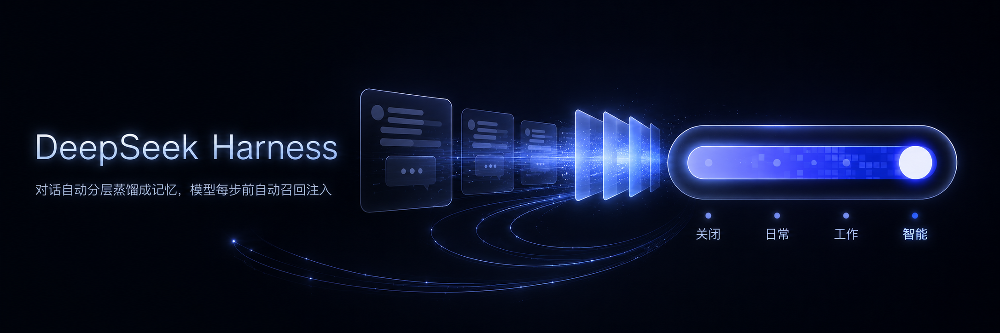
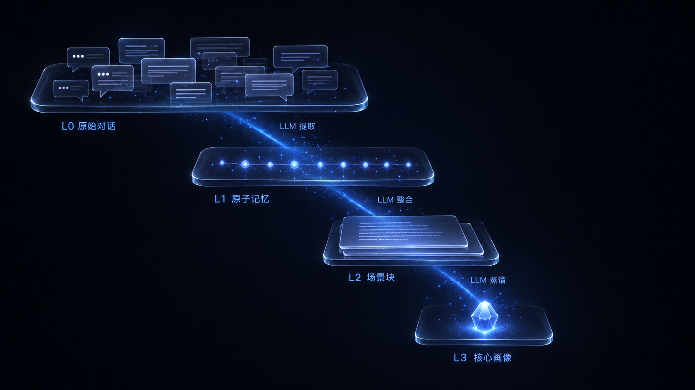
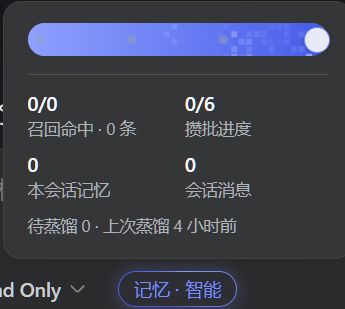
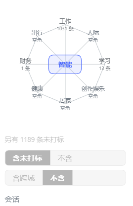
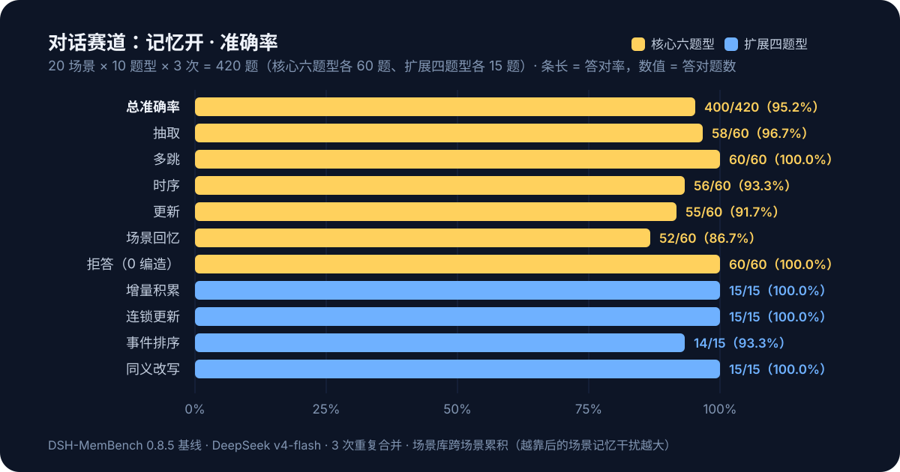
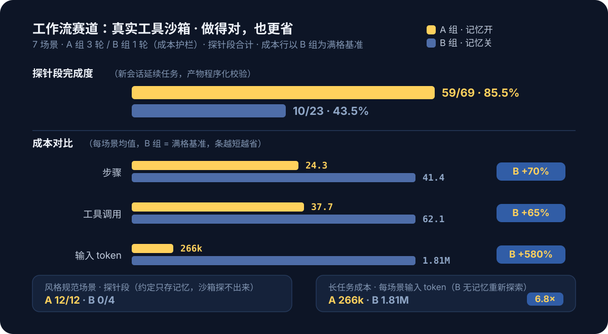
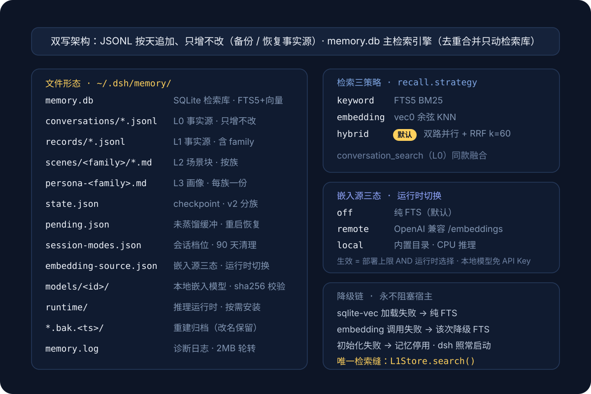
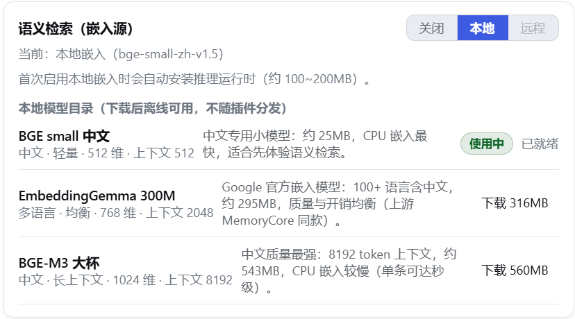

<div align="center">



# dsh-layered-memory

**DeepSeek Harness용 계층적 증류 기억 플러그인: 대화는 백그라운드에서 L0 포착 → L1 원자 기억 → L2 장면 통합 → L3 페르소나 증류를 거쳐 처리되며, 관련 기억은 모델의 매 스텝 전에 자동으로 컨텍스트에 주입됩니다.**

[中文 README](./README.md) · [English README](./README.en.md) · [日本語 README](./README.ja.md) · [한국어 README](./README.ko.md) · [최신 릴리스](https://github.com/drscrewdriver/dsh-prime-memory/releases/latest) · [문제 제보](https://github.com/drscrewdriver/dsh-prime-memory/issues)

[](https://www.npmjs.com/package/dsh-layered-memory)
[](https://github.com/deepseek-ai/deepseek-harness)
[](LICENSE)

</div>

<details open>
<summary>🌐 언어 / Language</summary>

- [中文 README](./README.md)
- [English README](./README.en.md)
- [日本語 README](./README.ja.md)
- [한국어 README](./README.ko.md)
- [설치 안내（한국어）](./INSTALL.ko.md)
- [Installation guide (English)](./INSTALL.en.md)
- [中文安装指南](./INSTALL.md)
- [日本語インストールガイド](./INSTALL.ja.md)
- [한국어 changelog](./CHANGELOG.ko.md)
- [Changelog (English)](./CHANGELOG.en.md)
- [更新日志（中文）](./CHANGELOG.md)
- [日本語 changelog](./CHANGELOG.ja.md)

</details>

> **호환성 참고**: 본 플러그인은 일본어·한국어 문서를 제공하지만, 공식 DSH의 `LocaleRuntime`이 등록하는 언어는 `zh` / `en`뿐입니다. `ja` / `ko`를 선택하면 `locale "<id>" is not registered` 오류가 납니다. 플러그인은 자체 사전을 들고 있을 수 있으나 DSH 전역 로케일 목록은 확장할 수 없습니다. DSH를 fork하여 `LOCALE_IDS`(locale-settings.ts)와 `LOCALES` 라벨(client/index.ts)을 갱신하고 재빌드하면 사용 가능해집니다.

## 빠른 시작

Node ≥ 22.16 필요. 두 가지 호출 방식 중 선택（`npx` 접두사는 아래 모든 `dsh` 명령을 대체 가능）：

```bash
# 방식 1: npx로 공식 CLI 직접 실행（dsh 사전 설치 불필요. 버전 고정 가능, 예: dsh-layered-memory@0.8.4）
npx -y @deepseek-ai/dsh plugin --profile web add dsh-layered-memory

# 방식 2: dsh CLI 설치된 경우（dsh는 pnpm 포워더. 없으면 먼저 npm i -g pnpm）
dsh plugin --profile web add dsh-layered-memory

# 기타 소스: GitHub 저장소 / 로컬 경로（개발·디버깅용. link: 는 저장소를 가리키며, npm run build + dsh 재시작으로 반영）
dsh plugin --profile web add https://github.com/drscrewdriver/dsh-prime-memory
dsh plugin --profile web add /path/to/dsh-layered-memory
```

### Agent에게 설치시키기（권장）

현재 Agent가 터미널 명령을 실행할 수 있다면 아래 문장을 그대로 보내세요：

```text
DeepSeek Harness의 web 프로파일에 dsh-layered-memory 플러그인을 설치해 주세요.

다른 프로파일은 수정하지 말고 아래 두 명령만 실행해 주세요:
dsh plugin --profile web add dsh-layered-memory
dsh --profile web --dump-config

출력에 dsh-layered-memory가 나타나면 설치 결과를 알려 주세요.
실행 중인 DSH를 임의로 닫거나 재시작하지 마세요. 설치 후 DSH Web Host 수동 재시작을 알려 주세요.
```

Agent는 설치 결과와 설정에 `dsh-layered-memory`가 나타났는지 보고합니다.

본 패키지는 `dsh.bundle` 합성 계층（`cordis.patch.yml`）을 선언하며, 설치 후 **플러그인 행이 자동 마운트**됩니다——`$DSH_HOME/profiles/web/cordis.patch.yml`을 손으로 고칠 필요가 없습니다. 이후 DeepSeek Harness를 재시작하고 확인：`~/.dsh/memory/` 아래에 `conversations/ records/ scenes/` 디렉터리와 `memory.db`가 나타나면 플러그인 적용 성공；설정 페이지에 "기억" 페이지, 입력 바에 모드 pill이 나타나면 클라이언트 준비 완료.

**제거**：`dsh plugin --profile web remove dsh-layered-memory` + 재시작. 데이터는 `~/.dsh/memory/`에 남습니다. 필요 없으면 해당 디렉터리 전체를 수동 삭제하세요.

### 소스에서 개발

```bash
git clone https://github.com/drscrewdriver/dsh-prime-memory
cd dsh-layered-memory
npm install && npm run build
dsh plugin --profile web add .        # link: 설치. 코드 변경 후 npm run build + dsh 재시작으로 반영
npm run smoke                         # 스모크 테스트（먼저 재빌드: 아래 명령 참조）
npx tsc src/smoke.ts --outDir dist-smoke --module nodenext --moduleResolution nodenext --target es2022 --strict --skipLibCheck --esModuleInterop
```

## 런타임 데이터 흐름

<p align="center">
  
</p>

플러그인은 DSH 네이티브 이벤트 심（`session/event`로 포착, `agent/pre-step`로 주입）에 부착되며, 증류는 호스트의 `ctx.llm`을 재사용합니다. 회상은 **메시지 측 주입**으로 표시됩니다——관련 기억은 사용자의 새 메시지 바로 앞에 배치된 합성 메시지로 표시되며, 채팅 흐름에는 **"컨텍스트 주입 · memory"** 행（펼치면 히트 내용 표시）으로 나타납니다. 주입 내용은 길이·시간 예산으로 제한되며, 초과는 잘림/타임아웃으로 건너뛰어 대화를 지연시키지 않습니다. **동일 세션 중복 제거**：이미 주입된 기억은 재주입하지 않습니다（`/compact` 등으로 리셋되면 재주입 가능）. **신선도 가중**：회상 순위는 `관련도 × max(0.5, 0.5^(마지막 갱신 후 경과일/30))`로 소프트 가중됩니다（`recall.decayHalfLifeDays`로 조정, `0`=비활성）.

**비용 대시보드**：각 증류 LLM 호출（추출/중복제거/L2/L3）의 토큰 비용을 `provider/model` 단위로 SQLite 명세 테이블에 기록（보존 기간 설정 가능, 기본 365일）. 설정 → 기억 → **비용** 탭에서 시각화.

**기억 도구(3)**：

- memory_search
- conversation_search
- memory_read_scene

## 계층적 기억（L0–L3）

<p align="center">
  
</p>

## 세션 단위 기억 모드

<p align="center">
  
</p>

- **컨트롤**：입력 바 내, 모드 셀렉터 우측의 pill（`기억·자동`）을 클릭하면档位 슬라이더가 열립니다（라이트/다크 테마 자적응）.
- 팝오버 하단은 **세션 정보 영역**：회상 히트, 배치 진행, 본 세션 산출 기억 수, 세션 메시지 수에 더해 이상 상태 행（저장소 저하 / 벡터 검색 불가）과 전체 요약.
- 각 세션 선택은 sessionId 단위로 `session-modes.json`에 영속화되어 재시작/복원에도 유실되지 않습니다.
- **쓰기 전용（#38）**：팝오버 내 "주입" 3상 스위치（전역 따름 / 켜기 / 끄기）——"끄기"로 **쓰기 전용 세션**：포착과 증류는 평소대로（대화는 L0→L1→L2/L3로 축적）이나 본 세션에는 아무것도 주입되지 않습니다. pill 면문은 `기억·只写`로 변경.

## UI 미리보기

<p align="center">
  
  
</p>

## 실측 비교（DSH-MemBench: 자동 벤치마크）

"볼거리"에 더해 이 절은 **자동 벤치마크**의 실측 수치로 "**켜면 대체 무엇을 얻는가**"에 답합니다（[`bench/`](./bench/), 1명령으로 재현 가능）. 방법：동일 시나리오 뱅크·동일 입력으로 **A군（기억 켜기） 3회 병합**, **B군（기억 끄기） 1회**（기억 없는 장작업은 수 배 토큰 소모로 비용 가드레일）. 대화 트랙은 A군만.

### 대화 트랙（20 시나리오 × 10형 × 3회 = 420문）

> 0.8.5 베이스라인（A군 데이터；대화 트랙 B군은 폐지, A군만）.

<p align="center">
  
</p>

**회상 이중 채널**（A군）：수동 주입 회상률 **78.1%**（281/360）, 나머지는 모델이 **기억 도구를 능동 호출**로 보완（106문이 능동 쿼리, 그중 75문을 도구로 구제）. 엔드투엔드 95.2%는 양 채널과 모델 활용의 합성 결과. 기억库가 팽창해도 정확도는 전단 92.8% → 후단 97.7%로 상승, 검색층 recall@5은 합성 노이즈 600건 주입에도 2.8pp만 하락했습니다.

**계층별 약점**：검색층 오프라인 지표（recall@5）는 전체 73.3%（이벤트 순서 0%, 장면 회상 50%）. **효율 삼각형**（기억의 비용）：주입은 지연을 더하지 않고（주입 턴이 평균 210ms 빠름）, 주입은 턴당 입력의 약 10.3%, 증류 전체는 포착 메시지 1건당 약 2727 입력 / 240 출력 토큰（1172회 호출·0 실패）.

### 워크플로 트랙（0.8.3 보관판）

<p align="center">
  
</p>

**프로브 단계 완료 85.5% vs 43.5%（+42pp）**：3개 신규 프로브 원형（플로 지식 갱신 / 쌍둥이 runbook 구분 / 스타일 규약 계속）에서 A군은 모두 12/12 만점且 3회 일치. B군은 스타일 규약 프로브에서 **0/4**（명명/구조/천단위 구분/푸터 규약은 기억에만 존재）.

**장작업 비용：B군 세션당 입력 토큰은 A군의 6.8배**（1.81M vs 266k）.

### 방법론과 재현

```bash
node bench/harness/run.mjs --arm A --repeats 3 --provider deepseek-official --model deepseek-v4-flash   # 대화 트랙（A군만）
node bench/harness/run.mjs --track workflow --arm AB --repeats 3 ...                                  # 워크플로 트랙（A/B 병렬）
node bench/harness/run.mjs --track lifecycle --arm A ...                                              # 라이프사이클 트랙
node bench/harness/report.mjs --latest [dialog|workflow]                                               # 집계 리포트
node bench/harness/retrieval-metrics.mjs <runDir> --flood 200,600                                     # 검색층 지표 + 주입 곡선
```

자세한 것은 [`bench/baseline/`](./bench/baseline/) 참조.

## 저장소 레이아웃

<p align="center">
  
</p>

벡터 기능은 기본 꺼짐（순수 FTS）. DSH의 `ctx.llm`에는 embeddings 엔드포인트가 없으며, 의미 검색은 **3상 임베딩 소스**（끄기 / 원격 / 로컬）가 제공합니다. 설정 페이지에서 런타임 전환 가능（다음 절 참조）.

## 의미 검색（임베딩 소스）

설정 → 기억 → 개요 → 의미 검색에서 임베딩 소스를 선택, 즉시 반영, 설정 변경·재시작 불필요：

<p align="center">
  
</p>

3가지 소스：**끄기**（기본, 순수 BM25 키워드 검색）, **원격**（임의의 OpenAI 호환 `/embeddings` 서비스 지참, `embedding.*` 4점 세트가 갖춰지면 선택 가능）, **로컬**（내장 모델 카탈로그에서 선택, ONNX 양자화 **CPU 추론**——API Key 불필요, 데이터는 본기에서 나가지 않음）. 로컬 카탈로그는 플러그인 내장 허용 목록（각 모델을 revision + 파일별 sha256로 고정, 임의 저장소 다운로드 불가）.

- **다운로드**：모델 카드 1클릭（기본 미러 `hf-mirror.com`, 재개 대응 + sha256 무결성 검증）. 단일 파일 실패는 자동 재시도（캐시 키 변경 `?dshmem-retry=N`）.
- **온디맨드 런타임**：로컬档으로의 첫 전환 시에만 추론 런타임（transformers.js, 약 100〜200MB）을 데이터 디렉터리 `runtime/`에 도입（플러그인 의존 트리·설치 디렉터리에는 손대지 않음）. 모델 로드와 추론은 **전용 워커 스레드**에서 실행.
- **라이브 전환**：1클릭으로 소스 교환——백그라운드 전량 재임베딩（진행 가시·취소 가능, 그 사이 검색은 키워드로 자동 열화, 대화 무영향）.
- **유효 규칙 = 배포 상한 AND 런타임 선택**：`embedding.allowLocalModels=false`로 로컬档 전체 무효화, 미설정이면 원격档 선택 불가（기업 배포에서 수구 가능）. 상태는 `embedding-source.json`에 영속화.

## 설정

덮어쓰기 설정은 profile 자신의 `cordis.patch.yml`에 **최상위 수준의 naked patch 항목**으로 작성합니다（직접 `id:` 사용, `insert:`로 감싸지 마세요）：

```yaml
- id: dsh-memory
  name: dsh-layered-memory
  config:                    # 키는 행 단위 전체 교체（딥 머지 아님）
    family: auto             # 새 세션 기본档: auto | chat | work
    llm:
      provider: ''
      model: ''
```

| 필드 | 기본 | 설명 |
| --- | --- | --- |
| `family` | `auto` | 새 세션 기본 기억档：`auto` \| `chat` \| `work` |
| `dataDir` | `$DSH_HOME/memory` | 데이터 디렉터리 |
| `capture.enabled` | `true` | L0 포착 |
| `capture.stripCodeBlocks` | `true` | 어시스턴트 메시지에서 코드 블록 제거 |
| `capture.maxMessageChars` | `4000` | 단메시지 최대 문자 수 |
| `extract.enabled` | `true` | L1 추출 |
| `extract.minMessages` | `6` | 정상 트리거 임계값：단세션이 N건 새 메시지 누적 시 L1 추출 1회. 시작 단계는 1→2→4→…→N 배증 |
| `extract.idleSeconds` | `300` | 유휴兜底：세션이 N초 무음이면 미증류 슬라이스 투하. `0` 비활성 |
| `extract.backgroundMessages` | `10` | 추출 시 수반하는 배경 메시지 수 |
| `extract.candidatePool` | `5` | 중복 제거 후보 풀 크기 |
| `l2.enabled` | `true` | L2 장면 통합 |
| `l2.minNewMemories` | `5` | 직전 L2 이후 신규 기억 임계값 |
| `l2.maxScenes` | `12` | 장면 블록 수 상한 |
| `l2.sceneContextLimit` | `3` | L2 prompt 수반 유사 장면 전문 상한 |
| `l3.enabled` | `true` | L3 페르소나 증류 |
| `l3.interval` | `20` | L3 증류 간격（신규 기억 건수） |
| `recall.enabled` | `true` | 자동 회상 |
| `recall.maxResults` | `5` | 각 신규 사용자 메시지 전 주입하는 L1 건수 상한 |
| `recall.maxCharsPerMemory` | `500` | 주입 기억 1건 문자 상한（초과 잘림）. `0` 무제한 |
| `recall.maxTotalRecallChars` | `2000` | 1회 주입 총 문자 상한. `0` 무제한 |
| `recall.timeoutMs` | `5000` | 회상 총 예산（ms）. 타임아웃은 해당 턴 주입 스킵. `0` 무제한 |
| `recall.includePersona` | `true` | 시스템 프롬프트에 페르소나 문맥 주입（`<user-persona>`, 안정 영역） |
| `recall.includeSceneNav` | `true` | 시스템 프롬프트에 장면 내비 주입（`<scene-navigation>`, 안정 영역） |
| `recall.strategy` | `hybrid` | 검색 전략：`keyword` / `embedding` / `hybrid` |
| `recall.scoreThreshold` | `0.3` | 회상 점수 임계값（이하 주입 안 함） |
| `recall.decayHalfLifeDays` | `30` | 회상 신선도 감쇠 반감기（일, `0`=비활성） |
| `embedding.enabled` | `false` | 벡터 검색 스위치. 끄면 순수 FTS |
| `embedding.baseUrl` | 빈값 | OpenAI 호환 `/embeddings` 주소 |
| `embedding.apiKey` | 빈값 | API Key（**원격档은 임의**——로컬 self-host의 무키 `/embeddings`도 허용） |
| `embedding.model` | 빈값 | 임베딩 모델명 |
| `embedding.dimensions` | `0` | 벡터 차원（활성 시 필수） |
| `embedding.maxInputChars` | `5000` | 단텍스트 최대 문자 수（초장 잘림） |
| `embedding.timeoutMs` | `10000` | 단회 임베딩 호출 타임아웃（ms） |
| `embedding.allowLocalModels` | `true` | 로컬 임베딩档 허용（배포 상한） |
| `embedding.mirror` | `https://hf-mirror.com` | 로컬 모델 다운로드 미러 루트 |
| `embedding.proxy` | `''` | 모델 다운로드 프록시 3상：`''`（기본）= 프록시 환경변수 자동 검출；`none` = 강제 직결 비활성；기타 = 프록시 URL |
| `llm.provider/model` | 빈값 | 증류 모델 정적 경로（배포 pin）：양란 일치 시 잠금 |
| `llm.fallbacks` | `[]` | 증류 폴백 체인（주 경로 실패 시 순차 시도） |
| `llm.layerRoutes` | `{}` | **계층별 증류 라우팅**：`l1`/`l2`/`l3` 각 완전 체인 |
| `llm.maxTokens` | `65536` | 비계층 호출兜底 출력 총闸 |
| `llm.reasoningEffort` | 빈값 | 증류 사고档位：빈값 = **자동** |
| `llm.temperature` | `0.3` | 증류 온도 |
| `llm.maxInputChars` | `700000` | 단회 증류 입력 문자 예산 |
| `llm.timeoutMs` | `120000` | 단회 증류 호출 타임아웃（ms） |
| `tokenCost.retentionDays` | `365` | 증류 비용 명세 보존 일수. `0` = 영구 |
| `tools` | `true` | 모델 호출 가능한 기억 도구 등록 여부 |
| `benchControl` | `false` | 벤치 제어 서비스 등록（기본 꺼짐） |

### 증류 폴백 체인과 느린 TTFT 모델

일부 공급자의 무료/느린档位는 **첫 토큰 지연（TTFT）이 20초를 넘을** 수 있습니다. 3가지 완화책：

1. **경로 전환**（가장 직접）：설정 → 기억 → 개요 → 증류 파라미터의 경로 체인 편집기에서 주 경로 즉시 변경.
2. **폴백 체인**（자동 강등）：주 경로 실패 시 순차 백업 경로 시도.
3. **계층별 라우팅**：L1（고빈도·저렴·안정 중시）과 L3（저빈도·강능력）에 별도 체인.
4. **타임아웃 상향**：`llm.timeoutMs`는 경로가 실제로 느리되 게이트웨이가 끊지 않는 경우에만 유효.

## 로그와 문제 해결

dsh 호스트는 플러그인 로그를 콘솔로 출력합니다. 플러그인은 info 이상을 데이터 디렉터리의 `memory.log`에도 미러합니다. 1턴의 전형 경로：`L0 포착` → `L0 투하` → `증류 파이프라인 시작` → `LLM 호출` → `L1 단계 완료` → `파이프라인 종료`；다음 턴 머리에 `회상 주입 N건 L1`.

## MemoryCore와의 차이

- 완전한 파이프라인 내장（외부 Gateway 비의존）, 증류는 DSH 자신의 LLM 재사용；
- L2/L3를 "LLM이 파일 도구 조작"에서 "LLM이 조작 JSON / 완전 문서 출력, 공학측 실행"으로 변경；
- 회상 주입점은 `agent/pre-step`（메시지 측 합성 메시지）＋ 에이전트 범위 `systemPrompt.context`（페르소나/내비 안정 영역）；
- 저장/검색은 공식 sqlite 백엔드의 단기 슬림판（멀티테넌트 분리열·TCVDB 클라우드 백엔드·감사표 삭제；토큰화는 공식과 동일 jieba 사용）.

## 로드맵

[Issues](https://github.com/drscrewdriver/dsh-prime-memory/issues)에서 요구와 우선순위 환영：

- [ ] **Git 브랜치 인식**：기억을 현재 git 브랜치와 연관, 회상을 브랜치로 필터/가중
- [ ] **Claude Code / Codex 기억 가져오기**：기존 자산（`CLAUDE.md`, Claude Code 기억 파일, Codex `AGENTS.md` 등）1클릭 이전

## 감사

핵심 기억 능력（계층적 증류 파이프라인, 프롬프트 설계, 이중 기록 저장소）은 [TencentCloud/TencentDB-Agent-Memory](https://github.com/TencentCloud/TencentDB-Agent-Memory)의 **MemoryCore**를 참고했습니다.

## License

[MIT](LICENSE)
