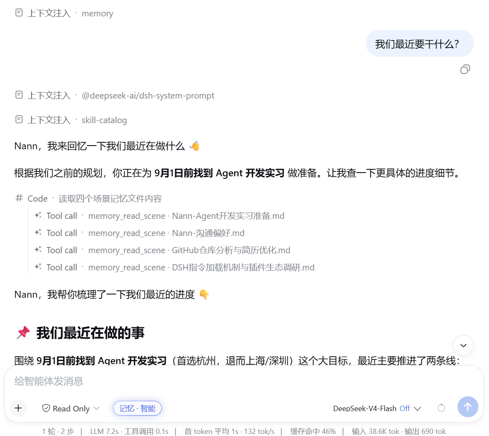
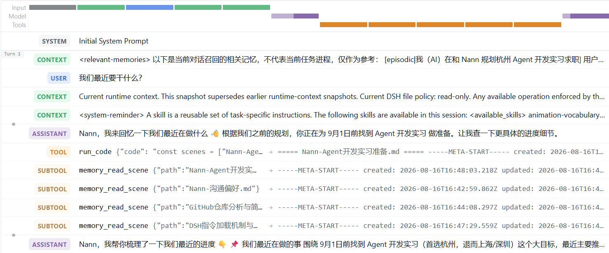
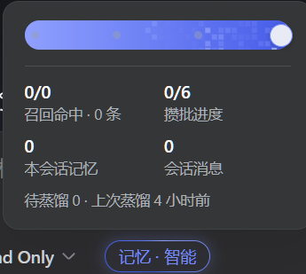
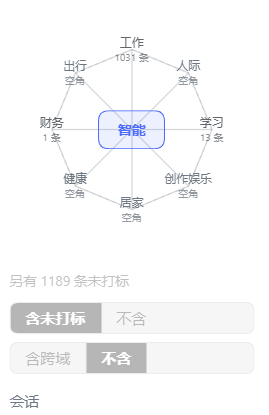
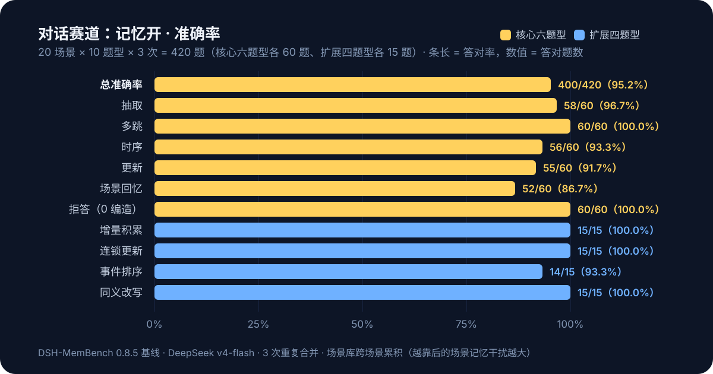
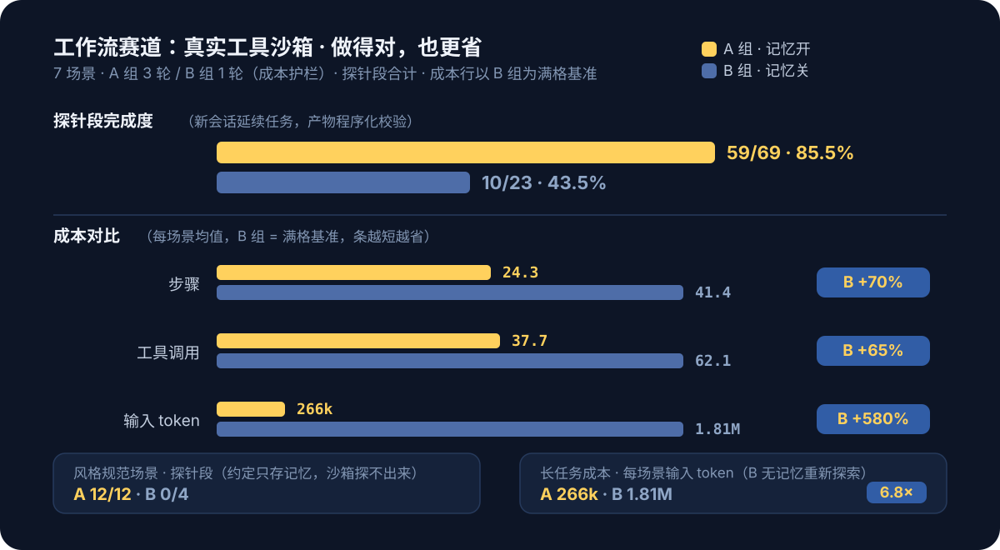
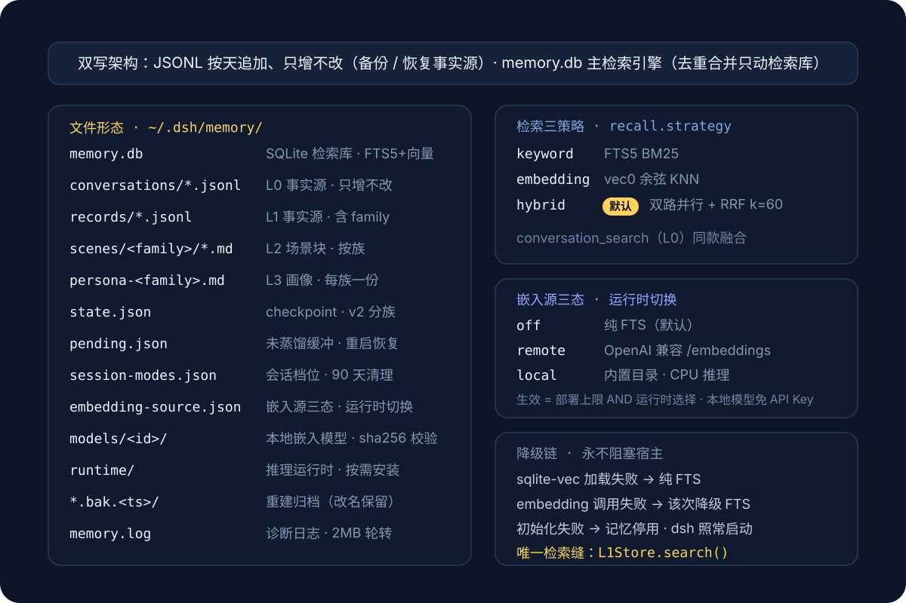

<div align="center">


# dsh-prime-memory

**Плагин многослойной дистиллятивной памяти для DeepSeek Harness: диалог в фоне проходит путь L0-захват → L1-атомарные воспоминания → L2-консолидация сцен → L3-дистилляция профиля, и перед каждым шагом модели релевантные воспоминания автоматически внедряются в контекст.**

[English](README.en.md) · [中文](README.md) · [Последний релиз](https://github.com/drscrewdriver/dsh-prime-memory/releases/latest) · [Сообщить о проблеме](https://github.com/drscrewdriver/dsh-prime-memory/issues)

[](https://www.npmjs.com/package/dsh-prime-memory)
[](https://github.com/deepseek-ai/deepseek-harness)
[](LICENSE)

</div>

<details open>
<summary>🌐 Язык / Language</summary>

- [中文 README](./README.md)
- [English README](./README.en.md)
- [日本語 README](./README.ja.md)
- [한국어 README](./README.ko.md)
- [README на русском](./README.ru.md)
- [README en français](./README.fr.md)
- [README auf Deutsch](./README.de.md)
- [README in italiano](./README.it.md)
- [README en español](./README.es.md)
- [安装指南（中文）](./INSTALL.md)
- [Installation guide (English)](./INSTALL.en.md)
- [日本語インストールガイド](./INSTALL.ja.md)
- [한국어 설치 안내](./INSTALL.ko.md)
- [Руководство по установке (Русский)](./INSTALL.ru.md)
- [Guide d'installation (français)](./INSTALL.fr.md)
- [Installationsanleitung (Deutsch)](./INSTALL.de.md)
- [Guida all'installazione (Italiano)](./INSTALL.it.md)
- [Guía de instalación (Español)](./INSTALL.es.md)
- [更新日志（中文）](./CHANGELOG.md)
- [Changelog (English)](./CHANGELOG.en.md)
- [日本語 changelog](./CHANGELOG.ja.md)
- [한국어 changelog](./CHANGELOG.ko.md)
- [Changelog на русском](./CHANGELOG.ru.md)
- [Changelog en français](./CHANGELOG.fr.md)
- [Changelog auf Deutsch](./CHANGELOG.de.md)
- [Changelog in italiano](./CHANGELOG.it.md)
- [Changelog en español](./CHANGELOG.es.md)

</details>

## Матрица совместимости версий DSH

| Версия DSH | API регистрации настроек | Статус |
|---|---|---|
| 0.1.1-rc.2 | `settings.register()` (live-scope) | ✅ Проверено |
| 0.1.2-rc.1 | `settings.register()` (есть запасной путь) | ⚠️ Выведено по документации фреймворка, вживую не проверялось |
| 0.1.3-rc.1 | `settings.register()` (есть запасной путь) | ⚠️ Вживую не проверялось (с 0.1.3 неймспейсы стали простыми строками; плагин совместим) |
| 0.1.5-rc.2 | `settings.register()` (есть запасной путь) | ⚠️ Вживую не проверялось; семантика поверхности Session V3 и слотов строки ввода/настроек ждёт регресса |
| 0.2.0-rc.1 | `settings.register()` (live-scope) | ✅ Текущая линия адаптации (переподключение события agent/session-start → agent/created) |

> Механизм совместимости: регистрация настроек на этапе исполнения идёт по трём ветвям
> (`register` → мост `installSection` → деградация в режим «всегда включено»),
> подробнее — запись 0.11.0 в [CHANGELOG.md](./CHANGELOG.md). `dsh.plugin.json` объявляет
> `engines.dsh: ">=0.2.0-rc.1 <0.2.1-0"`.

## Быстрый старт

Требуется Node ≥ 22.16. Любой из двух способов вызова (префикс `npx` может заменить `dsh` в любой из команд ниже):

```bash
# Способ 1: официальный CLI напрямую через npx (предустановка dsh не нужна; версию можно зафиксировать, например dsh-prime-memory@0.8.4)
npx -y @deepseek-ai/dsh plugin --profile web add dsh-prime-memory

# Способ 2: при уже установленном CLI dsh (dsh — forwarding-обёртка pnpm; если pnpm нет, сначала npm i -g pnpm)
dsh plugin --profile web add dsh-prime-memory

# Альтернативные источники пакета: репозиторий GitHub / локальный путь (разработка и отладка; link: указывает на репозиторий, достаточно npm run build + перезапуска dsh)
dsh plugin --profile web add https://github.com/drscrewdriver/dsh-prime-memory
dsh plugin --profile web add /path/to/dsh-prime-memory
```

### Поручить установку агенту (рекомендуется)

Если текущий агент умеет выполнять команды терминала, отправьте ему целиком следующий текст:

```text
Установи плагин dsh-prime-memory для web-профиля DeepSeek Harness.

Выполни только следующие две команды и не изменяй другие профили:
dsh plugin --profile web add dsh-prime-memory
dsh --profile web --dump-config

Когда dsh-prime-memory появится в выводе, сообщи мне результат установки.
Не закрывай и не перезапускай работающий DSH по своей инициативе; после установки напомни мне вручную перезапустить DSH Web Host.
```

Агент должен вернуть результат установки и явно сказать, появился ли
`dsh-prime-memory` в конфигурации.

Пакет объявляет компоновочный слой `dsh.bundle` (`cordis.patch.yml`); после установки
**строка плагина монтируется автоматически** — вручную править
`$DSH_HOME/profiles/web/cordis.patch.yml` не нужно. Затем перезапустите DeepSeek Harness и проверьте:
появление каталогов `conversations/ records/ scenes/` и файла `memory.db` в
`~/.dsh/memory/` означает, что плагин применился успешно; страница «Память» в настройках
и пилюля режима в строке ввода означают, что клиентская половина готова.

**Удаление**: `dsh plugin --profile web remove dsh-prime-memory` + перезапуск. Данные остаются в
`~/.dsh/memory/`; если они не нужны, удалите весь каталог вручную.

### Разработка из исходников

```bash
git clone https://github.com/drscrewdriver/dsh-prime-memory
cd dsh-prime-memory
npm install && npm run build
dsh plugin --profile web add .        # установка link: ; после правок кода достаточно npm run build + перезапуск dsh
npm run smoke                         # smoke-тест (сначала пересобрать: см. команду ниже)
npx tsc src/smoke.ts --outDir dist-smoke --module nodenext --moduleResolution nodenext --target es2022 --strict --skipLibCheck --esModuleInterop
```

## Поток данных во время работы

<p align="center">
  
</p>

Плагин вешается на нативные события dsh (`session/event` для захвата, `agent/pre-step` для внедрения); вызовы дистилляции переиспользуют `ctx.llm` хоста. Вспоминание оформлено как **внедрение со стороны сообщений**: релевантные воспоминания приходят синтетическим сообщением перед новым сообщением пользователя и отображаются в потоке строкой \*\*«Внедрение контекста · memory»\*\* (развернув её, видно, что именно попало) — пользователь воочию видит, что «память работает». Внедрение ограничено бюджетом длины и бюджетом времени; при превышении — усечение или пропуск, разговор никогда не тормозится. **Дедупликация внутри сессии**: уже внедрявшееся воспоминание не внедряется повторно (оно уже в контексте модели — экономия токенов, когда пользователь переспрашивает о том же); при сжатии контекста `/compact` или его очистке счётчик сбрасывается, и воспоминание может быть внедрено снова; обновлённое воспоминание (новый id при изменении содержимого) больше не сковано старым подавлением. **Взвешивание по свежести**: ранжирование припоминания мягко взвешивается по `релевантность × max(0.5, 0.5^(дней с последнего обновления/30))` — между кандидатами близкой релевантности свежие воспоминания идут первыми (места естественным образом ротируются), а давнее, но достаточно релевантное воспоминание вспоминается как обычно (пол гарантирует потерю не более половины ранжирующего балла: долгосрочные факты не тонут); `recall.decayHalfLifeDays` настраивается, 0 = выключено.

**Панель стоимости**: стоимость в токенах каждого LLM-вызова дистилляции (извлечение/дедупликация/L2/L3) записывается по `provider/model` в таблицу деталей SQLite (срок хранения настраивается, по умолчанию 365 дней, скользящая очистка при записи; сбой учёта лишь предупреждает и никогда не блокирует дистилляцию); страница настроек → Память → вкладка **Стоимость** показывает: линии тренда с раскраской по моделям (гранулярность день/неделя/месяц + окно последних N дней + фильтр по уровням L1/L2/L3), таблицу уровень × временное окно (вызовы / токены вывода и размышления / среднее / медиана), накопления по моделям — стоимость дистилляции видна с одного взгляда. Входы считаются в символах (стриминговый usage dsh не содержит входных токенов), вывод и размышления — в токенах.

**Инструменты памяти (3):**

- memory\_search

- conversation\_search

- memory\_read\_scene

Живая запись с машины — как выглядят внедрение припоминания и вызовы инструментов в диалоге: строка «Внедрение контекста · memory» сначала приносит релевантные воспоминания, затем модель при необходимости читает блок сцены через `memory_read_scene` и отвечает прямо по памяти:

<p align="center">
  
</p>

В ограниченной сессии, где открыт только вход исполнения кода, модель вызывает инструменты памяти косвенно через `run_code` (вложенность SUBTOOL в виде траекторий):

<p align="center">
  
</p>

## Многослойная память (L0–L3)

<p align="center">
  
</p>

## Режимы памяти на уровне сессии

<p align="center">
  
</p>

- **Элемент управления**: пилюля в строке ввода, справа от селектора режимов (`Память · авто`); клик раскрывает над ней ползунок режимов, адаптирующийся к светлой/тёмной теме;

- нижняя половина всплывающей панели — **зона информации о сессии**: попадания припоминания (попадания/раунды поиска и накопление), прогресс накопления
  (срез x этой сессии / действующий порог; в режиме «Выкл» показывается число срезов в ожидании), число воспоминаний, произведённых в сессии, число сообщений сессии,
  плюс строка аномальных состояний (хранилище деградировало / векторный поиск недоступен) и глобальная сводка (записи в ожидании дистилляции, последняя дистилляция);
  данные идут через эндпоинт `dsh-memory/session-stats` (чисто резидентный реестр + COUNT по индексу, нулевой файловый I/O),
  с адаптивным опросом, пока панель открыта (2 с при работе / 5 с в простое); при закрытии опрос останавливается;

- выбор каждой сессии сохраняется по sessionId в `session-modes.json` и не теряется при перезапуске/возобновлении;
  он складывается с глобальным выключателем (глобальный — общий кран); L2/L3 полностью классифицированы по семействам, содержимое не просачивается.

- **Только запись, без чтения (#38)**: трёхпозиционный переключатель «Внедрение» на всплывающей панели (как глобально / вкл / выкл) — в положении «выкл» сессия становится **записью без чтения**: захват и дистилляция продолжаются (диалог по-прежнему оседает как L0→L1→L2/L3), но в эту сессию не внедряется ни одно воспоминание
  (внедрение припоминания, стабильные зоны профиля/навигации и справочник инструментов останавливаются вместе; читающие инструменты вроде `memory_search` отвечают подсказкой о режиме «только запись»). Лицо пилюли меняется на `Память · только запись`; переопределение сохраняется по сессии — возврат в
  «как глобально» снимает его и снова следует выключателю припоминания на странице настроек; подходит для отладочных/оценочных/чувствительных сессий в духе «впитывать, не мешая».
  Ортогонально режиму «Выкл»: «Выкл» остаётся полной невидимостью (выключен даже захват), «только запись» сохраняет вход и закрывает выход.

## Предпросмотр интерфейса

<p align="center">
  
  
</p>

## Измеренное сравнение (DSH-MemBench: автоматизированный бенчмарк)

На картинках видно, «как выглядят» ответы; этот раздел числами **автоматизированного бенчмарка** отвечает на вопрос «**что это даёт, когда включено**» ([`bench/`](./bench/), воспроизводится одной командой). Метод: одна библиотека сцен, дословно одинаковые входы, **группа A (память включена) — 3 прогона с объединением результатов, группа B (память выключена) — 1 прогон** (долгие задачи без памяти глотают в разы больше токенов на сцену — отсюда этот стоимостный барьер); трасса диалога гоняет только группу A (сессии группы B независимы и без памяти — провал гарантирован, контроль ничего не сообщает и снят с забега). Среда трассы диалога: официальный `deepseek-v4-flash` от DeepSeek, плагин 0.8.5 (судья и испытуемый одной породы, тексты ответов полностью архивируются для ручной сверки), Windows; схема задач вдохновлена [LongMemEval](https://github.com/xiaowu0162/longmemeval) / [LoCoMo](https://snap-research.github.io/locomo/) / [AMB](https://github.com/vectorize-io/agent-memory-benchmark), расширенные типы задач и трасса жизненного цикла — [MemoryAgentBench](https://arxiv.org/abs/2507.05257) / [GoodAI LTM](https://github.com/GoodAI/goodai-ltm-benchmark) / BEAM.

> Трасса диалога — **новая база 0.8.5** (исправленный плагин + уточнённый критерий судейства); цифры трассы workflow — по-прежнему архив 0.8.3 (с 0.8.5 библиотека сцен выросла до 8, добавлена сцена проспективной памяти; повторный прогон впереди).

### Трасса диалога (20 сцен × 10 типов задач × 3 прогона = 420 вопросов): отвечает ли точно?

> База 0.8.5 (данные группы A; группа B трассы диалога снята, бежит только A).

<p align="center">
  
</p>

**Двухканальное припоминание** (группа A): доля пассивно внедрённых **78,1%** (ключевые пункты вопроса присутствовали во внедрении, 281/360); в остальном модель **сама вызывала инструменты памяти** — 106 вопросов с активным запросом, **75 вопросов спасены инструментами**; 95,2% от начала до конца — синтез двух каналов и умения модели ими пользоваться. Пока база воспоминаний копилась от сцены к сцене, внедрения припоминания в зондах 295 раз подмешивали воспоминания из других сцен (честно посчитано), и всё же общая точность выросла с 92,8% в начале серии до 97,7% в конце — устойчивость к помехам выдержала раздувающуюся базу (офлайн, при догрузке ещё 600 синтетических шумовых записей, recall\@5 поискового слоя падает лишь на 2,8 п.п.).

**Слабые места по слоям**: офлайн-показатели поискового слоя (recall\@5, контролируемое воспроизведение) в сумме 73,3%, из них упорядочивание событий 0% и воспоминание сцены 50% — 93%+ от начала до конца держатся на устойчивости модели после внедрения соседних воспоминаний; **треугольник эффективности** (цена памяти): внедрение не добавляет задержки (внедрённые туры отвечают в среднем на 210 мс быстрее невнедрённых), внедрение занимает ~10,3% входа за тур, а вся цепочка дистилляции амортизируется в ≈2727 входных / 240 выходных токенов на захваченное сообщение (1172 вызова, 0 сбоев).

### Трасса workflow (архив 0.8.3 · версия на 7 сцен · группа A 3 раза / группа B 1 раз, настоящая песочница инструментов): делает ли верно, делает ли экономно?

<p align="center">
  
</p>

**Полнота сегмента-зонда: 85,5% против 43,5% (+42 п.п.)**: в сегментах обучения/изменения у обеих групп есть контекст на месте; сегмент-зонд (продолжение задачи в новой сессии) — единственное чистое окно памяти — все три новые проверочные сцены группы A (обновление процессного знания / различение близнецов / продолжение стилевых конвенций) дают 12/12 без ошибок и одинаково во всех трёх прогонах; группа B на зонде сцены стилевых конвенций даёт **0/4** (конвенции имён/структуры/разделителя тысяч/колонтитула живут только в памяти, песочница их не выдаёт); в сцене обновления процесса она может восстановить ход, читая скрипты (различительная сила ограничена аффордансами песочницы, отмечено честно).

**Стоимость долгих задач: группа B тратит на сцену в 6,8 раза больше входных токенов, чем группа A** (1,81M против 266k) — без памяти агент продвигается повторным обследованием; на режиме размышления high он способен выстроить целый проект, чтобы разведать процесс, который легко уместился бы в одну скриптовую конвенцию. Выходных токенов втрое больше (46,2k против 15,4k), шагов +70%. В этом и есть главная ценность памяти: **экономится не сложность задачи, а бессмысленные хождения туда-обратно и повторное обследование**.

### Методология и воспроизведение

```bash
node bench/harness/run.mjs --arm A --repeats 3 --provider deepseek-official --model deepseek-v4-flash   # трасса диалога (только группа A)
node bench/harness/run.mjs --track workflow --arm AB --repeats 3 ...                                  # трасса workflow (группы A/B параллельно)
node bench/harness/run.mjs --track lifecycle --arm A ...                                              # трасса жизненного цикла (гейтинг/off/rebuild/забывание)
node bench/harness/report.mjs --latest [dialog|workflow]                                               # сводный отчёт
node bench/harness/retrieval-metrics.mjs <runDir> --flood 200,600                                     # показатели поискового слоя + кривая заливки
```

- Оценка: программная проверка `contains-all` + суждение судейской модели по пунктам (полные тексты ответов и обоснования оценки архивируются в `result.json` для ручной сверки); в задачах со stale (обновление/цепочка/забывание) проигрыш засчитывается только когда «старое значение подаётся как текущее положение дел» — простое описание эволюции с верным итоговым значением не штрафуется; задачи на отказ от ответа разрешают сослаться на реальный контекст, объясняя «почему неизвестно то, о чём спрашивают»; полнота workflow проверяется программно по созданным файлам + ключевому содержимому (четыре типа критериев: позитивные проверки/запретные слова/отсутствие артефакта/существование);

- Панель метрик: помимо общей таблицы точности (6 центральных + 4 расширенных типов задач), автоматически получаются **офлайн-показатели поискового слоя** (recall\@5 / точность внедрения / утечка устаревшей информации), **треугольник эффективности** (разностная стоимость внедрения / доля внедрения / учёт дистилляции в расчёте на сообщение), **анализ позиции по масштабу** (точность/загрязнение при росте базы) и собственный раздел трассы жизненного цикла (матрица гейтинга по семействам / двойная проверка off / верность rebuild / забывание);

- Прогресс в реальном времени: при запуске бенчмарка автоматически поднимается локальная панель прогресса и открывается браузер (`--no-panel` отключает) — прогресс по сценам/фазам/сообщениям обеих рук A/B, сердцебиение и свежесть активности («зависло vs процесс умер» определяется сразу), накопленная стоимость растёт на глазах;

- Все метрики берутся из usage, отчитываемого провайдером (вход с разбивкой попаданий в кэш), и свёртки событий сессии; установившаяся доля кэша исключает первый запрос каждой сессии (база 0.8.5: 89,1% — внедрение памяти кэшу не вредит);

- Для регрессии: по прогону до и после изменения плагина, `compare.mjs` выдаёт сравнительную таблицу (проверка шапки окружения с gitSha + предупреждение о дрейфе контрольной группы B + сравнение показателей поискового слоя);

- Ограничения (честное заявление): одна машина; группа A ×3 с объединением, группа B ×1 (стоимостный барьер, шум выше); судья и испытуемый: для диалоговой базы 0.8.5 одной породы, в архиве workflow — разнородные (glm-5.3 судит v4-flash); библиотека сцен составлена автором (со сдвигом в пользу памяти — свободно воспроизводите сами); аффордансы файлов песочницы могут частично выдать процесс (группа B может читать скрипты и восстановить ход; места ограниченной различительной силы помечены честно); двухуровневый аудит инструментов (строгий: нарушение = поражение / мягкий: предупреждение), на практике 0 нарушений у обеих сторон.

Полный отчёт и данные по каждому вопросу: [`bench/baseline/`](./bench/baseline/).

## Раскладка хранилища

<p align="center">
  
</p>

Векторная возможность по умолчанию выключена (чистый FTS). У `ctx.llm` DSH нет эндпоинта embeddings; семантический поиск обеспечивает **трёхпозиционный источник эмбеддингов** (выкл / удалённый / локальный), переключаемый на лету на странице настроек — см. следующий раздел.

## Семантический поиск (источник эмбеддингов)

На странице настроек (Память → Обзор → Семантический поиск) выбирается источник эмбеддингов; действует мгновенно, без правки конфигурации и перезапуска:

<p align="center">
  
</p>

Три источника эмбеддингов: **выкл** (по умолчанию, чистый ключевой поиск BM25), **удалённый** (приносите любой совместимый с OpenAI сервис `/embeddings`; выбираем, только если все четыре ключа `embedding.*` заполнены), **локальный** (модель из встроенного каталога, квантованная ONNX-инференс на **CPU** — без ключа API, данные не покидают машину). Локальный каталог — встроенный в плагин белый список (у каждой модели зафиксирована ревизия + sha256 на каждый файл; произвольные репозитории скачать нельзя).

- **Загрузка**: скачивание в один клик с карточки модели (зеркало по умолчанию `hf-mirror.com`, докачка после обрыва + проверка целостности sha256; если прямое соединение недоступно — прокси: по умолчанию автоматическое обнаружение переменных окружения `HTTPS_PROXY`/`ALL_PROXY` и т. п., см. `embedding.proxy`). При сбое отдельного файла — автоматический повтор с подменой ключа кэша (`?dshmem-retry=N`, чтобы обойти испорченные объекты кэша, которые иногда отдаёт CDN зеркала); при несовпадении sha256 — скачивание с нуля; при сетевой ошибке докачка сохраняется; данные укладываются в `models/<id>/` каталога данных, удаляются в любой момент со страницы настроек;

- **Рантайм по требованию**: рантайм инференса (transformers.js, около 100~200 МБ) устанавливается только при первом переключении в локальный режим, в каталог данных `runtime/` — вне дерева зависимостей плагина, его установочный каталог не трогается; загрузка модели и инференс идут в **отдельном worker-потоке**, не замораживая event loop хоста (пока считаются эмбеддинги, диалог и взаимодействие со страницами продолжаются);

- **Горячее переключение**: смена источника одним кликом — автоматический полный переэмбеддинг в фоне (прогресс виден, отмена возможна; в это время поиск автоматически деградирует до ключевого, диалог не страдает; при смене размерности векторная таблица пересоздаётся под новую размерность); при неудаче остаётся старый источник, и после перезапуска работает именно прежний;

- **Правило действия = потолок развёртывания AND выбор в рантайме**: `embedding.allowLocalModels=false` выключает локальный режим целиком; без четырёх ключей `embedding.*` удалённый режим не выбирается (можно закрыть для корпоративных развёртываний); состояние сохраняется в `embedding-source.json`.

## Конфигурация

Переопределяющие настройки пишутся в собственный `cordis.patch.yml` профиля, как **голые patch-записи верхнего уровня** (сразу `id:`, без заворачивания в `insert:` — добавление через `insert:` записи с тем же id, что у слоя bundle, приводит к падению запуска `duplicate loader entry id`):

```yaml
- id: dsh-memory
  name: dsh-prime-memory
  config:                    # ключи заменяют строку целиком (без глубокого слияния); при необходимости перечислите все сохраняемые ключи
    family: auto             # режим по умолчанию для новых сессий: auto | chat | work
    llm:                     # статический маршрут модели дистилляции (оба поля заполнены = pin развёртывания, старше маршрута со
      provider: ''           # страницы настроек; пусто — следовать главному маршруту страницы или текущей модели по умолчанию)
      model: ''
```

| Поле | По умолчанию | Описание |
| ---------------------------- | ----------------------- | ---------------------------------------------------------------------------------------------------------------------------------------------------------------------------------------------------------------------------------------------------------------- |
| `family`                     | `auto`                  | Режим памяти по умолчанию для новых сессий: `auto` (двухсемейный автоматический) \| `chat` (личное) \| `work` (работа); внутри сессии временно переключается элементом в строке ввода |
| `dataDir`                    | `$DSH_HOME/memory`      | Каталог данных |
| `capture.enabled`            | `true`                  | Захват L0 |
| `capture.stripCodeBlocks`    | `true`                  | Вырезать блоки кода из сообщений ассистента |
| `capture.maxMessageChars`    | `4000`                  | Максимум символов на одно сообщение |
| `capture.redactSecrets`      | `true`                  | Обезличивание полезной нагрузки: уже при записи захвата заменяет 8 классов секретов (PEM/Bearer/JWT/Cookie/вендорские API-ключи/почту/длинные номера/ID высокой энтропии) плейсхолдерами `[REDACTED:<KIND>]` — покрывает L0, входы дистилляции и ручную запись; `false` возвращает открытый текст (после включения исходный текст L0 невосстановим) |
| `trace.enabled`              | `true`                  | Структурированный трейсинг: события припоминания/дистилляции в ежедневный JSONL (`<dataDir>/trace/`), просмотр и переключение на вкладке «Журналы» страницы настроек |
| `trace.retentionDays`        | `14`                    | Хранение событий трассировки в днях (`0` — бессрочно) |
| `trace.captureContent`       | `false`                 | Только при `true` хранится текст запроса припоминания (по умолчанию — только длина + sha256) |
| `extract.enabled`            | `true`                  | Извлечение L1 |
| `extract.minMessages`        | `6`                     | Порог установившегося режима: когда в сессии накопится N новых сообщений, запускается извлечение L1. На разгоне действующий порог удваивается от 1 до этого значения (память уже в первом туре, дальше автоматическое накопление ради экономии вызовов) |
| `extract.idleSeconds`        | `300`                   | Страховка по простою: после N секунд тишины сессии недистиллированные срезы записываются в дело (ловит случай «ушёл, не набрав порога»); `0` — выключено |
| `extract.backgroundMessages` | `10`                    | Число фоновых сообщений, прилагаемых к извлечению (запрашиваются на лету из L0 по сессии, без загрязнения между сессиями) |
| `extract.candidatePool`      | `5`                     | Размер пула кандидатов дедупликации |
| `l2.enabled`                 | `true`                  | Консолидация сцен L2 |
| `l2.minNewMemories`          | `5`                     | Порог новых воспоминаний с последней консолидации L2 |
| `l2.maxScenes`               | `12`                    | Верхний предел числа блоков сцен |
| `l2.sceneContextLimit`       | `3`                     | Предел похожих сцен, прилагаемых полным текстом к промпту L2 |
| `l3.enabled`                 | `true`                  | Дистилляция профиля L3 |
| `l3.interval`                | `20`                    | Интервал дистилляции L3 (в новых воспоминаниях) |
| `recall.enabled`             | `true`                  | Автоматическое припоминание |
| `recall.maxResults`          | `5`                     | Предел числа записей L1, внедряемых перед каждым новым сообщением пользователя |
| `recall.maxCharsPerMemory`   | `500`                   | Предел символов на одно внедряемое воспоминание (при превышении усекается с подсказкой посмотреть полный текст инструментом памяти); `0` — без ограничений |
| `recall.maxTotalRecallChars` | `2000`                  | Общий предел символов внедрения за тур (при превышении хвост отсекается по релевантности); `0` — без ограничений |
| `recall.timeoutMs`           | `5000`                  | Общий бюджет припоминания (мс): при превышении тур внедрения пропускается, диалог не блокируется; `0` — без лимита времени |
| `recall.includePersona`      | `true`                  | Внедрять контекст профиля в системный промпт (`<user-persona>`, стабильная зона) |
| `recall.includeSceneNav`     | `true`                  | Внедрять навигацию по сценам в системный промпт (`<scene-navigation>`, стабильная зона) |
| `recall.strategy`            | `hybrid`                | Стратегия поиска: `keyword` / `embedding` / `hybrid` |
| `recall.scoreThreshold`      | `0.3`                   | Порог оценки припоминания (ниже — не внедряется; действует только для стратегий keyword/embedding, hybrid до слияния не фильтрует; путь инструментов не фильтрует) |
| `recall.decayHalfLifeDays`   | `30`                    | Период полураспада свежести припоминания (дни, 0 = выкл): ранжирование мягко взвешивается по `релевантность × max(0.5, 0.5^(дней с обновления/полураспад))` — между кандидатами близкой релевантности первыми идут свежие (места ротируются), старое воспоминание теряет не более половины ранжирующего балла (гарантия пола: долгосрочные факты не тонут) |
| `embedding.enabled`          | `false`                 | Выключатель векторного поиска; выключен — работа в чистом FTS |
| `embedding.baseUrl`          | пусто                   | Адрес сервиса /embeddings, совместимого с OpenAI (например `https://api.siliconflow.cn/v1`) |
| `embedding.apiKey`           | пусто                   | Ключ API |
| `embedding.model`            | пусто                   | Имя модели эмбеддингов |
| `embedding.dimensions`       | `0`                     | Размерность векторов (при включении обязательна, должна совпадать с выходом модели) |
| `embedding.maxInputChars`    | `5000`                  | Максимум символов на один текст (сверх — усечение) |
| `embedding.timeoutMs`        | `10000`                 | Таймаут одного вызова эмбеддинга (мс) |
| `embedding.allowLocalModels` | `true`                  | Разрешить локальный режим эмбеддингов (потолок развёртывания: выключено — страница настроек не может скачивать модели и переключаться в локальный) |
| `embedding.mirror`           | `https://hf-mirror.com` | Корень зеркала загрузки локальных моделей (можно вернуть на официальный `https://huggingface.co`) |
| `embedding.proxy`            | `''`                    | Прокси для загрузки моделей, три состояния: `''` (по умолчанию) = автоматически обнаруживать переменные окружения прокси (`HTTPS_PROXY`/`ALL_PROXY` и т. п., уважая `NO_PROXY`); `none` = отключить, принудительное прямое соединение; иное значение = URL прокси (например `http://127.0.0.1:7890`). Прямой доступ к зеркалу в китайских сетях intermittent-нестабилен (чередуются таймауты прямых соединений и испорченные байты); на машинах с прокси рекомендуется оставить автоматическое обнаружение по умолчанию |
| `llm.provider/model`         | пусто                   | Статический маршрут модели дистилляции (pin развёртывания): при заполненных **обоих полях** provider и model маршрут дистилляции зафиксирован и старше рантайм-цепочки маршрутов страницы настроек и модели по умолчанию (развёртывание может заставить дистилляцию идти по заданному маршруту); пусто — следовать «главному маршруту цепочки маршрутов страницы настроек → модель по умолчанию». В рантайме в **редакторе цепочки маршрутов дистилляции** (страница настроек → Память → Обзор → Параметры дистилляции) настраиваются главный маршрут и цепочка отката (выбор из **настроенных провайдеров** (включая добавленные в dsh → Настройки → Модели); строка главного маршрута может остаться пустой и следовать модели по умолчанию); непустая цепочка целиком берёт управление у этой статической конфигурации — действует мгновенно, без перезапуска |
| `llm.fallbacks`              | `[]`                    | Цепочка отката дистилляции: список запасных маршрутов, которые по порядку пробуются при отказе главного маршрута (ошибка/обрыв/сетевая ошибка/**пустой вывод**); запись = `{provider, model, reasoningEffort?}` (непустой уровень перекрывает глобальный `llm.reasoningEffort`, по-прежнему с ограничением по способностям модели); записи, полностью совпадающие с главным маршрутом, пропускаются автоматически; **каждый маршрут получает полный** **`timeoutMs`**; при полном провале включается имеющийся ретрай с back-off по сессии. Пустой массив (по умолчанию) = поведение одиночного маршрута без изменений (см. ниже [Цепочка отката дистилляции и модели с медленным TTFT](#цепочка-отката-дистилляции-и-модели-с-медленным-ttft)); когда рантайм-цепочка маршрутов страницы настроек (`distillChain`) непуста, она **целиком берёт управление** главным маршрутом и цепочкой отката (цепочка из одной строки = явно без отката); пустая — следует этой конфигурации |
| `llm.layerRoutes`            | `{}`                    | **Маршрутизация по слоям** дистилляции: каждый ключ слоя `l1`/`l2`/`l3` получает **полную цепочку** (записи как в `llm.fallbacks`, **в головной строке обязателен явный provider+model**); непустая **целиком заменяет** разрешение этого слоя (главный маршрут и откат слоя подчиняются слойной цепочке, глобальная цепочка в нём не участвует); пусто/отсутствует — слой следует глобальному; `l1` заведует сразу двумя точками вызова — извлечением и дедупликацией. В рантайме редактируется по слоям в сегментной панели «Параметры дистилляции» страницы настроек (старше этой статической конфигурации); pin развёртывания не отменяет статические слойные цепочки (это тоже конфигурация развёртывания, тот же прецедент, что и у цепочки отката). Ортогонально цепочке отката и сочетается с ней — по цепочке на каждый слой (ADR-0005) |
| `llm.maxTokens`              | `65536`                 | Аварийный общий вентиль вывода для вызовов без слоёв. У каждого слоя дистилляции свой бюджет (извлечение 16k / дедупликация 8k / L2 32k / L3 16k; на уровнях размышления high/xhigh/max автоматически ×4, чтобы reasoning не съел бюджет); послойные бюджеты настраиваются в рантайме (страница настроек → Память → Обзор → Параметры дистилляции; пусто/0 = встроенные значения по умолчанию) |
| `llm.reasoningEffort`        | пусто                   | Уровень размышления дистилляции: пустая строка = **авто** (разрешается по способностям модели: уровень по умолчанию модели → `high`); явное значение (`off`/`none`/`minimal`/`low`/`medium`/`high`/`xhigh`/`max`) отправляется только если модель заявила его поддержку — словари effort у провайдеров разные (deepseek понимает `off`, семейство OpenAI говорит `none`, моделям без заявленных уровней не отправляется ничего), неподдерживаемый уровень автоматически понижается до «не отправлять» с однократным предупреждением; на уровнях high/xhigh/max бюджет вывода автоматически ×4. В рантайме редактор цепочки маршрутов позволяет переопределять уровень **порознь для каждого маршрута** (выпадающий список в строке, словарь показывается вживую по заявленным способностям каждой модели, по умолчанию — это значение) |
| `llm.temperature`            | `0.3`                   | Температура дистилляции |
| `llm.maxInputChars`          | `700000`                | Бюджет символов входа на один вызов дистилляции (переполнившийся вход L1 автоматически извлекается блоками); в рантайме настраивается (страница настроек → Параметры дистилляции → Бюджет входа; пусто/0 = следовать этому значению) |
| `llm.timeoutMs`              | `120000`                | Таймаут одного вызова дистилляции (мс) |
| `tokenCost.retentionDays`    | `365`                   | Хранение деталей стоимости дистилляции (таблица token\_cost) в днях, при записи скользяще удаляются более старые строки; `0` — хранить бессрочно. Верхняя граница окна «последние N дней» панели стоимости совпадает с этим значением |
| `tools`                      | `true`                  | Регистрировать ли вызываемые моделью инструменты памяти |
| `benchControl`               | `false`                 | Регистрирует контрольный сервис bench (запуск rebuild внутри процесса / установка режимов сессии / снимок использования дистилляции, для трассы жизненного цикла бенчмарка). По умолчанию выключен — нулевая поверхность в боевом развёртывании, не включайте без нужды |
| `scope` | `global` | **Область хранения** (видимость): `global` (по умолчанию) = видна между рабочими пространствами; `workspace` = семейство **`work`** изолируется по рабочим пространствам. Ортогонально `family` (тип содержимого) — оси отвечают на разные вопросы, существуют все четыре квадранта (`chat×global` / `chat×workspace` / `work×global` / `work×workspace`). Семейство `chat` по умолчанию остаётся глобальным: личные воспоминания и должны переходить между проектами. **При `global` по умолчанию поведение слово в слово совпадает с поведением до введения этой настройки** — все существующие данные с одной корневой папкой относятся к `global`; миграция только помечает принадлежность, ничего не перемещая и не удаляя ([ADR-0008](./docs/adr/0008-storage-scope-vs-family.md) / [ADR-0009](./docs/adr/0009-workspace-identity-source.md)). Если рабочее пространство сессии определить не удалось — откат к `global` (без исключений, без блокировки) |
| `conflictFreeze.enabled`     | `false`                 | Главный выключатель **заморозки противоречий**. При включении словарь решений дедупликации получает действие `conflict`: когда LLM судит, что «обе стороны похожи на верные и машина не в силах решить», он **больше не делает автоматический `update` или `merge`**, а **паркует** пару в очередь разбирательства — новое воспоминание попадает в базу как обычно, **содержимое обеих сторон не трогается**, а новый инструмент `memory_resolve_conflict` передаёт арбитраж человеку. В выключенном состоянии промпт дедупликации **слово в слово** совпадает с промптом без этой функции (ноль дрейфа). По умолчанию выключено: заморозка расходует человеческое внимание и не может быть включена для всех по умолчанию ([ADR-0010](./docs/adr/0010-conflict-freeze-default-off-and-timeout.md)) |
| `conflictFreeze.maxPending`  | `100`                   | Верхний предел очереди разбирательства. Когда число неразобранных пар достигает предела, новые конфликты **больше не паркуются**, а тут же закрываются по winner/loser, назначенному LLM (пара **всё равно записывается в очередь с отметкой**, `resolution` = `auto` — в отличие от человеческих решений). Семантика — «**новые не принимаем**», а не «тайно удаляем старые» — отсюда ограниченность, без потери ещё никем не рассмотренных запросов на арбитраж |
| `conflictFreeze.timeoutDays` | `30`                    | Деградация по таймауту (дни): пары, пролежавшие дольше этого числа дней, автоматически закрываются **в начале следующего тура дистилляции** (как выше, с отметкой `resolution=auto`). `0` = **без** деградации по таймауту (явное отключение, а не «сразу всё просрочить»). Без предохранительного клапана «два противоречащих воспоминания, всплывающие бок о бок» остались бы в базе навсегда |

### Цепочка отката дистилляции и модели с медленным TTFT

У некоторых провайдеров инференса бесплатные/медленные тарифы дают **задержку первого токена (TTFT) свыше 20 секунд**, а часть вышестоящих шлюзов обрывает соединение после примерно 20 секунд тишины — вызовы дистилляции стабильно падают на ~20-й секунде (`llm aborted`), и 120-секундный таймаут плагина просто не успевает сработать (наблюдаемый сценарий из [#31](https://github.com/drscrewdriver/dsh-prime-memory/issues/31)). Три уровня смягчения — берите по необходимости:

1. **Сменить маршрут** (самое прямое): страница настроек → Память → Обзор → Параметры дистилляции, редактор цепочки маршрутов мгновенно меняет главный маршрут (или ставит быстрый маршрут во главу цепочки), либо статически зафиксировать `llm.provider`/`llm.model`.

2. **Цепочка отката** (автоматическая деградация): при отказе главного маршрута запасные вступают по порядку, без участия человека:

   ```yaml
   llm:
     provider: opencode-go          # главный маршрут (можно и не фиксировать: следовать главному маршруту страницы настроек / модели по умолчанию)
     model: ox-alpha-free
     fallbacks:                     # порядок записей = приоритет деградации; без конфигурации поведение одиночного маршрута не меняется
       - provider: opencode-go
         model: deepseek-v4-flash
         reasoningEffort: low       # необязательно: перекрытие уровня для этого маршрута (по умолчанию — глобальный)
       - provider: deepseek-official
         model: deepseek-v4-flash
   ```

3. **Маршрутизация по слоям** (каждый идёт своим каналом): слои дистилляции предъявляют модели разные требования (L1, частый, хочет дёшево, быстро и стабильно;
   L3, редкий, терпит медленный первый пакет, но требует сильных способностей) — расходящимся слоям можно дать собственные цепочки: **полная цепочка отката на каждый слой**,
   ненастроенные слои продолжают ходить по глобальной цепочке:

   ```yaml
   llm:
     layerRoutes:                  # независимая маршрутизация по слоям (#34); в головной строке обязателен явный provider+model
       l1:                         # l1 заведует сразу извлечением + дедупликацией: дешёвая, быстрая и стабильная цепочка
         - provider: opencode-go
           model: deepseek-v4-flash
           reasoningEffort: low
         - provider: deepseek-official   # откат внутри слоя: сбой L1 деградирует только сюда, не в глобальную цепочку
           model: deepseek-v4-flash
       l3:                         # дистилляция профиля L3: редкие крупные входы — цепочка сильных способностей
         - provider: deepseek-official
           model: deepseek-v4-flash
           reasoningEffort: high
   ```

   Редактируется и по слоям в рантайме в **сегментной панели** (Глобально / L1 / L2 / L3)
   страницы настроек → Память → Обзор → Параметры дистилляции; приоритет внутри слоя:
   рантайм-цепочка слоя > статическая слойная цепочка этого YAML > глобальная цепочка по умолчанию,
   со страховкой ступень за ступенью.

   Отказ = ошибка / обрыв / сетевая ошибка / **пустой вывод** (поток завершился штатно, но с 0 символов — для дистилляции это гарантированный провал ещё на этапе разбора, поэтому переклассифицируется в отказ этого маршрута, а не в возврат пустой строки); добровольная отмена вызывающим не деградирует; каждый маршрут получает **полный** `llm.timeoutMs` (общий бюджет дал бы медленному запасному маршруту окно меньше его реального времени первого пакета — цепочка отката стала бы фикцией); стоимость токенов учитывается на каждой попытке (включая неудавшиеся, с токенами, полученными до обрыва потока), успешный вызов атрибутируется тому маршруту, который его реально обслужил. Цепочка маршрутов настраивается и в рантайме в редакторе «Цепочка маршрутов дистилляции» (страница настроек → Память → Обзор → Параметры дистилляции, без правки конфигурации и перезапуска); этот YAML — для тех, кто разворачивает и хочет зафиксировать статическую цепочку.

4. **Поднять таймаут**: `llm.timeoutMs` помогает, только если маршрута действительно медленная, а шлюз не обрывает; когда шлюз обрывает на 20-й секунде, увеличивать таймаут плагина бесполезно — используйте первые два уровня.

## Журналы и диагностика

Хост dsh выводит журналы плагина в консоль; плагин дополнительно зеркалирует уровень info и выше в `memory.log` каталога данных.
Типичный путь журналов одного тура диалога: `L0 捕获` → `L0 落盘` → `蒸馏管线开始` → `LLM 调用（输入/输出 字符数、耗时）` → `L1 阶段完成` → `管线结束`; следующий тур начинается с `召回注入 N 条 L1`. Пустой вывод LLM
сопровождается полной диагностикой (finish reason / подсчёт токенов / выдержка из reasoning); сбой разбора JSON записывает первые 400 символов
сырого вывода модели; все сбои предупреждают с первым кадром стека. JSONL-источник фактов дописывается тур за туром и полагается на write-back ОС (без
fsync на каждую запись): при отключении питания и ином крайнем падении теряется максимум небольшой хвост; поисковую базу можно целиком переимпортировать из источника фактов через «Пересобрать память».

## Отличия от MemoryCore

- Встроенный полный конвейер (без зависимости от внешнего шлюза), дистилляция переиспользует собственный LLM DSH;

- L2/L3 перешли от «LLM управляет файлами инструментами» к «LLM выдаёт JSON операций / полный документ, исполнение — на инженерной стороне»;

- Точка внедрения припоминания — `agent/pre-step` (синтетическое сообщение со стороны сообщений, официальная семантика замены pre-step) + `systemPrompt.context` в scope агента (стабильные зоны профиля/навигации, нативные события/сервисы DSH);

- Хранилище/поиск — одноигровая урезанная версия официального sqlite-бэкенда (без колонок мультиарендной изоляции, облачного бэкенда TCVDB, таблиц аудита;
  токенизация совпадает с официальной — jieba: прекомпилированный бинарник @node-rs/jieba + объединение с CJK-биграммами,
  токены дают BM25 точные попадания по целым словам, биграммы сохраняют припоминание подслов; при сбое загрузки — автоматический откат к чистым биграммам,
  FTS-индекс автоматически пересоздаётся по штампу версии токенизатора).

## Уход воспоминаний, восстановление и очистка

Удаление бывает **двух ступеней**, выбор определяется ценой: **обратимая ступень — по умолчанию**, необратимая требует явного запроса и приносит с собой свой экспорт.

| Действие | Эндпоинт / инструмент | Обратимо | Описание |
| --- | --- | --- | --- |
| Уход (мягкое удаление) | `memory_delete` · `dsh-memory/records-delete` | ✅ | Строка главной таблицы сохраняется + `valid_to` закрывается + пишется маркер замещения; снимаются только строки FTS/векторов. **По умолчанию уходит только 1 запись**; для партий передавайте точные `ids`, не полагайтесь на семантический поиск |
| Возврат | `dsh-memory/records-restore` | — | Маркер ухода снимается + индексы пересоздаются: запись снова участвует в припоминании |
| Физическая очистка | `dsh-memory/cleanup-retired` | ❌ | **Единственное необратимое** действие плагина. **По умолчанию пробный прогон** (без `dryRun` ничего не удаляется); даже при явном запуске сначала снимается снимок всей базы и **проверяется по хешу содержимого** — при расхождении остановка, ни одна запись не удаляется |
| Список снимков | `dsh-memory/snapshots-list` | — | Перечисляет снимки в `snapshots/` с корректным манифестом (с причиной и числом записей) |
| Возврат из снимка | `dsh-memory/snapshot-restore` | — | Записывает очищенные записи обратно. **По умолчанию пробный прогон**; принимает только имена каталогов снимков, не пути |

Три пути ухода — проигрыш в арбитраже, замещение дедупликацией (`update`/`merge`), ручное удаление — **пользуются одним примитивом**, поэтому «удаление» во всех трёх местах означает одно и то же: всё восстановимо.

### Из чего состоит «таблетка от сожалений» очистки

Перед любой физической проверкой удаления снимок обязан быть снят и сверен (см. таблицу выше). Дорога назад такова:

1. `dsh-memory/snapshots-list` — получить имя каталога снимка (вида `l1-<метка времени>-<причина>`);
2. `dsh-memory/snapshot-restore` — сначала пробный прогон, чтобы увидеть `missing` (сколько записей реально возвращается, а не общий объём снимка), затем явная запись с `dryRun:false`.

Вход восстановления **принимает только имена каталогов, не пути**: иначе этот RPC получал бы заодно способность «читать любой каталог и записывать его содержимое в поисковую базу». Само восстановление — идемпотентный upsert, безопасный для повторов.

> **Обязательно знать эту семантику**: `cleanup-retired` чистит только **уже ушедшие** записи, а снимок снимается **до** удаления — потому каждая запись, возвращаемая снимком очистки, несёт маркер ухода. По умолчанию `snapshot-restore` лишь возвращает строки в главную таблицу (и честно докладывает `stillRetired`): **«вернулся в главную таблицу» ≠ «вернулся в припоминание»**; для настоящего отката за один шаг добавьте `unretire: true` или после этого вызовите `records-restore` для этой партии id.

## Дорожная карта

Планируемые функции — о потребностях и приоритетах пишите в [Issues](https://github.com/drscrewdriver/dsh-prime-memory/issues):

- [ ] **Осознание веток git**: связать воспоминания с текущей веткой git; фильтровать/взвешивать припоминание по ветке (ортогонально существующим режимам памяти)

- [ ] **Импорт воспоминаний из Claude Code / Codex**: миграция имеющихся активов памяти в один клик (`CLAUDE.md`, файлы памяти Claude Code, `AGENTS.md` Codex и т. п.); после импорта они входят в конвейер послойной дистилляции

## Благодарности

Прямой предок этого репозитория — [JunNanLYS/dsh-layered-memory](https://github.com/JunNanLYS/dsh-layered-memory)
— плагин послойной дистиллятивной памяти на стороне DSH. Спасибо оригинальному автору **JunNanLYS** за открытый проект: этот репозиторий переписал слой реализации на его основе
(первый коммит `0b506b8` — уже «расчистка под чистовик-rewrite: удалены старая реализация и артефакты сборки»); документация, картинки и архитектура модулей следуют вверх по течению.
По сравнению с апстримом этот репозиторий добавляет 12 ориентированных на агента инструментов памяти (включая привилегированные записи `memory_add` / `memory_delete` /
`memory_import`, серию управления руминацией `memory_ruminate`, граф памяти `memory_search_graph` /
`memory_expand_graph_node`, обратную трассировку решений `memory_receipts`, арбитраж противоречий `memory_resolve_conflict`),
перенос памяти между инструментами `skills/memport`, а также декларацию скриншотов для магазина.

Два из этих инструментов служат **прослеживаемости**:

- `memory_receipts` — восстанавливает, «**откуда** взялось это воспоминание». Каждое решение дедупликации L1 оставляет квитанцию
  (**сводку пула кандидатов, виденного в момент решения** + вывод); по записи можно спросить «из какого тура, какой пул видели тогда»,
  по партии — «что было решено в том туре». Квитанция обязана существовать **до** события — снимок входа невозможно задним числом достроить
  ([ADR-0006](./docs/adr/0006-l1-decision-receipts.md)).
- `memory_resolve_conflict` — разбирает спаркованные **заморозкой противоречий** конфликтные пары (см. конфигурацию `conflictFreeze.*`).
  Выводы `winner` / `loser` / `both`: если одна сторона объявлена истинной, другая уходит из поиска; `both` значит,
  что это два независимых факта и сохраняются оба.

Ядро возможностей памяти (послойный конвейер дистилляции, дизайн промптов, архитектура хранилища с двойной записью) отсылает к **MemoryCore** проекта
[TencentCloud/TencentDB-Agent-Memory](https://github.com/TencentCloud/TencentDB-Agent-Memory); спасибо оригинальному проекту за открытые дизайн и реализацию.

## License

[MIT](LICENSE)
